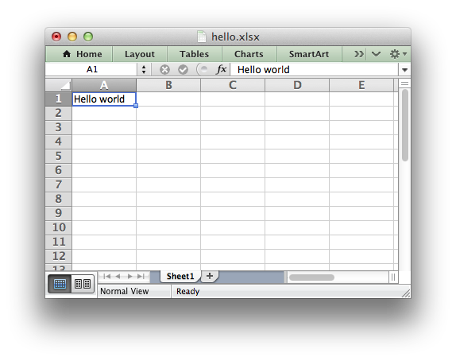

.. _getting_started:

Getting Started with XlsxWriter
===============================

Here are some easy instructions to get you up and running with the XlsxWriter
module.

Installing XlsxWriter
---------------------

The first step is to install the XlsxWriter module. There are several ways to
do this.

Using PIP
*********

The `pip <http://www.pip-installer.org/en/latest/index.html>`_  installer is
the preferred method for installing Python modules from
`PyPI <http://pypi.python.org/pypi>`_, the Python Package Index::

    $ sudo pip install XlsxWriter

.. Note::
   Windows users can omit ``sudo`` at the start of the command.

Using Easy_Install
******************

If ``pip`` doesn't work you can try
`easy_install <http://peak.telecommunity.com/DevCenter/EasyInstall>`_::

    $ sudo easy_install XlsxWriter

Installing from a tarball
*************************

If you download a tarball of the latest version of XlsxWriter you can install
it as follows (change the version number to suit)::

    $ tar -zxvf XlsxWriter-1.2.3.tar.gz

    $ cd XlsxWriter-1.2.3
    $ sudo python setup.py install

A tarball of the latest code can be downloaded from GitHub as follows::

    $ curl -O -L http://github.com/jmcnamara/XlsxWriter/archive/master.tar.gz

    $ tar zxvf master.tar.gz
    $ cd XlsxWriter-master/
    $ sudo python setup.py install

Cloning from GitHub
*******************

The XlsxWriter source code and bug tracker is in the
`XlsxWriter repository <http://github.com/jmcnamara/XlsxWriter>`_ on GitHub.
You can clone the repository and install from it as follows::

    $ git clone https://github.com/jmcnamara/XlsxWriter.git

    $ cd XlsxWriter
    $ sudo python setup.py install

Running a sample program
------------------------

If the installation went correctly you can create a small sample program like
the following to verify that the module works correctly:

.. code-block:: python

    import xlsxwriter

    workbook = xlsxwriter.Workbook('hello.xlsx')
    worksheet = workbook.add_worksheet()

    worksheet.write('A1', 'Hello world')

    workbook.close()

Save this to a file called ``hello.py`` and run it as follows::

    $ python hello.py

This will output a file called ``hello.xlsx`` which should look something like
the following:

If you downloaded a tarball or cloned the repo, as shown above, you should also
have a directory called
`examples <https://github.com/jmcnamara/XlsxWriter/tree/master/examples>`_
with some sample applications that demonstrate different features of
XlsxWriter.

Documentation
-------------

The latest version of this document is hosted on
`Read The Docs <https://xlsxwriter.readthedocs.io>`_. It is also
available as a
`PDF <https://github.com/jmcnamara/XlsxWriter/raw/master/docs/XlsxWriter.pdf>`_.

Once you are happy that the module is installed and operational you can have a
look at the rest of the XlsxWriter documentation. :ref:`tutorial1` is a good
place to start.

