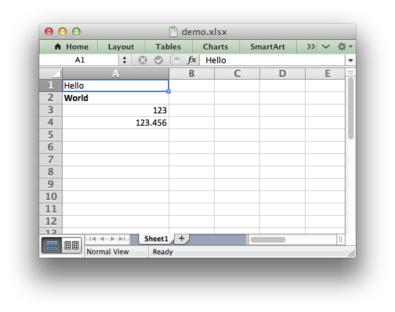

Creating Excel files with Python and XlsxWriter
===============================================

XlsxWriter is a Python module for creating Excel XLSX files.

.. only:: html

   (:ref:`Sample code to create the above spreadsheet <ex_demo>`.)

   **XlsxWriter**

XlsxWriter supports the following features in version |version|:

* 100% compatible Excel XLSX files.
* Write text, numbers, formulas, dates to cells.
* Write hyperlinks to cells.
* Full cell formatting.
* Multiple worksheets.
* Charts.
* Page setup methods for printing.
* Merged cells.
* Defined names.
* Autofilters.
* Data validation and drop down lists.
* Conditional formatting.
* Worksheet PNG/JPEG images.
* Rich multi-format strings.
* Cell comments.
* Document properties.
* Worksheet cell protection.
* Freeze and split worksheet panes.
* Worksheet Tables.
* Sparklines.
* Outlines and Grouping.
* Memory optimisation mode for writing large files.
* Standard libraries only.
* Python 2.5, 2.6, 2.7, 3.1, 3.2, 3.3, Jython and PyPy support.

.. only:: html

   This document explains how to use the XlsxWriter module. See the following
   sections for more information.

   .. toctree::
      :maxdepth: 1

      contents.rst

.. toctree::
   :maxdepth: 1

   introduction.rst
   getting_started.rst

.. toctree::
   :maxdepth: 1

   tutorial01.rst
   tutorial02.rst
   tutorial03.rst

.. toctree::
   :maxdepth: 1

   workbook.rst
   worksheet.rst
   page_setup.rst
   format.rst
   chart.rst

.. toctree::
   :maxdepth: 1

   working_with_cell_notation.rst
   working_with_formats.rst
   working_with_dates_and_time.rst
   working_with_charts.rst
   working_with_autofilters.rst
   working_with_data_validation.rst
   working_with_conditional_formats.rst
   working_with_tables.rst
   working_with_sparklines.rst
   working_with_cell_comments.rst
   working_with_outlines.rst
   working_with_memory.rst

.. toctree::
   :maxdepth: 1

   examples.rst

.. toctree::
   :maxdepth: 1

   chart_examples.rst

.. toctree::
   :maxdepth: 1

   excel_writer_xlsx.rst
   alternatives.rst
   bugs.rst
   faq.rst
   changes.rst
   author.rst
   license.rst
