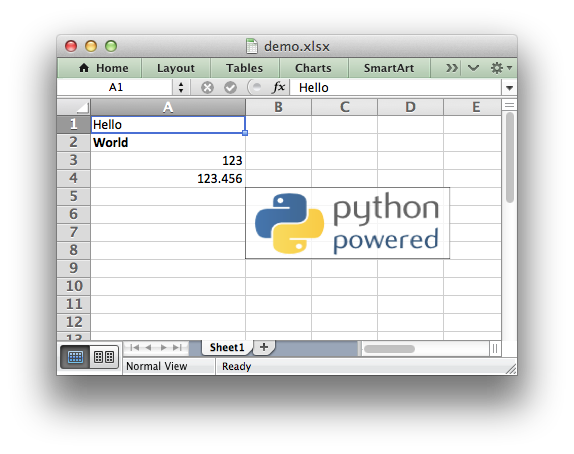

Creating Excel files with Python and XlsxWriter
===============================================

XlsxWriter is a Python module for creating Excel XLSX files.

.. only:: html

   (:ref:`Sample code to create the above spreadsheet <ex_demo>`.)

   **XlsxWriter**

XlsxWriter is a Python module that can be used to write text, numbers, formulas
and hyperlinks to multiple worksheets in an Excel 2007+ XLSX file. It supports
features such as formatting and many more, including:

* 100% compatible Excel XLSX files.
* Full formatting.
* Merged cells.
* Defined names.
* Charts.
* Autofilters.
* Data validation and drop down lists.
* Conditional formatting.
* Worksheet PNG/JPEG images.
* Rich multi-format strings.
* Cell comments.
* Textboxes.
* Integration with Pandas.
* Memory optimization mode for writing large files.

It supports Python 2.5, 2.6, 2.7, 3.1, 3.2, 3.3, 3.4, 3.5, Jython and PyPy and
uses standard libraries only.

.. only:: html

   This document explains how to use the XlsxWriter module. See the following
   sections for more information, or jump straight to the :ref:`intro`.

   .. toctree::
      :maxdepth: 1

      contents.rst

.. toctree::
   :maxdepth: 1

   introduction.rst
   getting_started.rst

.. toctree::
   :maxdepth: 1

   tutorial01.rst
   tutorial02.rst
   tutorial03.rst

.. toctree::
   :maxdepth: 1

   workbook.rst
   worksheet.rst
   page_setup.rst
   format.rst
   chart.rst
   chartsheet.rst

.. toctree::
   :maxdepth: 1

   working_with_cell_notation.rst
   working_with_formulas.rst
   working_with_dates_and_time.rst
   working_with_colors.rst
   working_with_charts.rst
   working_with_autofilters.rst
   working_with_data_validation.rst
   working_with_conditional_formats.rst
   working_with_tables.rst
   working_with_textboxes.rst
   working_with_sparklines.rst
   working_with_cell_comments.rst
   working_with_outlines.rst
   working_with_memory.rst
   working_with_macros.rst
   working_with_pandas.rst

.. toctree::
   :maxdepth: 1

   examples.rst

.. toctree::
   :maxdepth: 1

   chart_examples.rst

.. toctree::
   :maxdepth: 1

   pandas_examples.rst

.. toctree::
   :maxdepth: 1

   alternatives.rst
   bugs.rst
   faq.rst
   changes.rst
   author.rst
   license.rst
