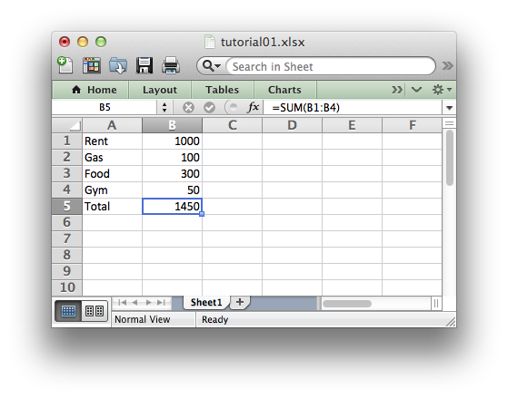

Tutorial: Create a simple XLSX file 1
=====================================

Lets start with a simple spreadsheet that we will create using Python and
the XlsxWriter module.

Say we have some data in Python that we want to convert into an Excel XLSX
file.

For example say that it is some information about monthly outgoings::

    expenses = (
        ['Rent', 1000],
        ['Gas', 100],
        ['Food', 300],
        ['Gym', 50],
    )

To do that we could start with a small program like the following::

    # Create a workbook and add a worksheet.
    workbook = Workbook('Expenses01.xlsx')
    worksheet = workbook.add_worksheet()
    
    # Some data we want to write to the worksheet.
    expenses = (
        ['Rent', 1000],
        ['Gas', 100],
        ['Food', 300],
        ['Gym', 50],
    )
    
    # Rows and columns are zero indexed. Start from the first column.
    row = 0
    
    # Iterate over the data and write it out row by row.
    for item in (expenses):
        worksheet.write(row, 0, item[0])
        worksheet.write(row, 1, item[1])
        row += 1
    
    # Write a total using a formula.
    worksheet.write(row, 0, 'Total')
    worksheet.write(row, 1, '=SUM(B1:B4)')
    
    workbook.close()

If we run this program we should end up with a spreadsheet like the following:

So, let's break that down into separate parts. The first step is to import the
`xlsxwriter` module.

    from xlsxwriter import Workbook

The we create a new workbook object. The ``Workbook()`` method takes one argument
which is the file that we want to create::

    workbook = Workbook('Expenses01.xlsx')

Note: XlsxWriter can only create new files. It cannot read or modify an
existing file so it will overwrite any file with the same name.

The workbook object is then used to add a new worksheet::

    worksheet = workbook.add_worksheet()

By default the worksheet name in the spreadsheet will be `Sheet1` but we can
specify a name as well::

    worksheet1 = workbook.add_worksheet()               # Defaults to Sheet1.
    worksheet2 = workbook.add_worksheet('Data')
    worksheet3 = workbook.add_worksheet('Test Results')
    worksheet4 = workbook.add_worksheet()               # Defaults to Sheet4.

We can then use the worksheet object to write data. TODO.
