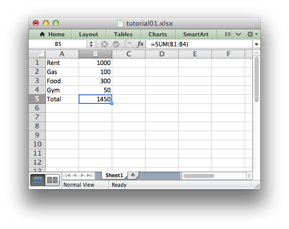

Tutorial 1: Create a simple XLSX file
=====================================

.. highlight:: python

Let's start by creating a simple spreadsheet using Python and the XlsxWriter
module.

For example, say that we have some data on monthly outgoings that we want to
convert into an Excel XLSX file::

    expenses = (
        ['Rent', 1000],
        ['Gas', 100],
        ['Food', 300],
        ['Gym', 50],
    )

To do that we could start with a small program like the following::

    # Create a workbook and add a worksheet.
    workbook = Workbook('Expenses01.xlsx')
    worksheet = workbook.add_worksheet()
    
    # Some data we want to write to the worksheet.
    expenses = (
        ['Rent', 1000],
        ['Gas', 100],
        ['Food', 300],
        ['Gym', 50],
    )
    
    # Start from the first cell. Rows and columns are zero indexed. 
    row = 0
    col = 0
    
    # Iterate over the data and write it out row by row.
    for item in (expenses):
        worksheet.write(row, col,    item[0])
        worksheet.write(row, col +1, item[1])
        row += 1
    
    # Write a total using a formula.
    worksheet.write(row, 0, 'Total')
    worksheet.write(row, 1, '=SUM(B1:B4)')
    
    workbook.close()

If we run this program we should get a spreadsheet that looks like the
following:

The general rules for creating an XlsxWriter spreadsheet are:

1. Create a workbook. 2. Add a worksheet to the workbook. 3. Write data to the
worksheet.

Well, there is actually a Step Zero to import the module but hopefully we
already knew that::

    from xlsxwriter import Workbook

So with these three steps in mind, let's break the program down into separate
parts. The first step is to create a new workbook object using the
``Workbook()`` constructor.

``Workbook()`` takes one, non-optional, argument which is the filename that we
want to create::

    workbook = Workbook('Expenses01.xlsx')

.. note::
   XlsxWriter can only create *new files*. It cannot read or modify an
   existing file.

The workbook object is then used to add a new worksheet::

    worksheet = workbook.add_worksheet()

By default the worksheet name in the spreadsheet will be `Sheet1` but we can
specify a name as well::

    worksheet1 = workbook.add_worksheet()         # Defaults to Sheet1.
    worksheet2 = workbook.add_worksheet('Data')   # Data.
    worksheet3 = workbook.add_worksheet()         # Defaults to Sheet3.

We can then use the worksheet object to write data::

    worksheet.write(row, col, some_data)

Throughout XlsxWriter, Rows and Columns are zero indexed. So the first cell in
a worksheet, ``A1`` is ``(0, 0)``. We will look at some utility routines to
deal with cells and the ``write()`` method in more detail in one of the next
sections.

So in our example we iterated over our data and wrote it out as follows::

    # Iterate over the data and write it out row by row.
    for item in (expenses):
        worksheet.write(row, col,    item[0])
        worksheet.write(row, col +1, item[1])
        row += 1

Also, we added a formula to calculate the total of the items in the second
column::

    worksheet.write(row, 1, '=SUM(B1:B4)')

Finally, we closed the Excel file::

    workbook.close()

Like most file objects in Python an XlsxWriter file is closed implicitly when
it goes out of scope or is no longer referenced in the program. As such this
line is generally optional unless you need to close the file explicitly.

And that's it. We now have a file that can be read by Excel and most other
spreadsheet applications.

In the next sections we will see how we can use the XlsxWriter module to add
formatting and other Excel features.

