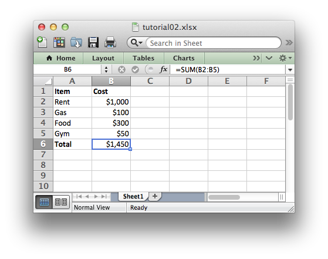

Tutorial 2: Adding formatting to the XLSX File
==============================================

.. highlight:: python

In the previous section we created a simple spreadsheet using Python and the
XlsxWriter module.

This presented the data that we wanted but it looked a little bare. In order to
make it a little clearer to understand we would like to add some simple
formatting, like this:

The differences here are that we have added **Item** and **Cost** header
columns in a bold font, we have formatted the currency in the second column
and we have made the **Total** string bold.

To get a spreadsheet like this we could extend our program like this::

    # Create a workbook and add a worksheet.
    workbook = Workbook(filename)
    worksheet = workbook.add_worksheet()
    
    # Add a bold format to use to highlight cells.
    bold = workbook.add_format({'bold': True})
    
    # Add a number format for cells with money.
    money = workbook.add_format({'num_format': '$#,##0'})
    
    # Write some data header.
    worksheet.write('A1', 'Item', bold)
    worksheet.write('B1', 'Cost', bold)
    
    # Some data we want to write to the worksheet.
    expenses = (
        ['Rent', 1000],
        ['Gas', 100],
        ['Food', 300],
        ['Gym', 50],
    )
    
    # Start from the first cell below the headers.
    row = 1
    col = 0
    
    # Iterate over the data and write it out row by row.
    for item in (expenses):
        worksheet.write(row, col,     item[0]       )
        worksheet.write(row, col + 1, item[1], money)
        row += 1
    
    # Write a total using a formula.
    worksheet.write(row, 0, 'Total',       bold)
    worksheet.write(row, 1, '=SUM(B2:B5)', money)
    
    workbook.close()

The main difference between this and the previous program is that we now create
two ``Format`` objects that we will use to format cells in the spreadsheet::

    # Add a bold format to use to highlight cells.
    bold = workbook.add_format({'bold': True})
    
    # Add a number format for cells with money.
    money = workbook.add_format({'num_format': '$#,##0'})

TODO Add more.

