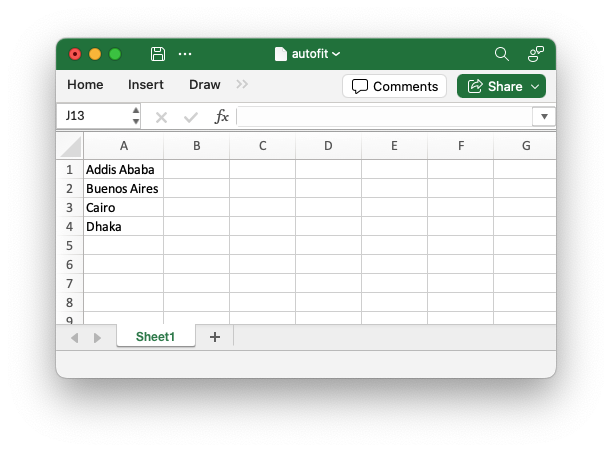

.. SPDX-License-Identifier: BSD-2-Clause
   Copyright (c) 2013-2025, John McNamara, jmcnamara@cpan.org

.. _utility:

Utility and Helper Functions
----------------------------

The ``XlsxWriter`` ``utility`` module contains several helper functions for
dealing with A1 notation and strings. These functions can be imported as
follows::

    from xlsxwriter.utility import xl_rowcol_to_cell

    cell = xl_rowcol_to_cell(1, 2)  # C2

xl_rowcol_to_cell()
~~~~~~~~~~~~~~~~~~~

.. py:function:: xl_rowcol_to_cell(row, col[, row_abs, col_abs])

   Convert a zero indexed row and column cell reference to a A1 style string.

   :param int row:      The cell row.
   :param int col:      The cell column.
   :param bool row_abs: Optional flag to make the row absolute.
   :param bool col_abs: Optional flag to make the column absolute.
   :return:             ``A1`` style string.
   :rtype:              str

The ``xl_rowcol_to_cell()`` function converts a zero indexed row and column
cell values to an ``A1`` style string::

    cell = xl_rowcol_to_cell(0, 0)   # A1
    cell = xl_rowcol_to_cell(0, 1)   # B1
    cell = xl_rowcol_to_cell(1, 0)   # A2

The optional parameters ``row_abs`` and ``col_abs`` can be used to indicate
that the row or column is absolute::

    str = xl_rowcol_to_cell(0, 0, col_abs=True)                # $A1
    str = xl_rowcol_to_cell(0, 0, row_abs=True)                # A$1
    str = xl_rowcol_to_cell(0, 0, row_abs=True, col_abs=True)  # $A$1

xl_cell_to_rowcol()
~~~~~~~~~~~~~~~~~~~

.. py:function:: xl_cell_to_rowcol(cell_str)

   Convert a cell reference in ``A1`` notation to a zero indexed row and column.

   :param string cell_str: ``A1`` style string, absolute or relative.
   :return:                Tuple of ints for (row, col).
   :rtype:                 (int, int).

The ``xl_cell_to_rowcol()`` function converts an Excel cell reference in ``A1``
notation to a zero based row and column. The function will also handle Excel's
absolute, ``$``, cell notation::

    (row, col) = xl_cell_to_rowcol('A1')    # (0, 0)
    (row, col) = xl_cell_to_rowcol('B1')    # (0, 1)
    (row, col) = xl_cell_to_rowcol('C2')    # (1, 2)
    (row, col) = xl_cell_to_rowcol('$C2')   # (1, 2)
    (row, col) = xl_cell_to_rowcol('C$2')   # (1, 2)
    (row, col) = xl_cell_to_rowcol('$C$2')  # (1, 2)

xl_col_to_name()
~~~~~~~~~~~~~~~~

.. py:function:: xl_col_to_name(col[, col_abs])

   Convert a zero indexed column cell reference to a string.

   :param int col:      The cell column.
   :param bool col_abs: Optional flag to make the column absolute.
   :return:             Column style string.
   :rtype:              str

The ``xl_col_to_name()`` converts a zero based column reference to a string::

    column = xl_col_to_name(0)    # A
    column = xl_col_to_name(1)    # B
    column = xl_col_to_name(702)  # AAA

The optional parameter ``col_abs`` can be used to indicate if the column is
absolute::

    column = xl_col_to_name(0, False)  # A
    column = xl_col_to_name(0, True)   # $A
    column = xl_col_to_name(1, True)   # $B

xl_range()
~~~~~~~~~~

.. py:function:: xl_range(first_row, first_col, last_row, last_col)

   Converts zero indexed row and column cell references to a A1:B1 range
   string.

   :param int first_row:     The first cell row.
   :param int first_col:     The first cell column.
   :param int last_row:      The last cell row.
   :param int last_col:      The last cell column.
   :return:                  ``A1:B1`` style range string.
   :rtype:                   str

The ``xl_range()`` function converts zero based row and column cell references
to an ``A1:B1`` style range string::

    cell_range = xl_range(0, 0, 9, 0)  # A1:A10
    cell_range = xl_range(1, 2, 8, 2)  # C2:C9
    cell_range = xl_range(0, 0, 3, 4)  # A1:E4
    cell_range = xl_range(0, 0, 0, 0)  # A1

xl_range_abs()
~~~~~~~~~~~~~~

.. py:function:: xl_range_abs(first_row, first_col, last_row, last_col)

   Converts zero indexed row and column cell references to a $A$1:$B$1
   absolute range string.

   :param int first_row:     The first cell row.
   :param int first_col:     The first cell column.
   :param int last_row:      The last cell row.
   :param int last_col:      The last cell column.
   :return:                  ``$A$1:$B$1`` style range string.
   :rtype:                   str

The ``xl_range_abs()`` function converts zero based row and column cell
references to an absolute ``$A$1:$B$1`` style range string::

    cell_range = xl_range_abs(0, 0, 9, 0)  # $A$1:$A$10
    cell_range = xl_range_abs(1, 2, 8, 2)  # $C$2:$C$9
    cell_range = xl_range_abs(0, 0, 3, 4)  # $A$1:$E$4
    cell_range = xl_range_abs(0, 0, 0, 0)  # $A$1

cell_autofit_width()
~~~~~~~~~~~~~~~~~~~~

.. py:function:: cell_autofit_width(string)

   Calculate the width required to auto-fit a string in a cell.

   :param String string: The string to calculate the cell width for.
   :return:              The string autofit width in pixels. Returns 0 if the
                         string is empty.
   :rtype:               int

The Worksheet :func:`autofit` method can be used to auto-fit cell data to the
optimal column width. However, in some cases you may wish to handle auto-fitting
yourself and apply additional logic to limit the maximum and minimum ranges.

The ``cell_autofit_width()`` function can be used to perform the required
calculation. It works by estimating the pixel width of a string based on the
width of each character. It also adds a 7 pixel padding for the cell
boundary in the same way that Excel does.

You can use the  calculated width in conjunction with Worksheet
:func:`set_column_pixels` method:

.. literalinclude:: ../../../examples/autofit_manually.py
   :lines: 11-

The limitations that apply to the Worksheet ``autofit`` method also applies to
this function. See the docs on :func:`autofit`  for more information.