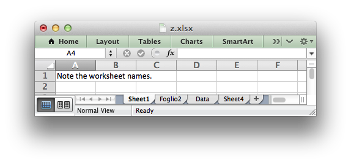

.. _workbook:

The Workbook Class
==================

The Workbook class is the main class exposed by the XlsxWriter module and it is
the only class that you will need to instantiate directly.

The Workbook class represents the entire spreadsheet as you see it in Excel and
internally it represents the Excel file as it is written on disk.

Constructor
-----------

.. py:function:: Workbook(filename)

   Create a new XlsxWriter Workbook object.
   
   :param string filename: The name of the new Excel file to create.
   :rtype: A Workbook object.

The ``Workbook()`` constructor is used to create a new Excel workbook with a
given filename::

    from xlsxwriter import Workbook

    workbook  = Workbook('filename.xlsx')
    worksheet = workbook.add_worksheet()

    worksheet.write(0, 0, 'Hello Excel')

.. image:: _static/workbook01.png

It is recommended that you always use an ``.xlsx`` extension in the filename
or Excel will generate a warning when the file is opened.

.. note::
   A later version of the module will support writing to filehandles like
   :ref:`ewx`.

workbook.add_worksheet()
------------------------

.. function:: add_worksheet([sheetname])

   Add a new worksheet to a workbook.

   :param string sheetname: Optional worksheet name, defaults to Sheet1, etc.
   :rtype: A :ref:`worksheet <Worksheet>` object.

The ``add_worksheet()`` method adds a new worksheet to a workbook.

At least one worksheet should be added to a new workbook. The
:ref:`Worksheet <worksheet>` object is used to write data and configure a
worksheet in the workbook.

The ``sheetname`` parameter is optional. If it is not specified the default
Excel convention will be followed, i.e. Sheet1, Sheet2, etc.::

    worksheet1 = workbook.add_worksheet()           # Sheet1
    worksheet2 = workbook.add_worksheet('Foglio2')  # Foglio2
    worksheet3 = workbook.add_worksheet('Data')     # Data
    worksheet4 = workbook.add_worksheet()           # Sheet4

The worksheet name must be a valid Excel worksheet name, i.e. it cannot contain
any of the characters
``'[]:*?/\'`` and it must be less than 32 characters. In addition, you cannot use the same, case insensitive, ``sheetname`` for more than one worksheet.

workbook.add_format()
---------------------

.. py:function:: add_format([properties])
   
   Create a new Format object to formats cells in worksheets.
   
   :param dictionary properties: An optional dictionary of format properties.
   :rtype: A :ref:`format <Format>` object.

The ``add_format()`` method can be used to create new :ref:`Format <Format>`
objects which are used to apply formatting to a cell. You can either define
the properties at creation time via a dictionary of property values or later
via method calls::

    format1 = workbook.add_format(props); # Set properties at creation.
    format2 = workbook.add_format();      # Set properties later.

See the :ref:`format` and :ref:`working_with_formats` sections for more details
about Format properties and how to set them.

workbook.close()
----------------

.. py:function:: close()

   Close the Workbook object and write the XLSX file.
            
In general your Excel file will be closed automatically when your program ends
or when the Workbook object goes out of scope, however the ``close()`` method
can be used to explicitly close an Excel file::

    workbook.close()

An explicit ``close()`` is required if the file must be closed prior to
performing some external action on it such as copying it, reading its size or
attaching it to an email.

In addition, ``close()`` may be occasionally required to prevent Python's
garbage collector from disposing of the Workbook, Worksheet and Format objects
in the wrong order.

In general, if an XlsxWriter file is created with a size of 0 bytes or fails to
be created for some unknown silent reason you should add ``close()`` to your
program.

workbook.set_properties()
-------------------------

.. py:function:: set_properties()

   Set the document properties such as Title, Author etc.
   
   :param dict properties: Dictionary of document properties.

The ``set_properties`` method can be used to set the document properties
of the Excel file created by ``XlsxWriter``. These properties are visible
when you use the ``Office Button -> Prepare -> Properties`` option in Excel
and are also available to external applications that read or index windows
files.

The properties that can be set are:

* ``title``
* ``subject``
* ``author``
* ``manager``
* ``company``
* ``category``
* ``keywords``
* ``comments``
* ``status``

The properties should be passed in dictionary format as follows::

    workbook.set_properties({
        'title':    'This is an example spreadsheet',
        'subject':  'With document properties',
        'author':   'John McNamara',
        'manager':  'Dr. Heinz Doofenshmirtz',
        'company':  'of Wolves',
        'category': 'Example spreadsheets',
        'keywords': 'Sample, Example, Properties',
        'comments': 'Created with Python and XlsxWriter'})

.. image:: _static/doc_properties.png

See also :ref:`ex_doc_properties`.

workbook.define_name()
----------------------

.. py:function:: define_name()

   Create a defined name in the workbook to use as a variable.
   
   :param string name:    The defined name.
   :param string formula: The cell or range that the defined name refers to.
   
This method is used to defined a name that can be used to represent a value,
a single cell or a range of cells in a workbook.

For example to set a global/workbook name::

    # Global/workbook names.
    workbook.define_name('Exchange_rate', '=0.96')
    workbook.define_name('Sales',         '=Sheet1!G1:H10')

It is also possible to define a local/worksheet name by prefixing it
with the sheet name using the syntax ``'sheetname!definedname'``::

    # Local/worksheet name.
    workbook.define_name('Sheet2!Sales', '=Sheet2!G1:G10')

If the sheet name contains spaces or special characters you must enclose it
in single quotes like in Excel::

    workbook.define_name("'New Data'!Sales", '=Sheet2!G1:G10')

See also the ``defined_name.py`` program in the examples directory.

workbook.worksheets()
---------------------

.. py:function:: worksheets()

   Return a list of the worksheet objects in the workbook.
   
   :rtype: A list of :ref:`worksheet <Worksheet>` objects.
   
The ``worksheets()`` method returns a list of the worksheets in a workbook.
This is useful if you want to repeat an operation on each worksheet in a
workbook::

    for worksheet in workbook.worksheets():
        worksheet.write('A1', 'Hello')
