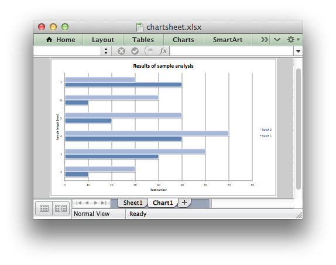
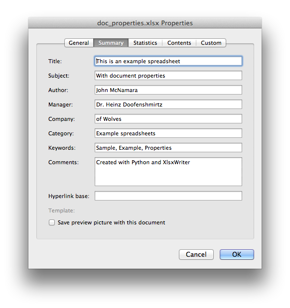
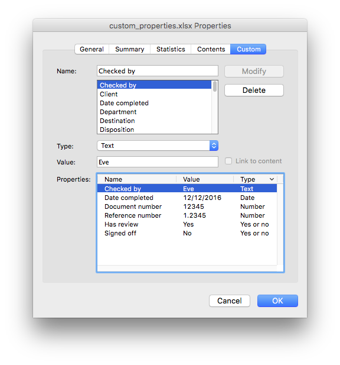
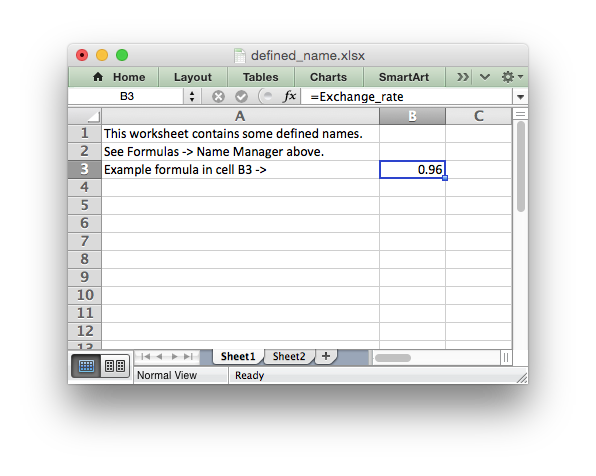

.. _workbook:

The Workbook Class
==================

The Workbook class is the main class exposed by the XlsxWriter module and it is
the only class that you will need to instantiate directly.

The Workbook class represents the entire spreadsheet as you see it in Excel and
internally it represents the Excel file as it is written on disk.

Constructor
-----------

.. py:function:: Workbook(filename [,options])

   Create a new XlsxWriter Workbook object.

   :param string filename: The name of the new Excel file to create.
   :param dict options:    Optional workbook parameters. See below.
   :rtype:                 A Workbook object.

The ``Workbook()`` constructor is used to create a new Excel workbook with a
given filename::

    import xlsxwriter

    workbook  = xlsxwriter.Workbook('filename.xlsx')
    worksheet = workbook.add_worksheet()

    worksheet.write(0, 0, 'Hello Excel')

    workbook.close()

.. image:: _images/workbook01.png

The constructor options are:

* **constant_memory**: Reduces the amount of data stored in memory so that
  large files can be written efficiently::

       workbook = xlsxwriter.Workbook(filename, {'constant_memory': True})

  Note, in this mode a row of data is written and then discarded when a cell
  in a new row is added via one of the worksheet ``write_()`` methods.
  Therefore, once this mode is active, data should be written in sequential
  row order. For this reason the :func:`add_table()` and :func:`merge_range()`
  Worksheet methods don't work in this mode.

  See :ref:`memory_perf` for more details.

* **tmpdir**: ``XlsxWriter`` stores workbook data in temporary files prior
  to assembling the final XLSX file. The temporary files are created in the
  system's temp directory. If the default temporary directory isn't accessible
  to your application, or doesn't contain enough space, you can specify an
  alternative location using the ``tempdir`` option::

       workbook = xlsxwriter.Workbook(filename, {'tmpdir': '/home/user/tmp'})

  The temporary directory must exist and will not be created.

* **in_memory**: To avoid the use of temporary files in the assembly of the
  final XLSX file, for example on servers that don't allow temp files such as
  the Google APP Engine, set the ``in_memory`` constructor option to ``True``::

       workbook = xlsxwriter.Workbook(filename, {'in_memory': True})

  This option overrides the ``constant_memory`` option.
* **strings_to_numbers**: Enable the
  :ref:`worksheet. <Worksheet>`:func:`write()` method to convert strings to
  numbers, where possible, using :func:`float()` in order to avoid an Excel
  warning about "Numbers Stored as Text". The default is ``False``. To enable
  this option use::

      workbook = xlsxwriter.Workbook(filename, {'strings_to_numbers': True})

* **strings_to_formulas**: Enable the
  :ref:`worksheet. <Worksheet>`:func:`write()` method to convert strings to
  formulas. The default is ``True``. To disable this option use::

      workbook = xlsxwriter.Workbook(filename, {'strings_to_formulas': False})

* **strings_to_urls**: Enable the
  :ref:`worksheet. <Worksheet>`:func:`write()` method to convert strings to
  urls. The default is ``True``. To disable this option use::

      workbook = xlsxwriter.Workbook(filename, {'strings_to_urls': False})

* **nan_inf_to_errors**: Enable the
  :ref:`worksheet. <Worksheet>`:func:`write()` and :func:`write_number()`
  methods to convert ``nan``, ``inf`` and ``-inf`` to Excel errors. Excel
  doesn't handle NAN/INF as numbers so as a workaround they are mapped to
  formulas that yield the error codes ``#NUM!`` and ``#DIV/0!``.  The default
  is ``False``. To enable this option use::

      workbook = xlsxwriter.Workbook(filename, {'nan_inf_to_errors': True})

* **default_date_format**: This option is used to specify a default date
  format string for use with the
  :ref:`worksheet. <Worksheet>`:func:`write_datetime()` method when an
  explicit format isn't given. See :ref:`working_with_dates_and_time` for more
  details::

      xlsxwriter.Workbook(filename, {'default_date_format': 'dd/mm/yy'})

* **remove_timezone**: Excel doesn't support timezones in datetimes/times so
  there isn't any fail-safe way that XlsxWriter can map a Python timezone aware
  datetime into an Excel datetime in functions such as
  :func:`write_datetime`. As such the user should convert and remove the
  timezones in some way that make sense according to their
  requirements. Alternatively the ``remove_timezone`` option can be used to
  strip the timezone from datetime values. The default is ``False``. To enable
  this option use::

      workbook = xlsxwriter.Workbook(filename, {'remove_timezone': True})

  See also :ref:`Timezone Handling in XlsxWriter <timezone_handling>`.

* **date_1904**: Excel for Windows uses a default epoch of 1900 and Excel for
  Mac uses an epoch of 1904. However, Excel on either platform will convert
  automatically between one system and the other. XlsxWriter stores dates in
  the 1900 format by default. If you wish to change this you can use the
  ``date_1904`` workbook option. This option is mainly for enhanced
  compatibility with Excel and in general isn't required very often::

      workbook = xlsxwriter.Workbook(filename, {'date_1904': True})

When specifying a filename it is recommended that you use an ``.xlsx``
extension or Excel will generate a warning when opening the file.

The ``Workbook()`` method also works using the ``with`` context manager. In
which case it doesn't need an explicit `close()` statement::

    with xlsxwriter.Workbook('hello_world.xlsx') as workbook:
        worksheet = workbook.add_worksheet()

        worksheet.write('A1', 'Hello world')

It is possible to write files to in-memory strings using StringIO as follows::

    output = StringIO()
    workbook = xlsxwriter.Workbook(output)
    worksheet = workbook.add_worksheet()

    worksheet.write('A1', 'Hello')
    workbook.close()

    xlsx_data = output.getvalue()

To avoid the use of any temporary files and keep the entire file in-memory use
the ``in_memory`` constructor option shown above.

See also :ref:`ex_http_server` and :ref:`ex_http_server3`.

workbook.add_worksheet()
------------------------

.. function:: add_worksheet([name])

   Add a new worksheet to a workbook.

   :param string name: Optional worksheet name, defaults to Sheet1, etc.
   :rtype: A :ref:`worksheet <Worksheet>` object.

The ``add_worksheet()`` method adds a new worksheet to a workbook.

At least one worksheet should be added to a new workbook. The
:ref:`Worksheet <worksheet>` object is used to write data and configure a
worksheet in the workbook.

The ``name`` parameter is optional. If it is not specified the default
Excel convention will be followed, i.e. Sheet1, Sheet2, etc.::

    worksheet1 = workbook.add_worksheet()           # Sheet1
    worksheet2 = workbook.add_worksheet('Foglio2')  # Foglio2
    worksheet3 = workbook.add_worksheet('Data')     # Data
    worksheet4 = workbook.add_worksheet()           # Sheet4

.. image:: _images/workbook02.png

The worksheet name must be a valid Excel worksheet name, i.e. it cannot contain
any of the characters ``' [ ] : * ? / \
'`` and it must be less than 32 characters.

In addition, you cannot use the same, case insensitive, ``name`` for more
than one worksheet.

workbook.add_format()
---------------------

.. py:function:: add_format([properties])

   Create a new Format object to formats cells in worksheets.

   :param dictionary properties: An optional dictionary of format properties.
   :rtype: A :ref:`format <Format>` object.

The ``add_format()`` method can be used to create new :ref:`Format <Format>`
objects which are used to apply formatting to a cell. You can either define
the properties at creation time via a dictionary of property values or later
via method calls::

    format1 = workbook.add_format(props)  # Set properties at creation.
    format2 = workbook.add_format()       # Set properties later.

See the :ref:`format` section for more details about Format properties and how
to set them.

workbook.add_chart()
--------------------

.. py:function:: add_chart(options)

   Create a chart object that can be added to a worksheet.

   :param dictionary options: An dictionary of chart type options.
   :rtype: A :ref:`Chart <chart_class>` object.

This method is use to create a new chart object that can be inserted into a
worksheet via the :func:`insert_chart()` Worksheet method::

    chart = workbook.add_chart({'type': 'column'})

The properties that can be set are::

    type    (required)
    subtype (optional)

* ``type``

  This is a required parameter. It defines the type of chart that will be
  created::

    chart = workbook.add_chart({'type': 'line'})

  The available types are::

    area
    bar
    column
    doughnut
    line
    pie
    radar
    scatter
    stock

* ``subtype``

  Used to define a chart subtype where available::

    workbook.add_chart({'type': 'bar', 'subtype': 'stacked'})

See the :ref:`chart_class` for a list of available chart subtypes.

.. Note::

   A chart can only be inserted into a worksheet once. If several similar
   charts are required then each one must be created separately with
   ``add_chart()``.

See also :ref:`working_with_charts` and :ref:`chart_examples`.

workbook.add_chartsheet()
-------------------------

.. function:: add_chartsheet([sheetname])

   Add a new add_chartsheet to a workbook.

   :param string sheetname: Optional chartsheet name, defaults to Chart1, etc.
   :rtype: A :ref:`chartsheet <Chartsheet>` object.

The ``add_chartsheet()`` method adds a new chartsheet to a workbook.

See :ref:`chartsheet` for details.

The ``sheetname`` parameter is optional. If it is not specified the default
Excel convention will be followed, i.e. Chart1, Chart2, etc.

The chartsheet name must be a valid Excel worksheet name, i.e. it cannot
contain any of the characters ``' [ ] : * ? / \
'`` and it must be less than 32 characters.

In addition, you cannot use the same, case insensitive, ``sheetname`` for more
than one chartsheet.

workbook.close()
----------------

.. py:function:: close()

   Close the Workbook object and write the XLSX file.

The workbook ``close()`` method writes all data to the xlsx file and closes
it::

    workbook.close()

The ``Workbook`` object also works using the ``with`` context manager. In
which case it doesn't need an explicit `close()` statement::

    with xlsxwriter.Workbook('hello_world.xlsx') as workbook:
        worksheet = workbook.add_worksheet()

        worksheet.write('A1', 'Hello world')

The workbook will close automatically when exiting the scope of the ``with``
statement.

.. Note::

   Unless you are using the ``with`` context manager you should always use an
   explicit ``close()`` in your XlsxWriter application.

workbook.set_size()
-------------------

.. py:function:: set_size(width, height)

   Set the size of a workbook window.

   :param int width:  Width of the window in pixels.
   :param int height: Height of the window in pixels.

The ``set_size()`` method can be used to set the size of a workbook window::

    workbook,set_size(1200, 800)

The Excel window size was used in Excel 2007 to define the width and height of
a workbook window within the Multiple Document Interface (MDI). In later
versions of Excel for Windows this interface was dropped. This method is
currently only useful when setting the window size in Excel for Mac 2011. The
units are pixels and the default size is 1073 x 644.

Note, this doesn't equate exactly to the Excel for Mac pixel size since it is
based on the original Excel 2007 for Windows sizing. Some trial and error may
be required to get an exact size.

workbook.set_properties()
-------------------------

.. py:function:: set_properties(properties)

   Set the document properties such as Title, Author etc.

   :param dict properties: Dictionary of document properties.

The ``set_properties()`` method can be used to set the document properties of the
Excel file created by ``XlsxWriter``. These properties are visible when you
use the ``Office Button -> Prepare -> Properties`` option in Excel and are
also available to external applications that read or index windows files.

The properties that can be set are:

* ``title``
* ``subject``
* ``author``
* ``manager``
* ``company``
* ``category``
* ``keywords``
* ``comments``
* ``status``
* ``hyperlink_base``

The properties are all optional and should be passed in dictionary format as
follows::

    workbook.set_properties({
        'title':    'This is an example spreadsheet',
        'subject':  'With document properties',
        'author':   'John McNamara',
        'manager':  'Dr. Heinz Doofenshmirtz',
        'company':  'of Wolves',
        'category': 'Example spreadsheets',
        'keywords': 'Sample, Example, Properties',
        'comments': 'Created with Python and XlsxWriter'})

See also :ref:`ex_doc_properties`.

workbook.set_custom_property()
------------------------------

.. py:function:: set_custom_property(name, value [, property_type])

   Set a custom document property.

   :param name:          The name of the custom property.
   :param value:         The value of the custom property (various types).
   :param property_type: The type of the property. Optional.
   :type name:           string
   :type property_type:  string

The ``set_custom_property()`` method can be used to set one or more custom
document properties not covered by the standard properties in the
``set_properties()`` method above.

For example::

    date = datetime.strptime('2016-12-12', '%Y-%m-%d')

    workbook.set_custom_property('Checked by',       'Eve')
    workbook.set_custom_property('Date completed',   date)
    workbook.set_custom_property('Document number',  12345)
    workbook.set_custom_property('Reference number', 1.2345)
    workbook.set_custom_property('Has review',       True)
    workbook.set_custom_property('Signed off',       False)

Date parameters should be :class:`datetime.datetime` objects.

The optional ``property_type`` parameter can be used to set an explicit type
for the custom property, just like in Excel. The available types are::

    text
    date
    number
    bool

However, in almost all cases the type will be inferred correctly from the
Python type, like in the example above.

Note: the ``name`` and ``value`` parameters are limited to 255 characters by
Excel.

workbook.define_name()
----------------------

.. py:function:: define_name()

   Create a defined name in the workbook to use as a variable.

   :param string name:    The defined name.
   :param string formula: The cell or range that the defined name refers to.

This method is used to defined a name that can be used to represent a value, a
single cell or a range of cells in a workbook. These are sometimes referred to
as a "Named Range".

Defined names are generally used to simplify or clarify formulas by using
descriptive variable names::

    workbook.define_name('Exchange_rate', '=0.96')
    worksheet.write('B3', '=B2*Exchange_rate')

As in Excel a name defined like this is "global" to the workbook and can be
referred to from any worksheet::

    # Global workbook name.
    workbook.define_name('Sales', '=Sheet1!$G$1:$H$10')

It is also possible to define a local/worksheet name by prefixing it with the
sheet name using the syntax ``'sheetname!definedname'``::

    # Local worksheet name.
    workbook.define_name('Sheet2!Sales', '=Sheet2!$G$1:$G$10')

If the sheet name contains spaces or special characters you must follow the
Excel convention and enclose it in single quotes::

    workbook.define_name("'New Data'!Sales", '=Sheet2!$G$1:$G$10')

The rules for names in Excel are explained in the `Microsoft Office
documentation
<http://office.microsoft.com/en-001/excel-help/define-and-use-names-in-formulas-HA010147120.aspx>`_.

See also :ref:`ex_defined_name`.

workbook.add_vba_project()
--------------------------

.. py:function:: add_vba_project(vba_project[, is_stream])

   Add a vbaProject binary to the Excel workbook.

   :param      vba_project: The vbaProject binary file name.
   :param bool is_stream:   The vba_project is an in memory byte stream.

The ``add_vba_project()`` method can be used to add macros or functions to a
workbook using a binary VBA project file that has been extracted from an
existing Excel xlsm file::

    workbook.add_vba_project('./vbaProject.bin')

Only one ``vbaProject.bin`` file can be added per workbook.

The ``is_stream`` parameter is used to indicate that ``vba_project`` refers to
a BytesIO byte stream rather than a physical file. This can be used when
working with the workbook ``in_memory`` mode.

See :ref:`macros` for more details.

workbook.set_vba_name()
-----------------------

.. py:function:: set_vba_name(name)

   Set the VBA name for the workbook.

   :param string name: The VBA name for the workbook.

The ``set_vba_name()`` method can be used to set the VBA codename for the
workbook. This is sometimes required when a vbaProject macro included via
``add_vba_project()`` refers to the workbook. The default Excel VBA name of
``ThisWorkbook`` is used if a user defined name isn't specified.

See :ref:`macros` for more details.

workbook.worksheets()
---------------------

.. py:function:: worksheets()

   Return a list of the worksheet objects in the workbook.

   :rtype: A list of :ref:`worksheet <Worksheet>` objects.

The ``worksheets()`` method returns a list of the worksheets in a workbook.
This is useful if you want to repeat an operation on each worksheet in a
workbook::

    for worksheet in workbook.worksheets():
        worksheet.write('A1', 'Hello')

workbook.get_worksheet_by_name()
--------------------------------

.. function:: get_worksheet_by_name(name)

   Return a worksheet object in the workbook using the sheetname.

   :param string name: Name of worksheet that you wish to retrieve.
   :rtype: A :ref:`worksheet <Worksheet>` object.

The ``get_worksheet_by_name()`` method returns the worksheet or chartsheet
object with the the given ``name`` or ``None`` if it isn't found::

    worksheet = workbook.get_worksheet_by_name('Sheet1')

workbook.set_calc_mode()
------------------------

.. py:function:: set_calc_mode(mode)

   Set the Excel calculation mode for the workbook.

   :param string mode: The calculation mode string

Set the calculation mode for formulas in the workbook. This is mainly of use
for workbooks with slow formulas where you want to allow the user to calculate
them manually.

The ``mode`` parameter can be:

* ``auto``: The default. Excel will re-calculate formulas when a formula or a
  value affecting the formula changes.

* ``manual``: Only re-calculate formulas when the user requires it. Generally
  by pressing F9.

* ``auto_except_tables``: Excel will automatically re-calculate formulas
  except for tables.

workbook.use_zip64()
--------------------

.. py:function:: use_zip64()

   Allow ZIP64 extensions when writing xlsx file zip container.

Use ZIP64 extensions when writing the xlsx file zip container to allow files
greater than 4 GB.
