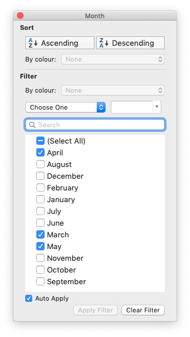

.. _working_with_autofilters:

Working with Autofilters
========================

An autofilter in Excel is a way of filtering a 2D range of data based on some
simple criteria.

.. image:: _images/autofilter1.png

Applying an autofilter
----------------------

The first step is to apply an autofilter to a cell range in a worksheet using
the :func:`autofilter` method::

    worksheet.autofilter('A1:D11')

As usual you can also use :ref:`Row-Column <cell_notation>` notation::

    worksheet.autofilter(0, 0, 10, 3)  # Same as above.

Filter data in an autofilter
----------------------------

The :func:`autofilter` defines the cell range that the filter applies to and
creates drop-down selectors in the heading row. In order to filter out data it
is necessary to apply some criteria to the columns using either the
:func:`filter_column()` or :func:`filter_column_list()` methods.

The ``filter_column`` method is used to filter columns in a autofilter range
based on simple criteria::

    worksheet.filter_column('A', 'x > 2000')
    worksheet.filter_column('B', 'x > 2000 and x < 5000')

It isn't sufficient to just specify the filter condition. You must also hide
any rows that don't match the filter condition. Rows are hidden using the
:func:`set_row()` ``hidden`` parameter. ``XlsxWriter`` cannot filter rows
automatically since this isn't part of the file format.

The following is an example of how you might filter a data range to match an
autofilter criteria::

    # Set the autofilter.
    worksheet.autofilter('A1:D51')

    # Add the filter criteria. The placeholder "Region" in the filter is
    # ignored and can be any string that adds clarity to the expression.
    worksheet.filter_column(0, 'Region == East')

    # Hide the rows that don't match the filter criteria.
    row = 1
    for row_data in (data):
        region = row_data[0]

        # Check for rows that match the filter.
        if region == 'East':
            # Row matches the filter, display the row as normal.
            pass
        else:
            # We need to hide rows that don't match the filter.
            worksheet.set_row(row, options={'hidden': True})

        worksheet.write_row(row, 0, row_data)

        # Move on to the next worksheet row.
        row += 1

Setting a filter criteria for a column
--------------------------------------

The :func:`filter_column` method can be used to filter columns in a autofilter
range based on simple conditions::

    worksheet.filter_column('A', 'x > 2000')

The ``column`` parameter can either be a zero indexed column number or a string
column name.

The following operators are available for setting the filter criteria::

    Operator
       ==
       !=
       >
       <
       >=
       <=

       and
       or

An expression can comprise a single statement or two statements separated by
the ``and`` and ``or`` operators. For example::

    'x <  2000'
    'x >  2000'
    'x == 2000'
    'x >  2000 and x <  5000'
    'x == 2000 or  x == 5000'

Filtering of blank or non-blank data can be achieved by using a value of
``Blanks`` or ``NonBlanks`` in the expression::

    'x == Blanks'
    'x == NonBlanks'

Excel also allows some simple string matching operations::

    'x == b*'      # begins with b
    'x != b*'      # doesn't begin with b
    'x == *b'      # ends with b
    'x != *b'      # doesn't end with b
    'x == *b*'     # contains b
    'x != *b*'     # doesn't contains b

You can also use ``'*'`` to match any character or number and ``'?'`` to match
any single character or number. No other regular expression quantifier is
supported by Excel's filters. Excel's regular expression characters can be
escaped using ``'~'``.

The placeholder variable ``x`` in the above examples can be replaced by any
simple string. The actual placeholder name is ignored internally so the
following are all equivalent::

    'x     < 2000'
    'col   < 2000'
    'Price < 2000'

A filter condition can only be applied to a column in a range specified by the
:func:`autofilter()` method.

Setting a column list filter
----------------------------

Prior to Excel 2007 it was only possible to have either 1 or 2 filter
conditions such as the ones shown above in the :func:`filter_column` method.

Excel 2007 introduced a new list style filter where it is possible to specify 1
or more 'or' style criteria. For example if your column contained data for the
months of the year you could filter the data based on certain months:

The :func:`filter_column_list()` method can be used to represent these types of
filters::

    worksheet.filter_column_list('A', ['March', 'April', 'May'])

One or more criteria can be selected::

    worksheet.filter_column_list('A', ['March'])
    worksheet.filter_column_list('B', [100, 110, 120, 130])

To filter blanks as part of the list use `Blanks` as a list item::

    worksheet.filter_column_list('A', ['March', 'April', 'May', 'Blanks'])

As explained above, it isn't sufficient to just specify filters. You must also
hide any rows that don't match the filter condition.

Example
-------

See :ref:`ex_autofilter` for a full example of all these features.
