.. _working_with_charts:

Working with Charts
===================

This section explains how to work with some of the options and features of
:ref:`chart_class`.

The majority of the examples in this section are based on a variation of the
following program::

    import xlsxwriter

    workbook = xlsxwriter.Workbook('chart_line.xlsx')
    worksheet = workbook.add_worksheet()

    # Add the worksheet data to be plotted.
    data = [10, 40, 50, 20, 10, 50]
    worksheet.write_column('A1', data)

    # Create a new chart object.
    chart = workbook.add_chart({'type': 'line'})

    # Add a series to the chart.
    chart.add_series({'values': '=Sheet1!$A$1:$A$6'})

    # Insert the chart into the worksheet.
    worksheet.insert_chart('C1', chart)

    workbook.close()

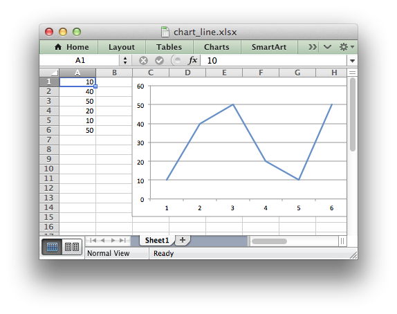

See also :ref:`chart_examples`.

.. _chart_val_cat_axes:

Chart Value and Category Axes
-----------------------------

When working with charts it is important to understand how Excel
differentiates between a chart axis that is used for series categories and a
chart axis that is used for series values.

In the example above the X axis is the **category** axis and each of the values
is evenly spaced and sequential. The Y axis is the **value** axis and points
are displayed according to their value.

Excel treats these two types of axis differently and exposes different
properties for each.

As such some of the ``XlsxWriter`` axis properties can be set for a value axis,
some can be set for a category axis and some properties can be set for both.

For example ``reverse`` can be set for either category or value axes while the
``min`` and ``max`` properties can only be set for value axes (and Date Axes).

:ref:`date_category_axes` are a special type of category axis that give them
some of the properties of Values axes such as ``min`` and ``max`` when used
with date or time values.

.. _chart_series_options:

Chart Series Options
--------------------

This following sections detail the more complex options of the
:func:`add_series()` Chart method::

    marker
    trendline
    y_error_bars
    x_error_bars
    data_labels
    points
    smooth

.. _chart_series_option_marker:

Chart series option: Marker
---------------------------

The marker format specifies the properties of the markers used to distinguish
series on a chart. In general only Line and Scatter chart types and trendlines
use markers.

The following properties can be set for ``marker`` formats in a chart::

    type
    size
    border
    fill
    pattern
    gradient

The ``type`` property sets the type of marker that is used with a series::

    chart.add_series({
        'values': '=Sheet1!$A$1:$A$6',
        'marker': {'type': 'diamond'},
    })

.. image:: _images/chart_marker1.png
   :scale: 75 %

The following ``type`` properties can be set for ``marker`` formats in a chart.
These are shown in the same order as in the Excel format dialog::

    automatic
    none
    square
    diamond
    triangle
    x
    star
    short_dash
    long_dash
    circle
    plus

The ``automatic`` type is a special case which turns on a marker using the
default marker style for the particular series number::

    chart.add_series({
        'values': '=Sheet1!$A$1:$A$6',
        'marker': {'type': 'automatic'},
    })

If ``automatic`` is on then other marker properties such as size, border or
fill cannot be set.

The ``size`` property sets the size of the marker and is generally used in
conjunction with ``type``::

    chart.add_series({
        'values': '=Sheet1!$A$1:$A$6',
        'marker': {'type': 'diamond', 'size': 7},
    })

Nested ``border`` and ``fill`` properties can also be set for a marker::

    chart.add_series({
        'values': '=Sheet1!$A$1:$A$6',
        'marker': {
            'type': 'square',
            'size': 8,
            'border': {'color': 'black'},
            'fill':   {'color': 'red'},
        },
    })

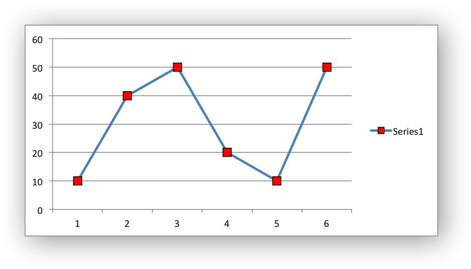

.. _chart_series_option_trendline:

Chart series option: Trendline
------------------------------

A trendline can be added to a chart series to indicate trends in the data such
as a moving average or a polynomial fit.

The following properties can be set for trendlines in a chart series::

    type
    order               (for polynomial trends)
    period              (for moving average)
    forward             (for all except moving average)
    backward            (for all except moving average)
    name
    line
    intercept           (for exponential, linear and polynomial only)
    display_equation    (for all except moving average)
    display_r_squared   (for all except moving average)

The ``type`` property sets the type of trendline in the series::

    chart.add_series({
        'values':    '=Sheet1!$A$1:$A$6',
        'trendline': {'type': 'linear'},
    })

The available ``trendline`` types are::

    exponential
    linear
    log
    moving_average
    polynomial
    power

A ``polynomial`` trendline can also specify the ``order`` of the polynomial.
The default value is 2::

    chart.add_series({
        'values': '=Sheet1!$A$1:$A$6',
        'trendline': {
            'type': 'polynomial',
            'order': 3,
        },
    })

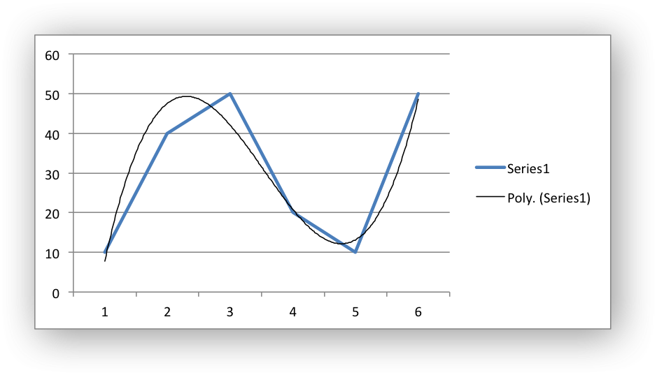

A ``moving_average`` trendline can also specify the ``period`` of the moving
average. The default value is 2::

    chart.add_series({
        'values': '=Sheet1!$A$1:$A$6',
        'trendline': {
            'type': 'moving_average',
            'period': 2,
        },
    })

.. image:: _images/chart_trendline2.png
   :scale: 75 %

The ``forward`` and ``backward`` properties set the forecast period of the
trendline::

    chart.add_series({
        'values': '=Sheet1!$A$1:$A$6',
        'trendline': {
            'type': 'polynomial',
            'name': 'My trend name',
            'order': 2,
        },
    })

The ``name`` property sets an optional name for the trendline that will appear
in the chart legend. If it isn't specified the Excel default name will be
displayed. This is usually a combination of the trendline type and the series
name::

    chart.add_series({
        'values': '=Sheet1!$A$1:$A$6',
        'trendline': {
            'type': 'polynomial',
            'order': 2,
            'forward': 0.5,
            'backward': 0.5,
        },
    })

The ``intercept`` property sets the point where the trendline crosses the Y
(value) axis::

    chart.add_series({
        'values': '=Sheet1!$B$1:$B$5',
        'trendline': {'type': 'linear',
                      'intercept': 0.8,
        },
    })

The ``display_equation`` property displays the trendline equation on the
chart::

    chart.add_series({
        'values': '=Sheet1!$B$1:$B$5',
        'trendline': {'type': 'linear',
                      'display_equation': True,
        },
    })

The ``display_r_squared`` property displays the R squared value of the
trendline on the chart::

    chart.add_series({
        'values': '=Sheet1!$B$1:$B$5',
        'trendline': {'type': 'linear',
                      'display_r_squared': True,
        },
    })

Several of these properties can be set in one go::

    chart.add_series({
        'values': '=Sheet1!$A$1:$A$6',
        'trendline': {
            'type': 'polynomial',
            'name': 'My trend name',
            'order': 2,
            'forward': 0.5,
            'backward': 0.5,
            'display_equation': True,
            'line': {
                'color': 'red',
                'width': 1,
                'dash_type': 'long_dash',
            },
        },
    })

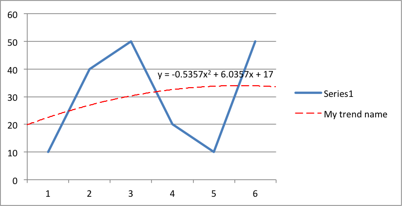

Trendlines cannot be added to series in a stacked chart or pie chart, doughnut
chart, radar chart or (when implemented) to 3D or surface charts.

.. _chart_series_option_error_bars:

Chart series option: Error Bars
-------------------------------

Error bars can be added to a chart series to indicate error bounds in the data.
The error bars can be vertical ``y_error_bars`` (the most common type) or
horizontal ``x_error_bars`` (for Bar and Scatter charts only).

The following properties can be set for error bars in a chart series::

    type
    value        (for all types except standard error and custom)
    plus_values  (for custom only)
    minus_values (for custom only)
    direction
    end_style
    line

The ``type`` property sets the type of error bars in the series::

    chart.add_series({
        'values':       '=Sheet1!$A$1:$A$6',
        'y_error_bars': {'type': 'standard_error'},
    })

.. image:: _images/chart_error_bars1.png
   :scale: 75 %

The available error bars types are available::

    fixed
    percentage
    standard_deviation
    standard_error
    custom

All error bar types, except for ``standard_error`` and ``custom`` must also
have a value associated with it for the error bounds::

    chart.add_series({
        'values': '=Sheet1!$A$1:$A$6',
        'y_error_bars': {
            'type': 'percentage',
            'value': 5,
        },
    })

The ``custom`` error bar type must specify ``plus_values`` and ``minus_values``
which should either by a ``Sheet1!$A$1:$A$5`` type range formula or a list of
values::

     chart.add_series({
         'categories': '=Sheet1!$A$1:$A$5',
         'values':     '=Sheet1!$B$1:$B$5',
         'y_error_bars': {
             'type':         'custom',
             'plus_values':  '=Sheet1!$C$1:$C$5',
             'minus_values': '=Sheet1!$D$1:$D$5',
         },
     })

     # or

     chart.add_series({
         'categories': '=Sheet1!$A$1:$A$5',
         'values':     '=Sheet1!$B$1:$B$5',
         'y_error_bars': {
             'type':         'custom',
             'plus_values':  [1, 1, 1, 1, 1],
             'minus_values': [2, 2, 2, 2, 2],
         },
     })

Note, as in Excel the items in the ``minus_values`` do not need to be negative.

The ``direction`` property sets the direction of the error bars. It should be
one of the following::

    plus   # Positive direction only.
    minus  # Negative direction only.
    both   # Plus and minus directions, The default.

The ``end_style`` property sets the style of the error bar end cap. The options
are 1 (the default) or 0 (for no end cap)::

    chart.add_series({
        'values': '=Sheet1!$A$1:$A$6',
        'y_error_bars': {
            'type': 'fixed',
            'value': 2,
            'end_style': 0,
            'direction': 'minus'
        },
    })

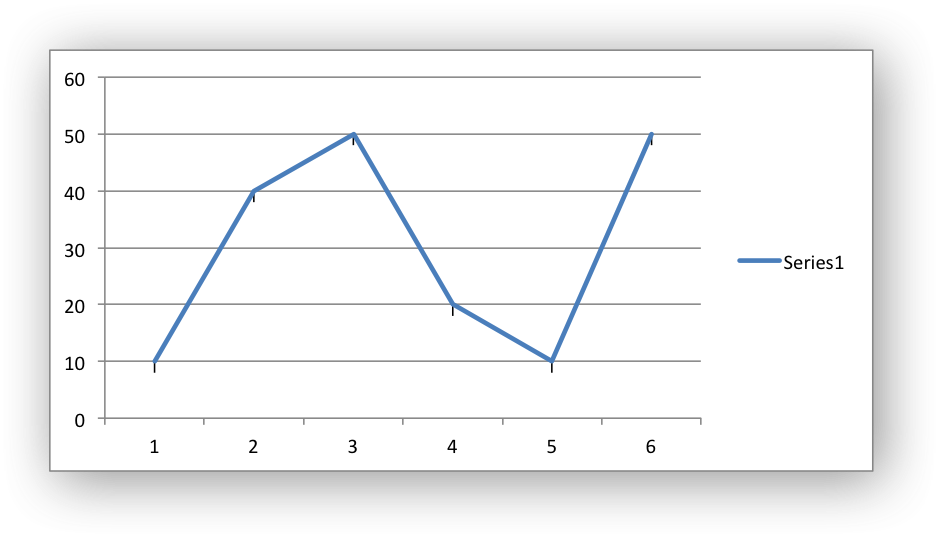

.. _chart_series_option_data_labels:

Chart series option: Data Labels
--------------------------------

Data labels can be added to a chart series to indicate the values of the
plotted data points.

The following properties can be set for ``data_labels`` formats in a chart::

    value
    category
    series_name
    position
    leader_lines
    percentage
    separator
    legend_key
    num_format
    font

The ``value`` property turns on the *Value* data label for a series::

    chart.add_series({
        'values':      '=Sheet1!$A$1:$A$6',
        'data_labels': {'value': True},
    })

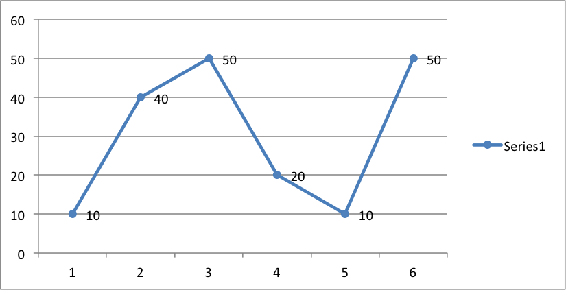

The ``category`` property turns on the *Category Name* data label for a series::

    chart.add_series({
        'values':      '=Sheet1!$A$1:$A$6',
        'data_labels': {'category': True},
    })

The ``series_name`` property turns on the *Series Name* data label for a
series::

    chart.add_series({
        'values':      '=Sheet1!$A$1:$A$6',
        'data_labels': {'series_name': True},
    })

The ``position`` property is used to position the data label for a series::

    chart.add_series({
        'values':      '=Sheet1!$A$1:$A$6',
        'data_labels': {'series_name': True, 'position': 'center'},
    })

In Excel the allowable data label positions vary for different chart types.
The allowable positions are:

+-------------+----------+--------+----------+-------+
| Position    | Line,    | Bar,   | Pie,     | Area, |
|             | Scatter, | Column | Doughnut | Radar |
|             | Stock    |        |          |       |
+=============+==========+========+==========+=======+
| center      | Yes      | Yes    | Yes      | Yes*  |
+-------------+----------+--------+----------+-------+
| right       | Yes*     |        |          |       |
+-------------+----------+--------+----------+-------+
| left        | Yes      |        |          |       |
+-------------+----------+--------+----------+-------+
| above       | Yes      |        |          |       |
+-------------+----------+--------+----------+-------+
| below       | Yes      |        |          |       |
+-------------+----------+--------+----------+-------+
| inside_base |          | Yes    |          |       |
+-------------+----------+--------+----------+-------+
| inside_end  |          | Yes    | Yes      |       |
+-------------+----------+--------+----------+-------+
| outside_end |          | Yes*   | Yes      |       |
+-------------+----------+--------+----------+-------+
| best_fit    |          |        | Yes*     |       |
+-------------+----------+--------+----------+-------+

Note: The * indicates the default position for each chart type in Excel, if
a position isn't specified.

The ``percentage`` property is used to turn on the display of data labels as a
*Percentage* for a series. It is mainly used for pie charts::

    chart.add_series({
        'values':      '=Sheet1!$A$1:$A$6',
        'data_labels': {'percentage': True},
    })

The ``leader_lines`` property is used to turn on *Leader Lines* for the data
label of a series. It is mainly used for pie charts::

    chart.add_series({
        'values':      '=Sheet1!$A$1:$A$6',
        'data_labels': {'value': True, 'leader_lines': True},
    })

.. Note::
  Even when leader lines are turned on they aren't automatically visible in
  Excel or XlsxWriter. Due to an Excel limitation (or design) leader lines
  only appear if the data label is moved manually or if the data labels are
  very close and need to be adjusted automatically.

The ``separator`` property is used to change the separator between multiple
data label items::

    chart.add_series({
        'values':      '=Sheet1!$A$1:$A$6',
        'data_labels': {'value': True, 'category': True, 'separator': "\n"},
    })

The separator value must be one of the following strings::

            ','
            ';'
            '.'
            '\n'
            ' '

The ``legend_key`` property is used to turn on the *Legend Key* for the data
label of a series::

    chart.add_series({
        'values':      '=Sheet1!$A$1:$A$6',
        'data_labels': {'value': True, 'legend_key': True},
    })

The ``num_format`` property is used to set the number format for the data
labels of a series::

     chart.add_series({
         'values':      '=Sheet1!$A$1:$A$5',
         'data_labels': {'value': True, 'num_format': '#,##0.00'},
     })

The number format is similar to the Worksheet Cell Format ``num_format``
apart from the fact that a format index cannot be used. An explicit format
string must be used as shown above. See :func:`set_num_format()` for more
information.

The ``font`` property is used to set the font of the data labels of a series::

     chart.add_series({
         'values': '=Sheet1!$A$1:$A$5',
         'data_labels': {
             'value': True,
             'font': {'name': 'Consolas'}
         },
     })

The ``font`` property is also used to rotate the data labels of a series::

     chart.add_series({
         'values': '=Sheet1!$A$1:$A$5',
         'data_labels': {
             'value': True,
             'font': {'rotation': 45}
         },
     })

See :ref:`chart_fonts`.

.. _chart_series_option_points:

Chart series option: Points
---------------------------

In general formatting is applied to an entire series in a chart. However, it
is occasionally required to format individual points in a series. In
particular this is required for Pie/Doughnut charts where each segment is
represented by a point.

In these cases it is possible to use the ``points`` property of
:func:`add_series()`::

    import xlsxwriter

    workbook = xlsxwriter.Workbook('chart_pie.xlsx')

    worksheet = workbook.add_worksheet()
    chart = workbook.add_chart({'type': 'pie'})

    data = [
        ['Pass', 'Fail'],
        [90, 10],
    ]

    worksheet.write_column('A1', data[0])
    worksheet.write_column('B1', data[1])

    chart.add_series({
        'categories': '=Sheet1!$A$1:$A$2',
        'values':     '=Sheet1!$B$1:$B$2',
        'points': [
            {'fill': {'color': 'green'}},
            {'fill': {'color': 'red'}},
        ],
    })

    worksheet.insert_chart('C3', chart)

    workbook.close()

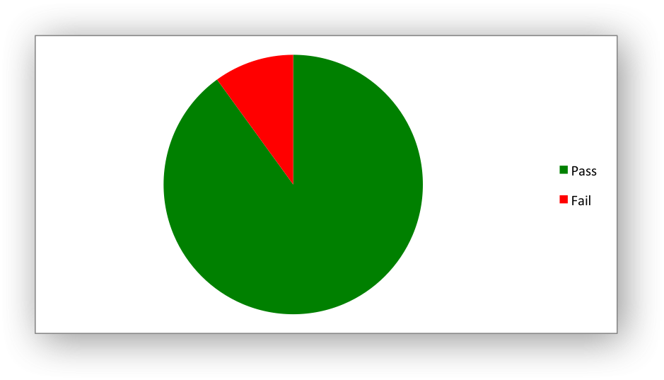

The ``points`` property takes a list of format options (see the "Chart
Formatting" section below). To assign default properties to points in a series
pass ``None`` values in the array ref::

    # Format point 3 of 3 only.
    chart.add_series({
        'values': '=Sheet1!A1:A3',
        'points': [
            None,
            None,
            {'fill': {'color': '#990000'}},
        ],
    })

    # Format point 1 of 3 only.
    chart.add_series({
        'values': '=Sheet1!A1:A3',
        'points': [
            {'fill': {'color': '#990000'}},
        ],
    })

Chart series option: Smooth
---------------------------

The ``smooth`` option is used to set the smooth property of a line series. It
is only applicable to the ``line`` and ``scatter`` chart types::

    chart.add_series({
        'categories': '=Sheet1!$A$1:$A$5',
        'values':     '=Sheet1!$B$1:$B$5',
        'smooth':     True,
    })

.. _chart_formatting:

Chart Formatting
----------------

The following chart formatting properties can be set for any chart object that
they apply to (and that are supported by XlsxWriter) such as chart lines,
column fill areas, plot area borders, markers, gridlines and other chart
elements::

    line
    border
    fill
    pattern
    gradient

Chart formatting properties are generally set using dicts::

    chart.add_series({
        'values': '=Sheet1!$A$1:$A$6',
        'line':   {'color': 'red'},
    })

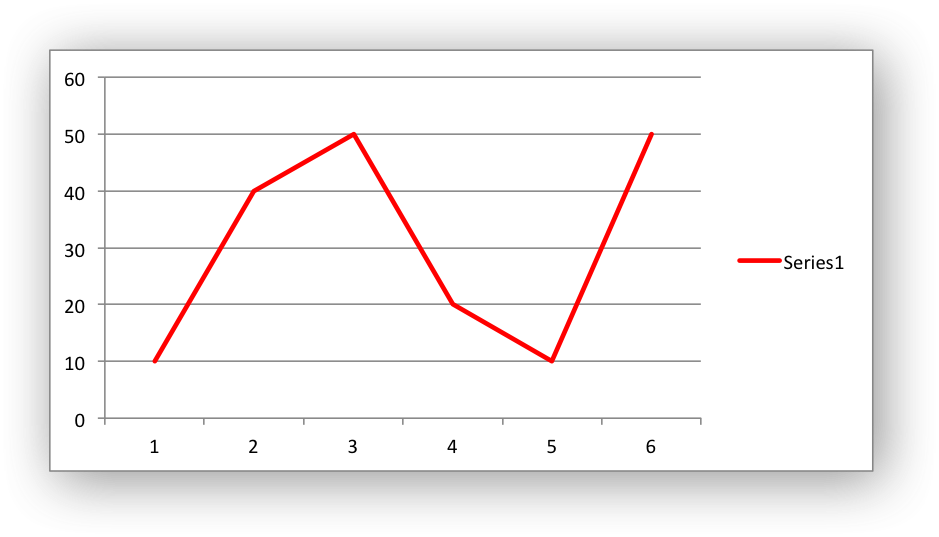

In some cases the format properties can be nested. For example a ``marker`` may
contain ``border`` and ``fill`` sub-properties::

    chart.add_series({
        'values': '=Sheet1!$A$1:$A$6',
        'line':   {'color': 'blue'},
        'marker': {'type': 'square',
                   'size,': 5,
                   'border': {'color': 'red'},
                   'fill':   {'color': 'yellow'}
        },
    })

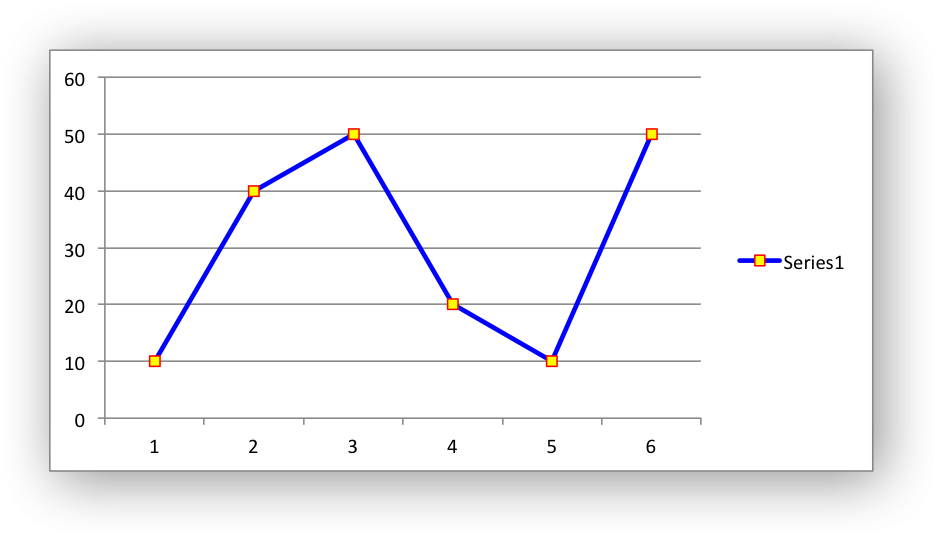

.. _chart_formatting_line:

Chart formatting: Line
----------------------

The line format is used to specify properties of line objects that appear in a
chart such as a plotted line on a chart or a border.

The following properties can be set for ``line`` formats in a chart::

    none
    color
    width
    dash_type

The ``none`` property is uses to turn the ``line`` off (it is always on by
default except in Scatter charts). This is useful if you wish to plot a series
with markers but without a line::

    chart.add_series({
        'values': '=Sheet1!$A$1:$A$6',
        'line':   {'none': True},
        'marker': {'type': 'automatic'},
    })

.. image:: _images/chart_formatting3.png
   :scale: 75 %

The ``color`` property sets the color of the ``line``::

    chart.add_series({
        'values': '=Sheet1!$A$1:$A$6',
        'line':   {'color': 'red'},
    })

The available colors are shown in the main XlsxWriter documentation. It is
also possible to set the color of a line with a Html style ``#RRGGBB`` string
or a limited number of named colors, see :ref:`colors`::

    chart.add_series({
        'values': '=Sheet1!$A$1:$A$6',
        'line':   {'color': '#FF9900'},
    })

.. image:: _images/chart_formatting4.png
   :scale: 75 %

The ``width`` property sets the width of the ``line``. It should be specified
in increments of 0.25 of a point as in Excel::

    chart.add_series({
        'values': '=Sheet1!$A$1:$A$6',
        'line':   {'width': 3.25},
    })

The ``dash_type`` property sets the dash style of the line::

    chart.add_series({
        'values': '=Sheet1!$A$1:$A$6',
        'line':   {'dash_type': 'dash_dot'},
    })

.. image:: _images/chart_formatting5.png
   :scale: 75 %

The following ``dash_type`` values are available. They are shown in the order
that they appear in the Excel dialog::

    solid
    round_dot
    square_dot
    dash
    dash_dot
    long_dash
    long_dash_dot
    long_dash_dot_dot

The default line style is ``solid``.

More than one ``line`` property can be specified at a time::

    chart.add_series({
        'values': '=Sheet1!$A$1:$A$6',
         'line': {
             'color': 'red',
             'width': 1.25,
             'dash_type': 'square_dot',
         },
    })

.. _chart_formatting_border:

Chart formatting: Border
------------------------

The ``border`` property is a synonym for ``line``.

It can be used as a descriptive substitute for ``line`` in chart types such as
Bar and Column that have a border and fill style rather than a line style. In
general chart objects with a ``border`` property will also have a fill
property.

.. _chart_formatting_fill:

Chart formatting: Solid Fill
----------------------------

The solid fill format is used to specify filled areas of chart objects such as
the interior of a column or the background of the chart itself.

The following properties can be set for ``fill`` formats in a chart::

    none
    color
    transparency

The ``none`` property is used to turn the ``fill`` property off (it is
generally on by default)::

    chart.add_series({
        'values': '=Sheet1!$A$1:$A$6',
        'fill':   {'none': True},
        'border': {'color': 'black'}
    })

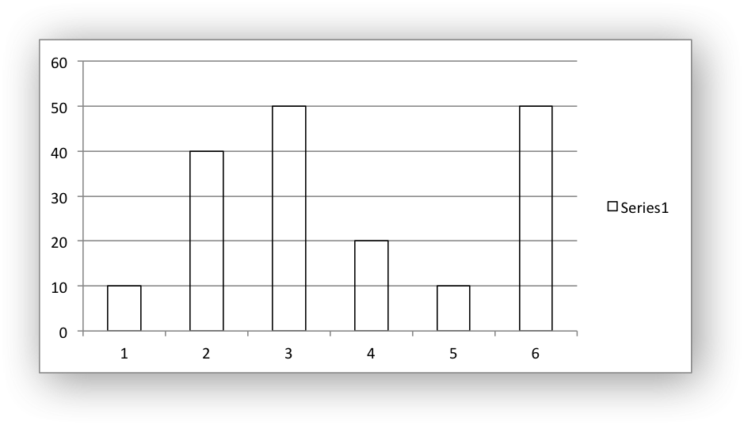

The ``color`` property sets the color of the ``fill`` area::

    chart.add_series({
        'values': '=Sheet1!$A$1:$A$6',
        'fill':   {'color': 'red'}
    })

The available colors are shown in the main XlsxWriter documentation. It is
also possible to set the color of a fill with a Html style ``#RRGGBB`` string
or a limited number of named colors, see :ref:`colors`::

    chart.add_series({
        'values': '=Sheet1!$A$1:$A$6',
        'fill':   {'color': '#FF9900'}
    })

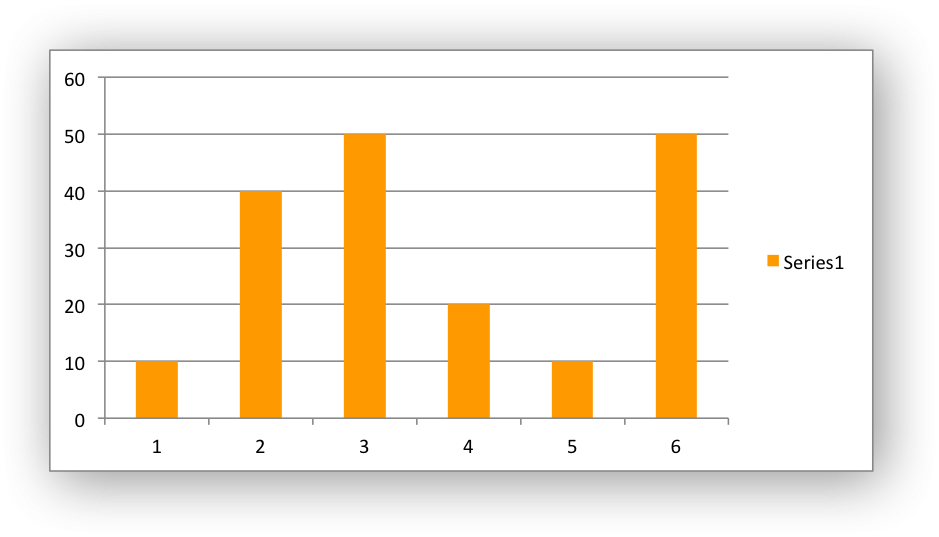

The ``transparency`` property sets the transparency of the solid fill color in
the integer range 1 - 100::

    chart.set_chartarea({'fill': {'color': 'yellow', 'transparency': 75}})

The ``fill`` format is generally used in conjunction with a ``border`` format
which has the same properties as a ``line`` format::

    chart.add_series({
        'values': '=Sheet1!$A$1:$A$6',
        'fill':   {'color': 'red'},
        'border': {'color': 'black'}
    })

.. _chart_formatting_pattern:

Chart formatting: Pattern Fill
------------------------------

The pattern fill format is used to specify pattern filled areas of chart
objects such as the interior of a column or the background of the chart
itself.

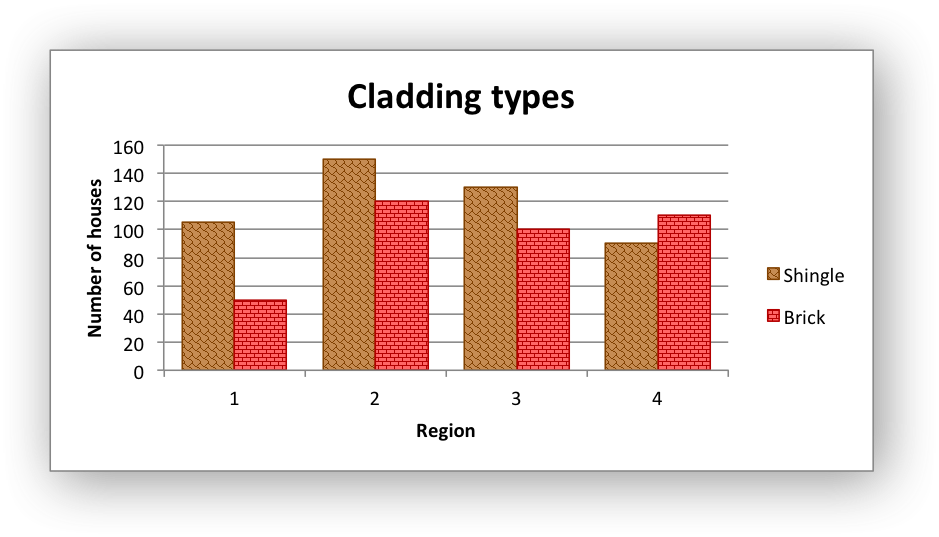

The following properties can be set for ``pattern`` fill formats in a chart::

    pattern:   the pattern to be applied (required)
    fg_color:  the foreground color of the pattern (required)
    bg_color:  the background color (optional, defaults to white)

For example::

    chart.set_plotarea({
        'pattern': {
            'pattern': 'percent_5',
            'fg_color': 'red',
            'bg_color': 'yellow',
        }
    })

The following patterns can be applied:

* ``percent_5``
* ``percent_10``
* ``percent_20``
* ``percent_25``
* ``percent_30``
* ``percent_40``
* ``percent_50``
* ``percent_60``
* ``percent_70``
* ``percent_75``
* ``percent_80``
* ``percent_90``
* ``light_downward_diagonal``
* ``light_upward_diagonal``
* ``dark_downward_diagonal``
* ``dark_upward_diagonal``
* ``wide_downward_diagonal``
* ``wide_upward_diagonal``
* ``light_vertical``
* ``light_horizontal``
* ``narrow_vertical``
* ``narrow_horizontal``
* ``dark_vertical``
* ``dark_horizontal``
* ``dashed_downward_diagonal``
* ``dashed_upward_diagonal``
* ``dashed_horizontal``
* ``dashed_vertical``
* ``small_confetti``
* ``large_confetti``
* ``zigzag``
* ``wave``
* ``diagonal_brick``
* ``horizontal_brick``
* ``weave``
* ``plaid``
* ``divot``
* ``dotted_grid``
* ``dotted_diamond``
* ``shingle``
* ``trellis``
* ``sphere``
* ``small_grid``
* ``large_grid``
* ``small_check``
* ``large_check``
* ``outlined_diamond``
* ``solid_diamond``

The foreground color, ``fg_color``, is a required parameter and can be a Html
style ``#RRGGBB`` string or a limited number of named colors, see
:ref:`colors`.

The background color, ``bg_color``, is optional and defaults to black.

If a pattern fill is used on a chart object it overrides the solid fill
properties of the object.

.. _chart_formatting_gradient:

Chart formatting: Gradient Fill
-------------------------------

The gradient fill format is used to specify gradient filled areas of chart
objects such as the interior of a column or the background of the chart
itself.

.. image:: _images/chart_gradient.png
   :scale: 75 %

The following properties can be set for ``gradient`` fill formats in a chart::

    colors:    a list of colors
    positions: an optional list of positions for the colors
    type:      the optional type of gradient fill
    angle:     the optional angle of the linear fill

The ``colors`` property sets a list of colors that define the ``gradient``::

    chart.set_plotarea({
        'gradient': {'colors': ['#FFEFD1', '#F0EBD5', '#B69F66']}
    })

Excel allows between 2 and 10 colors in a gradient but it is unlikely that
you will require more than 2 or 3.

As with solid or pattern fill it is also possible to set the colors of a
gradient with a Html style ``#RRGGBB`` string or a limited number of named
colors, see :ref:`colors`::

    chart.add_series({
        'values':   '=Sheet1!$A$1:$A$6',
        'gradient': {'colors': ['red', 'green']}
    })

The ``positions`` defines an optional list of positions, between 0 and 100, of
where the colors in the gradient are located. Default values are provided for
``colors`` lists of between 2 and 4 but they can be specified if required::

    chart.add_series({
        'values': '=Sheet1!$A$1:$A$5',
        'gradient': {
            'colors':    ['#DDEBCF', '#156B13'],
            'positions': [10,        90],
        }
    })

The ``type`` property can have one of the following values::

    linear        (the default)
    radial
    rectangular
    path

For example::

    chart.add_series({
        'values': '=Sheet1!$A$1:$A$5',
        'gradient': {
            'colors': ['#DDEBCF', '#9CB86E', '#156B13'],
            'type': 'radial'
        }
    })

If ``type`` isn't specified it defaults to ``linear``.

For a ``linear`` fill the angle of the gradient can also be specified::

    chart.add_series({
        'values': '=Sheet1!$A$1:$A$5',
        'gradient': {'colors': ['#DDEBCF', '#9CB86E', '#156B13'],
                     'angle': 45}
    })

The default angle is 90 degrees.

If gradient fill is used on a chart object it overrides the solid fill and
pattern fill properties of the object.

.. _chart_fonts:

Chart Fonts
-----------

The following font properties can be set for any chart object that they apply
to (and that are supported by XlsxWriter) such as chart titles, axis labels,
axis numbering and data labels::

    name
    size
    bold
    italic
    underline
    rotation
    color

These properties correspond to the equivalent Worksheet cell Format object
properties. See the :ref:`format` section for more details about Format
properties and how to set them.

The following explains the available font properties:

* ``name``: Set the font name::

    chart.set_x_axis({'num_font':  {'name': 'Arial'}})

* ``size``: Set the font size::

    chart.set_x_axis({'num_font':  {'name': 'Arial', 'size': 9}})

* ``bold``: Set the font bold property::

    chart.set_x_axis({'num_font':  {'bold': True}})

* ``italic``: Set the font italic property::

    chart.set_x_axis({'num_font':  {'italic': True}})

* ``underline``: Set the font underline property::

    chart.set_x_axis({'num_font':  {'underline': True}})

* ``rotation``: Set the font rotation, angle, property in the range -90 to 90 deg::

    chart.set_x_axis({'num_font':  {'rotation': 45}})

  This is useful for displaying axis data such as dates in a more compact
  format.

* ``color``: Set the font color property. Can be a color index, a color name
  or HTML style RGB color::

    chart.set_x_axis({'num_font': {'color': 'red' }})
    chart.set_y_axis({'num_font': {'color': '#92D050'}})

Here is an example of Font formatting in a Chart program::

    chart.set_title({
        'name': 'Test Results',
        'name_font': {
            'name': 'Calibri',
            'color': 'blue',
        },
    })

    chart.set_x_axis({
        'name': 'Month',
        'name_font': {
            'name': 'Courier New',
            'color': '#92D050'
        },
        'num_font': {
            'name': 'Arial',
            'color': '#00B0F0',
        },
    })

    chart.set_y_axis({
        'name': 'Units',
        'name_font': {
            'name': 'Century',
            'color': 'red'
        },
        'num_font': {
            'bold': True,
            'italic': True,
            'underline': True,
            'color': '#7030A0',
        },
    })

    chart.set_legend({'font': {'bold': 1, 'italic': 1}})

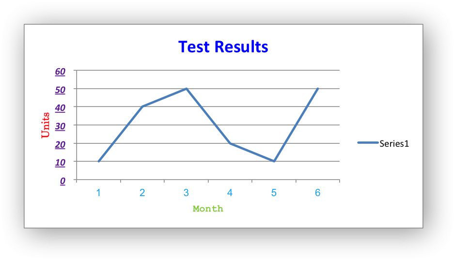

.. _chart_layout:

Chart Layout
------------

The position of the chart in the worksheet is controlled by the
:func:`set_size()` method.

It is also possible to change the layout of the following chart sub-objects::

    plotarea
    legend
    title
    x_axis caption
    y_axis caption

Here are some examples::

        chart.set_plotarea({
            'layout': {
                'x':      0.13,
                'y':      0.26,
                'width':  0.73,
                'height': 0.57,
            }
        })

        chart.set_legend({
            'layout': {
                'x':      0.80,
                'y':      0.37,
                'width':  0.12,
                'height': 0.25,
            }
        })

        chart.set_title({
            'name':    'Title',
            'overlay': True,
            'layout': {
                'x': 0.42,
                'y': 0.14,
            }
        })

        chart.set_x_axis({
            'name': 'X axis',
            'name_layout': {
                'x': 0.34,
                'y': 0.85,
            }
        })

See :func:`set_plotarea()`, :func:`set_legend()`, :func:`set_title()` and
:func:`set_x_axis()`,

.. note::

   It is only possible to change the width and height for the ``plotarea``
   and ``legend`` objects. For the other text based objects the width and
   height are changed by the font dimensions.

The layout units must be a float in the range ``0 < x <= 1`` and are expressed
as a percentage of the chart dimensions as shown below:

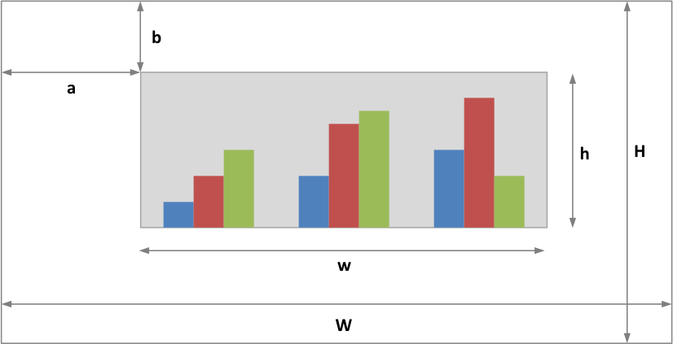

From this the layout units are calculated as follows::

    layout:
        x      = a / W
        y      = b / H
        width  = w / W
        height = h / H

These units are cumbersome and can vary depending on other elements in the
chart such as text lengths. However, these are the units that are required by
Excel to allow relative positioning. Some trial and error is generally
required.

.. note::

   The ``plotarea`` origin is the top left corner in the plotarea itself and
   does not take into account the axes.

.. _date_category_axes:

Date Category Axes
------------------

Date Category Axes are category axes that display time or date information. In
XlsxWriter Date Category Axes are set using the ``date_axis`` option in
:func:`set_x_axis` or :func:`set_y_axis`::

    chart.set_x_axis({'date_axis': True})

In general you should also specify a number format for a date axis although
Excel will usually default to the same format as the data being plotted::

    chart.set_x_axis({
        'date_axis':  True,
        'num_format': 'dd/mm/yyyy',
    })

Excel doesn't normally allow minimum and maximum values to be set for category
axes. However, date axes are an exception. The ``min`` and ``max`` values
should be set as Excel times or dates::

    chart.set_x_axis({
        'date_axis': True,
        'min': date(2013, 1, 2),
        'max': date(2013, 1, 9),
        'num_format': 'dd/mm/yyyy',
    })

For date axes it is also possible to set the type of the major and minor units::

    chart.set_x_axis({
        'date_axis':       True,
        'minor_unit':      4,
        'minor_unit_type': 'months',
        'major_unit':      1,
        'major_unit_type': 'years',
        'num_format':      'dd/mm/yyyy',
    })

See :ref:`ex_chart_date_axis`.

.. _chart_secondary_axes:

Chart Secondary Axes
--------------------

It is possible to add a secondary axis of the same type to a chart by setting
the ``y2_axis`` or ``x2_axis`` property of the series::

    import xlsxwriter

    workbook = xlsxwriter.Workbook('chart_secondary_axis.xlsx')
    worksheet = workbook.add_worksheet()

    data = [
        [2, 3, 4, 5, 6, 7],
        [10, 40, 50, 20, 10, 50],
    ]

    worksheet.write_column('A2', data[0])
    worksheet.write_column('B2', data[1])

    chart = workbook.add_chart({'type': 'line'})

    # Configure a series with a secondary axis.
    chart.add_series({
        'values': '=Sheet1!$A$2:$A$7',
        'y2_axis': True,
    })

    # Configure a primary (default) Axis.
    chart.add_series({
        'values': '=Sheet1!$B$2:$B$7',
    })

    chart.set_legend({'position': 'none'})

    chart.set_y_axis({'name': 'Primary Y axis'})
    chart.set_y2_axis({'name': 'Secondary Y axis'})

    worksheet.insert_chart('D2', chart)

    workbook.close()

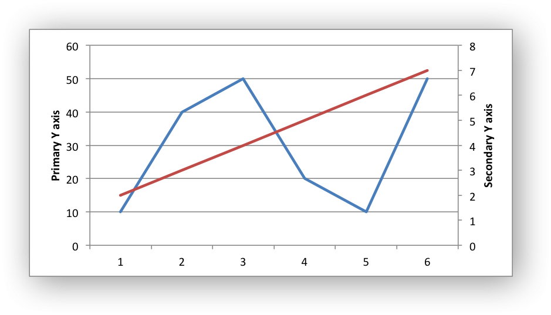

It is also possible to have a secondary, combined, chart either with a shared
or secondary axis, see below.

.. _chart_combined_charts:

Combined Charts
---------------

It is also possible to combine two different chart types, for example a column
and line chart to create a Pareto chart using the Chart :func:`combine()`
method:

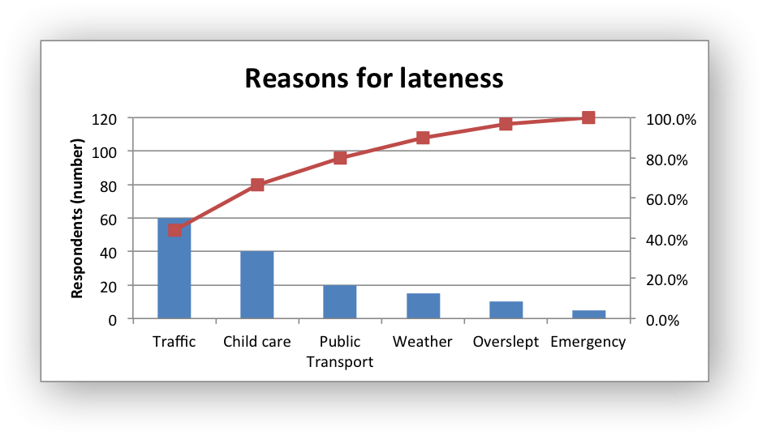

The combined charts can share the same Y axis like the following example::

    # Usual setup to create workbook and add data...

    # Create a new column chart. This will use this as the primary chart.
    column_chart = workbook.add_chart({'type': 'column'})

    # Configure the data series for the primary chart.
    column_chart.add_series({
        'name':       '=Sheet1!B1',
        'categories': '=Sheet1!A2:A7',
        'values':     '=Sheet1!B2:B7',
    })

    # Create a new column chart. This will use this as the secondary chart.
    line_chart = workbook.add_chart({'type': 'line'})

    # Configure the data series for the secondary chart.
    line_chart.add_series({
        'name':       '=Sheet1!C1',
        'categories': '=Sheet1!A2:A7',
        'values':     '=Sheet1!C2:C7',
    })

    # Combine the charts.
    column_chart.combine(line_chart)

    # Add a chart title and some axis labels. Note, this is done via the
    # primary chart.
    column_chart.set_title({ 'name': 'Combined chart - same Y axis'})
    column_chart.set_x_axis({'name': 'Test number'})
    column_chart.set_y_axis({'name': 'Sample length (mm)'})

    # Insert the chart into the worksheet
    worksheet.insert_chart('E2', column_chart)

.. image:: _images/chart_combined1.png
   :scale: 75 %

The secondary chart can also be placed on a secondary axis using the methods
shown in the previous section.

In this case it is just necessary to add a ``y2_axis`` parameter to the series
and, if required, add a title using :func:`set_y2_axis()`. The following are
the additions to the previous example to place the secondary chart on the
secondary axis::

    # ...
    line_chart.add_series({
        'name':       '=Sheet1!C1',
        'categories': '=Sheet1!A2:A7',
        'values':     '=Sheet1!C2:C7',
        'y2_axis':    True,
    })

    # Add a chart title and some axis labels.
    # ...
    column_chart.set_y2_axis({'name': 'Target length (mm)'})

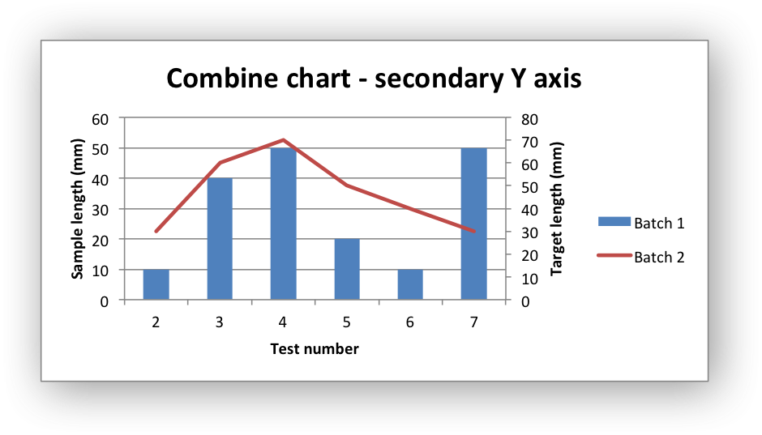

The examples above use the concept of a *primary* and *secondary* chart. The
primary chart is the chart that defines the primary X and Y axis. It is also
used for setting all chart properties apart from the secondary data
series. For example the chart title and axes properties should be set via the
primary chart.

See also :ref:`ex_chart_combined` and :ref:`ex_chart_pareto` for more detailed
examples.

There are some limitations on combined charts:

* Pie charts cannot currently be combined.
* Scatter charts cannot currently be used as a primary chart but they can be
  used as a secondary chart.
* Bar charts can only combined secondary charts on a secondary axis. This is
  an Excel limitation.

Chartsheets
-----------

The examples shown above and in general the most common type of charts in Excel
are embedded charts.

However, it is also possible to create "Chartsheets" which are worksheets that
are comprised of a single chart:

.. image:: _images/chartsheet.png

See :ref:`chartsheet` for details.

.. _charts_from_tables:

Charts from Worksheet Tables
----------------------------

Charts can by created from :ref:`Worksheet Tables <tables>`. However, Excel
has a limitation where the data series ``name``, if specified, must refer to a
cell within the table (usually one of the headers).

To workaround this Excel limitation you can specify a user defined name in the
table and refer to that from the chart::

    import xlsxwriter

    workbook = xlsxwriter.Workbook('chart_pie.xlsx')

    worksheet = workbook.add_worksheet()

    data = [
        ['Apple',  60],
        ['Cherry', 30],
        ['Pecan',  10],
    ]

    worksheet.add_table('A1:B4', {'data': data,
                                  'columns': [{'header': 'Types'},
                                             {'header': 'Number'}]}
    )

    chart = workbook.add_chart({'type': 'pie'})

    chart.add_series({
        'name':       '=Sheet1!$A$1',
        'categories': '=Sheet1!$A$2:$A$4',
        'values':     '=Sheet1!$B$2:$B$4',
    })

    worksheet.insert_chart('D2', chart)

    workbook.close()

Chart Limitations
-----------------

The following chart features aren't supported in XlsxWriter:

* 3D charts and controls.
* Bubble, Surface or other chart types not listed in :ref:`chart_class`.

Chart Examples
--------------

See :ref:`chart_examples`.
