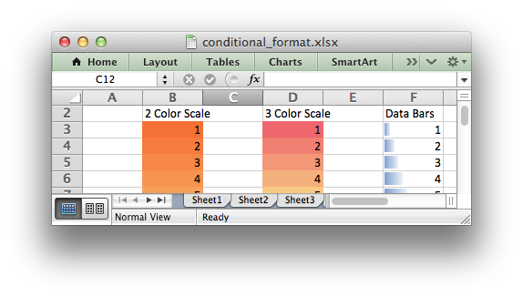

.. _working_with_conditional_formats:

Working with Conditional Formatting
===================================

Conditional formatting is a feature of Excel which allows you to apply a format
to a cell or a range of cells based on certain criteria.

For example the following rules are used to highlight cells in the
:ref:`conditional_format.py <ex_cond_format>` example::

    worksheet.conditional_format('B3:K12', {'type':     'cell',
                                            'criteria': '>=',
                                            'value':    50,
                                            'format':   format1})

    worksheet.conditional_format('B3:K12', {'type':     'cell',
                                            'criteria': '<',
                                            'value':    50,
                                            'format':   format2})

Which gives criteria like this:

.. image:: _images/conditional_format3.png

And output which looks like this:

.. image:: _images/conditional_format1.png

It is also possible to create color scales and data bars:

.. image:: _images/conditional_format2.png

The conditional_format() method
-------------------------------

The :func:`conditional_format` worksheet method is used to apply formatting
based on user defined criteria to an XlsxWriter file.

The conditional format can be applied to a single cell or a range of cells. As
usual you can use A1 or Row/Column notation (:ref:`cell_notation`).

With Row/Column notation you must specify all four cells in the range:
``(first_row, first_col, last_row, last_col)``. If you need to refer to a
single cell set the ``last_*`` values equal to the ``first_*`` values. With A1
notation you can refer to a single cell or a range of cells::

    worksheet.conditional_format(0, 0, 4, 1, {...})
    worksheet.conditional_format('B1',       {...})
    worksheet.conditional_format('C1:E5',    {...})

The options parameter in ``conditional_format()`` must be a dictionary
containing the parameters that describe the type and style of the conditional
format. The main parameters are:

* ``type``
* ``format``
* ``criteria``
* ``value``
* ``minimum``
* ``maximum``

Other, less commonly used parameters are:

* ``min_type``
* ``mid_type``
* ``max_type``
* ``min_value``
* ``mid_value``
* ``max_value``
* ``min_color``
* ``mid_color``
* ``max_color``
* ``bar_color``
* ``multi_range``

Conditional Format Options
--------------------------

The conditional format options that can be used with :func:`conditional_format`
are explained in the following sections.

type
****

The ``type`` option is a required parameter and it has no default value.
Allowable ``type`` values and their associated parameters are:

+---------------+------------+
| Type          | Parameters |
+===============+============+
| cell          | criteria   |
+---------------+------------+
|               | value      |
+---------------+------------+
|               | minimum    |
+---------------+------------+
|               | maximum    |
+---------------+------------+
| date          | criteria   |
+---------------+------------+
|               | value      |
+---------------+------------+
|               | minimum    |
+---------------+------------+
|               | maximum    |
+---------------+------------+
| time_period   | criteria   |
+---------------+------------+
| text          | criteria   |
+---------------+------------+
|               | value      |
+---------------+------------+
| average       | criteria   |
+---------------+------------+
| duplicate     | (none)     |
+---------------+------------+
| unique        | (none)     |
+---------------+------------+
| top           | criteria   |
+---------------+------------+
|               | value      |
+---------------+------------+
| bottom        | criteria   |
+---------------+------------+
|               | value      |
+---------------+------------+
| blanks        | (none)     |
+---------------+------------+
| no_blanks     | (none)     |
+---------------+------------+
| errors        | (none)     |
+---------------+------------+
| no_errors     | (none)     |
+---------------+------------+
| 2_color_scale | min_type   |
+---------------+------------+
|               | max_type   |
+---------------+------------+
|               | min_value  |
+---------------+------------+
|               | max_value  |
+---------------+------------+
|               | min_color  |
+---------------+------------+
|               | max_color  |
+---------------+------------+
| 3_color_scale | min_type   |
+---------------+------------+
|               | mid_type   |
+---------------+------------+
|               | max_type   |
+---------------+------------+
|               | min_value  |
+---------------+------------+
|               | mid_value  |
+---------------+------------+
|               | max_value  |
+---------------+------------+
|               | min_color  |
+---------------+------------+
|               | mid_color  |
+---------------+------------+
|               | max_color  |
+---------------+------------+
| data_bar      | min_type   |
+---------------+------------+
|               | max_type   |
+---------------+------------+
|               | min_value  |
+---------------+------------+
|               | max_value  |
+---------------+------------+
|               | bar_color  |
+---------------+------------+
| formula       | criteria   |
+---------------+------------+

All conditional formatting types have an associated :ref:`Format <format>`
parameter, see below.

type: cell
**********

This is the most common conditional formatting type. It is used when a format
is applied to a cell based on a simple criterion.

For example using a single cell and the ``greater than`` criteria::

    worksheet.conditional_format('A1', {'type':     'cell',
                                        'criteria': 'greater than',
                                        'value':     5,
                                        'format':    red_format})

Or, using a range and the ``between`` criteria::

    worksheet.conditional_format('C1:C4', {'type':     'cell',
                                           'criteria': 'between',
                                           'minimum':  20,
                                           'maximum':  30,
                                           'format':   green_format})

Other types are shown below, after the other main options.

criteria:
*********

The ``criteria`` parameter is used to set the criteria by which the cell data
will be evaluated. It has no default value. The most common criteria as
applied to ``{'type': 'cell'}`` are:

+------------------------------+--------+
| ``between``                  |        |
+------------------------------+--------+
| ``not between``              |        |
+------------------------------+--------+
| ``equal to``                 | ``==`` |
+------------------------------+--------+
| ``not equal to``             | ``!=`` |
+------------------------------+--------+
| ``greater than``             | ``>``  |
+------------------------------+--------+
| ``less than``                | ``<``  |
+------------------------------+--------+
| ``greater than or equal to`` | ``>=`` |
+------------------------------+--------+
| ``less than or equal to``    | ``<=`` |
+------------------------------+--------+

You can either use Excel's textual description strings, in the first column
above, or the more common symbolic alternatives.

Additional criteria which are specific to other conditional format types are
shown in the relevant sections below.

value:
******

The ``value`` is generally used along with the ``criteria`` parameter to set
the rule by which the cell data will be evaluated::

    worksheet.conditional_format('A1', {'type':     'cell',
                                        'criteria': 'greater than',
                                        'value':    5,
                                        'format':   red_format})

The ``value`` property can also be an cell reference::

    worksheet.conditional_format('A1', {'type':     'cell',
                                        'criteria': 'greater than',
                                        'value':    '$C$1',
                                        'format':   red_format})

.. note::

   In general any ``value`` property that refers to a cell reference should
   use an :ref:`absolute reference <abs_reference>`, especially if the
   conditional formatting is applied to a range of values. Without an absolute
   cell reference the conditional format will not be applied correctly by
   Excel from the first cell in the formatted range.

format:
*******

The ``format`` parameter is used to specify the format that will be applied to
the cell when the conditional formatting criterion is met. The format is
created using the :func:`add_format()` method in the same way as cell formats::

    format1 = workbook.add_format({'bold': 1, 'italic': 1})

    worksheet.conditional_format('A1', {'type':     'cell',
                                        'criteria': '>',
                                        'value':    5,
                                        'format':   format1})

.. Note::

   In Excel, a conditional format is superimposed over the existing cell
   format and not all cell format properties can be modified. Properties that
   **cannot** be modified in a conditional format are font name, font size,
   superscript and subscript, diagonal borders, all alignment properties and
   all protection properties.

Excel specifies some default formats to be used with conditional formatting.
These can be replicated using the following XlsxWriter formats::

    # Light red fill with dark red text.
    format1 = workbook.add_format({'bg_color':   '#FFC7CE',
                                   'font_color': '#9C0006'})

    # Light yellow fill with dark yellow text.
    format2 = workbook.add_format({'bg_color':   '#FFEB9C',
                                   'font_color': '#9C6500'})

    # Green fill with dark green text.
    format3 = workbook.add_format({'bg_color':   '#C6EFCE',
                                   'font_color': '#006100'})

See also :ref:`format`.

minimum:
********

The ``minimum`` parameter is used to set the lower limiting value when the
``criteria`` is either ``'between'`` or ``'not between'``::

        worksheet.conditional_format('A1', {'type':     'cell',
                                            'criteria': 'between',
                                            'minimum':  2,
                                            'maximum':  6,
                                            'format':   format1,
                                            })

maximum:
********

The ``maximum`` parameter is used to set the upper limiting value when the
``criteria`` is either ``'between'`` or ``'not between'``. See the previous
example.

type: date
**********

The ``date`` type is similar the ``cell`` type and uses the same criteria and
values. However, the ``value``, ``minimum`` and ``maximum`` properties are
specified as a datetime object as shown in :ref:`working_with_dates_and_time`::

    date = datetime.datetime.strptime('2011-01-01', "%Y-%m-%d")

    worksheet.conditional_format('A1:A4', {'type':     'date',
                                           'criteria': 'greater than',
                                           'value':    date,
                                           'format':   format1})

type: time_period
*****************

The ``time_period`` type is used to specify Excel's "Dates Occurring" style
conditional format::

    worksheet.conditional_format('A1:A4', {'type':     'time_period',
                                           'criteria': 'yesterday',
                                           'format':   format1})

The period is set in the ``criteria`` and can have one of the following values::

        'criteria': 'yesterday',
        'criteria': 'today',
        'criteria': 'last 7 days',
        'criteria': 'last week',
        'criteria': 'this week',
        'criteria': 'continue week',
        'criteria': 'last month',
        'criteria': 'this month',
        'criteria': 'continue month'

type: text
**********

The ``text`` type is used to specify Excel's "Specific Text" style conditional
format. It is used to do simple string matching using the ``criteria`` and
``value`` parameters::

    worksheet.conditional_format('A1:A4', {'type':     'text',
                                           'criteria': 'containing',
                                           'value':    'foo',
                                           'format':   format1})

The ``criteria`` can have one of the following values::

    'criteria': 'containing',
    'criteria': 'not containing',
    'criteria': 'begins with',
    'criteria': 'ends with',

The ``value`` parameter should be a string or single character.

type: average
*************

The ``average`` type is used to specify Excel's "Average" style conditional
format::

    worksheet.conditional_format('A1:A4', {'type':     'average',
                                           'criteria': 'above',
                                           'format':   format1})

The type of average for the conditional format range is specified by the
``criteria``::

    'criteria': 'above',
    'criteria': 'below',
    'criteria': 'equal or above',
    'criteria': 'equal or below',
    'criteria': '1 std dev above',
    'criteria': '1 std dev below',
    'criteria': '2 std dev above',
    'criteria': '2 std dev below',
    'criteria': '3 std dev above',
    'criteria': '3 std dev below',

type: duplicate
***************

The ``duplicate`` type is used to highlight duplicate cells in a range::

    worksheet.conditional_format('A1:A4', {'type':   'duplicate',
                                           'format': format1})

type: unique
************

The ``unique`` type is used to highlight unique cells in a range::

    worksheet.conditional_format('A1:A4', {'type':   'unique',
                                           'format': format1})

type: top
*********

The ``top`` type is used to specify the top ``n`` values by number or
percentage in a range::

    worksheet.conditional_format('A1:A4', {'type':   'top',
                                           'value':  10,
                                           'format': format1})

The ``criteria`` can be used to indicate that a percentage condition is
required::

    worksheet.conditional_format('A1:A4', {'type':     'top',
                                           'value':    10,
                                           'criteria': '%',
                                           'format':   format1})

type: bottom
************

The ``bottom`` type is used to specify the bottom ``n`` values by number or
percentage in a range.

It takes the same parameters as ``top``, see above.

type: blanks
************

The ``blanks`` type is used to highlight blank cells in a range::

    worksheet.conditional_format('A1:A4', {'type':   'blanks',
                                           'format': format1})

type: no_blanks
***************

The ``no_blanks`` type is used to highlight non blank cells in a range::

    worksheet.conditional_format('A1:A4', {'type':   'no_blanks',
                                           'format': format1})

type: errors
************

The ``errors`` type is used to highlight error cells in a range::

    worksheet.conditional_format('A1:A4', {'type':   'errors',
                                           'format': format1})

type: no_errors
***************

The ``no_errors`` type is used to highlight non error cells in a range::

    worksheet.conditional_format('A1:A4', {'type':   'no_errors',
                                           'format': format1})

type: 2_color_scale
*******************

The ``2_color_scale`` type is used to specify Excel's "2 Color Scale" style
conditional format::

    worksheet.conditional_format('A1:A12', {'type': '2_color_scale'})

This conditional type can be modified with ``min_type``, ``max_type``,
``min_value``, ``max_value``, ``min_color`` and ``max_color``, see below.

type: 3_color_scale
*******************

The ``3_color_scale`` type is used to specify Excel's "3 Color Scale" style
conditional format::

    worksheet.conditional_format('A1:A12', {'type': '3_color_scale'})

This conditional type can be modified with ``min_type``, ``mid_type``,
``max_type``, ``min_value``, ``mid_value``, ``max_value``, ``min_color``,
``mid_color`` and ``max_color``, see below.

type: data_bar
**************

The ``data_bar`` type is used to specify Excel's "Data Bar" style conditional
format::

    worksheet.conditional_format('A1:A12', {'type': 'data_bar'})

This conditional type can be modified with ``min_type``, ``max_type``,
``min_value``, ``max_value`` and ``bar_color``, see below.

type: formula
*************

The ``formula`` type is used to specify a conditional format based on a user
defined formula::

    worksheet.conditional_format('A1:A4', {'type':     'formula',
                                           'criteria': '=$A$1>5',
                                           'format':   format1})

The formula is specified in the ``criteria``.

Formulas must be written with the US style separator/range operator which is a
comma (not semi-colon) and should follow the same rules as
:func:`write_formula`. Also any cell or range references in the formula should
be :ref:`absolute references <abs_reference>` if they are applied to the full
range of the conditional format. See the note in the ``value`` section above.

min_type:
*********

The ``min_type`` and ``max_type`` properties are available when the conditional
formatting type is ``2_color_scale``, ``3_color_scale`` or ``data_bar``. The
``mid_type`` is available for ``3_color_scale``. The properties are used as
follows::

    worksheet.conditional_format('A1:A12', {'type':     '2_color_scale',
                                            'min_type': 'percent',
                                            'max_type': 'percent'})

The available min/mid/max types are::

    min        (for min_type only)
    num
    percent
    percentile
    formula
    max        (for max_type only)

mid_type:
*********

Used for ``3_color_scale``. Same as ``min_type``, see above.

max_type:
*********

Same as ``min_type``, see above.

min_value:
**********

The ``min_value`` and ``max_value`` properties are available when the
conditional formatting type is ``2_color_scale``, ``3_color_scale`` or
``data_bar``. The ``mid_value`` is available for ``3_color_scale``. The
properties are used as follows::

    worksheet.conditional_format('A1:A12', {'type':      '2_color_scale',
                                            'min_value': 10,
                                            'max_value': 90})

mid_value:
**********

Used for ``3_color_scale``. Same as ``min_value``, see above.

max_value:
**********

Same as ``min_value``, see above.

min_color:
**********

The ``min_color`` and ``max_color`` properties are available when the
conditional formatting type is ``2_color_scale``, ``3_color_scale`` or
``data_bar``. The ``mid_color`` is available for ``3_color_scale``. The
properties are used as follows::

    worksheet.conditional_format('A1:A12', {'type':      '2_color_scale',
                                            'min_color': '#C5D9F1',
                                            'max_color': '#538ED5'})

The color can be a Html style ``#RRGGBB`` string or a limited number named
colors, see :ref:`colors`.

mid_color:
**********

Used for ``3_color_scale``. Same as ``min_color``, see above.

max_color:
**********

Same as ``min_color``, see above.

bar_color:
**********

Used for ``data_bar``. Same as ``min_color``, see above.

multi_range:
************

The ``multi_range`` option is used to extend a conditional format over
non-contiguous ranges.

It is possible to apply the conditional format to different cell ranges in a
worksheet using multiple calls to ``conditional_format()``. However, as a
minor optimization it is also possible in Excel to apply the same conditional
format to different non-contiguous cell ranges.

This is replicated in ``conditional_format()`` using the ``multi_range``
option. The range must contain the primary range for the conditional format
and any others separated by spaces.

For example to apply one conditional format to two ranges, ``'B3:K6'`` and
``'B9:K12'``::

    worksheet.conditional_format('B3:K6', {'type': 'cell',
                                           'criteria': '>=',
                                           'value': 50,
                                           'format': format1,
                                           'multi_range': 'B3:K6 B9:K12'})

Conditional Formatting Examples
-------------------------------

Highlight cells greater than an integer value::

    worksheet.conditional_format('A1:F10', {'type':     'cell',
                                            'criteria': 'greater than',
                                            'value':    5,
                                            'format':   format1})

Highlight cells greater than a value in a reference cell::

    worksheet.conditional_format('A1:F10', {'type':     'cell',
                                            'criteria': 'greater than',
                                            'value':    'H1',
                                            'format':   format1})

Highlight cells more recent (greater) than a certain date::

    date = datetime.datetime.strptime('2011-01-01', "%Y-%m-%d")

    worksheet.conditional_format('A1:F10', {'type':     'date',
                                            'criteria': 'greater than',
                                            'value':    date,
                                            'format':   format1})

Highlight cells with a date in the last seven days::

    worksheet.conditional_format('A1:F10', {'type':     'time_period',
                                            'criteria': 'last 7 days',
                                            'format':   format1})

Highlight cells with strings starting with the letter ``b``::

    worksheet.conditional_format('A1:F10', {'type':     'text',
                                            'criteria': 'begins with',
                                            'value':    'b',
                                            'format':   format1})

Highlight cells that are 1 standard deviation above the average for the range::

    worksheet.conditional_format('A1:F10', {'type':   'average',
                                            'format': format1})

Highlight duplicate cells in a range::

    worksheet.conditional_format('A1:F10', {'type':   'duplicate',
                                            'format': format1})

Highlight unique cells in a range::

    worksheet.conditional_format('A1:F10', {'type':   'unique',
                                            'format': format1})

Highlight the top 10 cells::

    worksheet.conditional_format('A1:F10', {'type':   'top',
                                            'value':  10,
                                            'format': format1})

Highlight blank cells::

    worksheet.conditional_format('A1:F10', {'type':   'blanks',
                                            'format': format1})

See also :ref:`ex_cond_format`.
