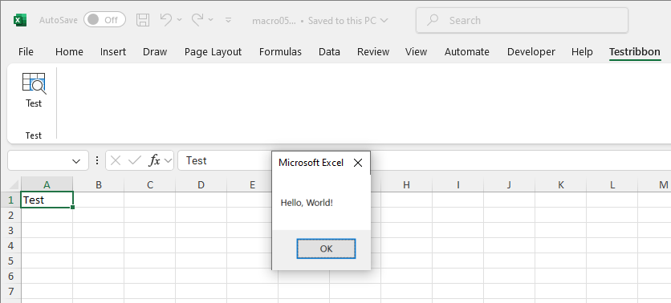

.. SPDX-License-Identifier: BSD-2-Clause
   Copyright (c) 2013-2025, John McNamara, jmcnamara@cpan.org

.. _customui:

Working with Custom UI Elements
===============================

This section explains how to add custom UI elements to the Excel ribbon
interface.

The Excel Custom UI format
--------------------------

Custom UI elements in Excel are defined in XML files that follow the Microsoft
Office Ribbon schema. Embedded within the Excel file, these XML definitions
enable customization of the ribbon interface with specific tabs, groups,
buttons, dropdowns, and other controls.

Adding Custom UI elements in XlsxWriter
---------------------------------------

Custom UI XML files are added to the workbook using the
``add_custom_ui()`` method:

.. code-block:: python

   workbook.add_custom_ui('./customUI.xml', version=2007)

The ``version`` parameter specifies the Office compatibility level:

- ``version=2006``: Office 2007 compatibility
- ``version=2007``: Office 2010+ compatibility

For broad compatibility, both versions can be included to the same workbook:

.. code-block:: python

   workbook.add_custom_ui('./customUI-01.xml', version=2006)
   workbook.add_custom_ui('./customUI14-01.xml', version=2007)

Custom UI XML structure
-----------------------

Office 2007 format (version=2006)
~~~~~~~~~~~~~~~~~~~~~~~~~~~~~~~~~

The Office 2007 format uses the ``2006/01/customui`` namespace:

.. code-block:: xml

   <?xml version="1.0" encoding="UTF-8"?>
   <customUI xmlns="http://schemas.microsoft.com/office/2006/01/customui">
       <ribbon>
           <tabs>
               <tab id="MyCustomTab" label="My Tools">
                   <group id="MyGroup" label="Custom Actions">
                       <button id="MyButton"
                               label="Run Analysis"
                               size="large"
                               onAction="RunAnalysis"
                               imageMso="DataAnalysisExcel"/>
                   </group>
               </tab>
           </tabs>
       </ribbon>
   </customUI>

Office 2010+ format (version=2007)
~~~~~~~~~~~~~~~~~~~~~~~~~~~~~~~~~~

The Office 2010+ format uses the ``2009/07/customui`` namespace and
supports additional features:

.. code-block:: xml

   <?xml version="1.0" encoding="UTF-8"?>
   <customUI xmlns="http://schemas.microsoft.com/office/2009/07/customui">
       <ribbon startFromScratch="false">
           <tabs>
               <tab id="MyCustomTab" label="My Tools">
                   <group id="MyGroup" label="Custom Actions">
                       <button id="MyButton"
                               label="Run Analysis"
                               size="large"
                               onAction="RunAnalysis"
                               imageMso="DataAnalysisExcel"
                               supertip="Click to run custom data analysis"/>
                   </group>
               </tab>
           </tabs>
       </ribbon>
   </customUI>

Integration with VBA projects
-----------------------------

Custom UI elements typically require VBA code to provide functionality.
The ``onAction`` callbacks referenced in the XML must be implemented as
VBA procedures:

.. code-block:: vbscript

   Sub RunAnalysis(control As IRibbonControl)
       MsgBox "Running analysis..."
       ' Custom logic here
   End Sub

When combining custom UI with VBA, use both ``add_custom_ui()`` and
``add_vba_project()`` or ``add_signed_vba_project()``:

.. code-block:: python

   workbook = Workbook('custom_ribbon.xlsm')
   worksheet = workbook.add_worksheet()

   # Add custom UI for both Office versions
   workbook.add_custom_ui('customUI-01.xml', version=2006)
   workbook.add_custom_ui('customUI14-01.xml', version=2007)

   # Add VBA project with callbacks
   workbook.add_signed_vba_project(
       'vbaProject06.bin',
       'vbaProject06Signature.bin'
   )

   worksheet.write('A1', 'Custom Ribbon Demo')
   workbook.close()

File format considerations
--------------------------

Excel files that contain custom UI elements should use an ``xlsm``
extension when they also include VBA code, or ``xlsx`` for custom UI
without macros. However, since custom UI elements typically require VBA
callbacks for functionality, ``xlsm`` is the recommended format.

Creating custom UI XML files
----------------------------

Custom UI XML can be created manually or extracted from existing Excel files
with customized ribbons, then modified as needed.
Unlike VBA projects, XlsxWriter does not include an extraction utility for
custom UI files.

The XML must be valid and conform to the Microsoft Office Ribbon schema, with
unique control IDs to avoid conflicts.

A more user-friendly option is to use the free
`Office RibbonX Editor <https://github.com/fernandreu/office-ribbonx-editor>`_,
which lets you create, edit, and validate custom UI XML directly within Excel
files. It offers syntax highlighting, schema validation, and tools to extract
custom UI definitions from existing workbooks.
