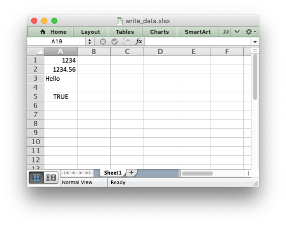
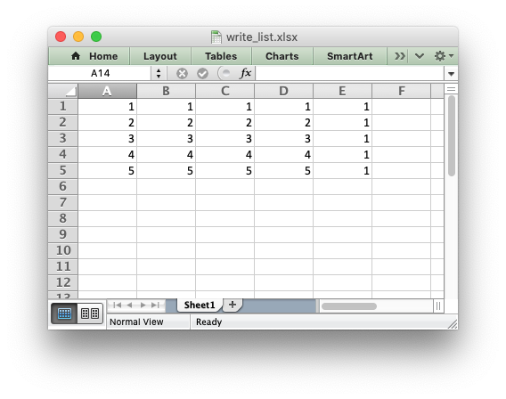
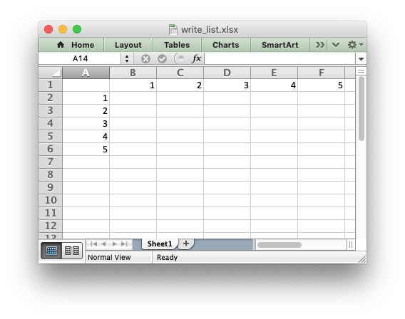
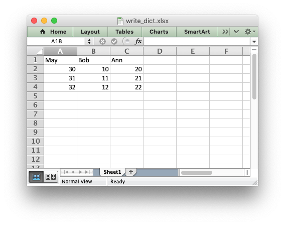
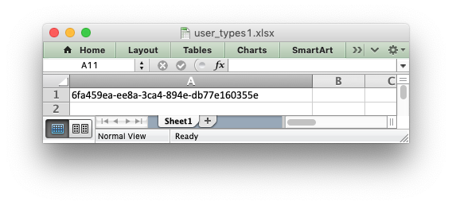
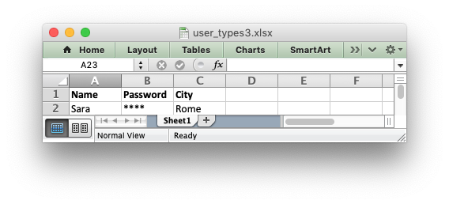

.. SPDX-License-Identifier: BSD-2-Clause
   Copyright (c) 2013-2025, John McNamara, jmcnamara@cpan.org

.. _working_with_data:

Working with and Writing Data
=============================

The following sections explain how to write various types of data to an Excel
worksheet using XlsxWriter.

.. _writing_cells:

Writing data to a worksheet cell
--------------------------------

The ``worksheet`` :func:`write` method is the most common means of writing
Python data to cells based on its type::

    import xlsxwriter

    workbook = xlsxwriter.Workbook('write_data.xlsx')
    worksheet = workbook.add_worksheet()

    worksheet.write(0, 0, 1234)     # Writes an int
    worksheet.write(1, 0, 1234.56)  # Writes a float
    worksheet.write(2, 0, 'Hello')  # Writes a string
    worksheet.write(3, 0, None)     # Writes None
    worksheet.write(4, 0, True)     # Writes a bool

    workbook.close()

The ``write()`` method uses the ``type()`` of the data to determine which
specific method to use for writing the data. These methods then map some basic
Python types to corresponding Excel types. The mapping is as follows:

======================   ==============   =====================================
Python type              Excel type       Worksheet methods
======================   ==============   =====================================
``int``                  Number           :func:`write`, :func:`write_number`
``long``
``float``
``Decimal``
``Fraction``
``basestring``           String           :func:`write`, :func:`write_string`
``str``
``unicode``
``None``                 String (blank)   :func:`write`, :func:`write_blank`
``datetime.date``        Number           :func:`write`, :func:`write_datetime`
``datetime.datetime``
``datetime.time``
``datetime.timedelta``
``bool``                 Boolean          :func:`write`, :func:`write_boolean`
======================   ==============   =====================================

The ``write()`` method also handles a few other Excel types that are
encoded as Python strings in XlsxWriter:

======================   ==============   =====================================
Pseudo-type              Excel type       Worksheet methods
======================   ==============   =====================================
formula string           Formula          :func:`write`, :func:`write_formula`
url string               URL              :func:`write`, :func:`write_url`
======================   ==============   =====================================

It should be noted that Excel has a very limited set of types to map to. The
Python types that the ``write()`` method can handle can be extended as
explained in the :ref:`writing_user_types` section below.

.. _writing_unicode:

Writing unicode data
---------------------

Unicode data in Excel is encoded as UTF-8. XlsxWriter also supports writing
UTF-8 data. This generally requires that your source file is UTF-8 encoded::

    worksheet.write('A1', 'Some UTF-8 text')

.. image:: _images/worksheet02.png

See :ref:`ex_unicode` for a more complete example.

Alternatively, you can read data from an encoded file, convert it to UTF-8
during reading and then write the data to an Excel file. See
:ref:`ex_unicode_polish_utf8` and :ref:`ex_unicode_shift_jis`.

.. _writing_lists:

Writing lists of data
---------------------

Writing compound data types such as lists with XlsxWriter is done the same way
it would be in any other Python program: with a loop. The Python
:func:`enumerate` function is also very useful in this context::

    import xlsxwriter

    workbook = xlsxwriter.Workbook('write_list.xlsx')
    worksheet = workbook.add_worksheet()

    my_list = [1, 2, 3, 4, 5]

    for row_num, data in enumerate(my_list):
        worksheet.write(row_num, 0, data)

    workbook.close()

Or if you wanted to write this horizontally as a row::

    import xlsxwriter

    workbook = xlsxwriter.Workbook('write_list.xlsx')
    worksheet = workbook.add_worksheet()

    my_list = [1, 2, 3, 4, 5]

    for col_num, data in enumerate(my_list):
        worksheet.write(0, col_num, data)

    workbook.close()

For a list of lists structure you would use two loop levels::

    import xlsxwriter

    workbook = xlsxwriter.Workbook('write_list.xlsx')
    worksheet = workbook.add_worksheet()

    my_list = [[1, 1, 1, 1, 1],
               [2, 2, 2, 2, 1],
               [3, 3, 3, 3, 1],
               [4, 4, 4, 4, 1],
               [5, 5, 5, 5, 1]]

    for row_num, row_data in enumerate(my_list):
        for col_num, col_data in enumerate(row_data):
            worksheet.write(row_num, col_num, col_data)

    workbook.close()

The :ref:`worksheet <worksheet>` class has two utility functions called
:func:`write_row` and :func:`write_column` which are basically a loop around
the :func:`write` method::

    import xlsxwriter

    workbook = xlsxwriter.Workbook('write_list.xlsx')
    worksheet = workbook.add_worksheet()

    my_list = [1, 2, 3, 4, 5]

    worksheet.write_row(0, 1, my_list)
    worksheet.write_column(1, 0, my_list)

    workbook.close()

.. _writing_dicts:

Writing dicts of data
---------------------

Unlike lists there is no single simple way to write a Python dictionary to an
Excel worksheet using Xlsxwriter. The method will depend of the structure of
the data in the dictionary. Here is a simple example for a simple data
structure::

    import xlsxwriter

    workbook = xlsxwriter.Workbook('write_dict.xlsx')
    worksheet = workbook.add_worksheet()

    my_dict = {'Bob': [10, 11, 12],
               'Ann': [20, 21, 22],
               'May': [30, 31, 32]}

    col_num = 0
    for key, value in my_dict.items():
        worksheet.write(0, col_num, key)
        worksheet.write_column(1, col_num, value)
        col_num += 1

    workbook.close()

.. _writing_dataframes:

Writing dataframes
------------------

The best way to deal with dataframes or complex data structure is to use
Python `Pandas <https://pandas.pydata.org/>`_. Pandas is a Python data analysis
library. It can read, filter and re-arrange small and large data sets and
output them in a range of formats including Excel.

To use XlsxWriter with Pandas you specify it as the Excel writer *engine*::

    import pandas as pd

    # Create a Pandas dataframe from the data.
    df = pd.DataFrame({'Data': [10, 20, 30, 20, 15, 30, 45]})

    # Create a Pandas Excel writer using XlsxWriter as the engine.
    writer = pd.ExcelWriter('pandas_simple.xlsx', engine='xlsxwriter')

    # Convert the dataframe to an XlsxWriter Excel object.
    df.to_excel(writer, sheet_name='Sheet1')

    # Close the Pandas Excel writer and output the Excel file.
    writer.close()

The output from this would look like the following:

.. image:: _images/pandas_simple.png

For more information on using Pandas with XlsxWriter see :ref:`ewx_pandas`.

.. _writing_user_types:

Writing user defined types
--------------------------

As shown in the first section above, the worksheet :func:`write` method
maps the main Python data types to Excel's data types. If you want to write an
unsupported type then you can either avoid ``write()`` and map the user type
in your code to one of the more specific write methods or you can extend it
using the :func:`add_write_handler` method. This can be, occasionally, more
convenient then adding a lot of if/else logic to your code.

As an example, say you wanted to modify ``write()`` to automatically write
:mod:`uuid` types as strings. You would start by creating a function that
takes the uuid, converts it to a string and then writes it using
:func:`write_string`::

    def write_uuid(worksheet, row, col, uuid, cell_format=None):
        return worksheet.write_string(row, col, str(uuid), cell_format)

You could then add a handler that matches the ``uuid`` type and calls your
user defined function::

    #                           match,     action()
    worksheet.add_write_handler(uuid.UUID, write_uuid)

Then you can use ``write()`` without further modification::

    my_uuid = uuid.uuid3(uuid.NAMESPACE_DNS, 'python.org')

    # Write the UUID. This would raise a TypeError without the handler.
    worksheet.write('A1', my_uuid)

Multiple callback functions can be added using :func:`add_write_handler()` but
only one callback action is allowed per type. However, it is valid to use the
same callback function for different types::

    worksheet.add_write_handler(int,   test_number_range)
    worksheet.add_write_handler(float, test_number_range)

.. _writing_user_types2:

How the write handler feature works
~~~~~~~~~~~~~~~~~~~~~~~~~~~~~~~~~~~

The :func:`write` method is mainly a large ``if()`` statement that checks the
``type()`` of the input value and calls the appropriate worksheet method to
write the data. The :func:`add_write_handler` method works by injecting
additional type checks and associated actions into this ``if()`` statement.

Here is a simplified version of the ``write()`` method::

    def write(self, row, col, *args):

        # The first arg should be the token for all write calls.
        token = args[0]

        # Get the token type.
        token_type = type(token)

        # Check for any user defined type handlers with callback functions.
        if token_type in self.write_handlers:
            write_handler = self.write_handlers[token_type]
            function_return = write_handler(self, row, col, *args)

            # If the return value is None then the callback has returned
            # control to this function and we should continue as
            # normal. Otherwise we return the value to the caller and exit.
            if function_return is None:
                pass
            else:
                return function_return

        # Check for standard Python types, if we haven't returned already.
        if token_type is bool:
            return self.write_boolean(row, col, *args)

        # Etc. ...

.. _writing_user_types3:

The syntax of write handler functions
~~~~~~~~~~~~~~~~~~~~~~~~~~~~~~~~~~~~~

Functions used in the :func:`add_write_handler` method should have the
following method signature/parameters::

    def my_function(worksheet, row, col, token, cell_format=None):
        return worksheet.write_string(row, col, token, cell_format)

The function will be passed a :ref:`worksheet <worksheet>` instance, an
integer ``row`` and ``col`` value, a ``token`` that matches the type added to
:func:`add_write_handler` and some additional parameters. Usually the
additional parameter(s) will only be a cell :ref:`format <format>`
instance. However, if you need to handle other additional parameters, such as
those passed to :func:`write_url` then you can have more generic handling
like this::

    def my_function(worksheet, row, col, token, *args):
        return worksheet.write_string(row, col, token, *args)

Note, you don't have to explicitly handle ``A1`` style cell ranges. These will
be converted to row and column values prior to your function being called.

You can also make use of the ``row`` and ``col`` parameters to control the
logic of the function. Say for example you wanted to hide/replace user
passwords with '\*\*\*\*' when writing string data. If your data was
structured so that the password data was in the second column, apart from the
header row, you could write a handler function like this::

    def hide_password(worksheet, row, col, string, cell_format=None):
        if col == 1 and row > 0:
            return worksheet.write_string(row, col, '****', cell_format)
        else:
            return worksheet.write_string(row, col, string, cell_format)

.. _writing_user_types4:

The return value of write handler functions
~~~~~~~~~~~~~~~~~~~~~~~~~~~~~~~~~~~~~~~~~~~

Functions used in the :func:`add_write_handler` method should return one of
the following values:

* ``None``: to indicate that control is return to the parent :func:`write`
  method to continue as normal. This is used if your handler function logic
  decides that you don't need to handle the matched token.
* The return value of the called ``write_xxx()`` function. This is generally 0
  for no error and a negative number for errors. This causes an immediate
  return from the calling ``write()`` method with the return value that was
  passed back.

For example, say you wanted to ignore ``NaN`` values in your data since Excel
doesn't support them. You could create a handler function like the following
that matched against floats and which wrote a blank cell if it was a ``NaN``
or else just returned to ``write()`` to continue as normal::

    def ignore_nan(worksheet, row, col, number, cell_format=None):
        if math.isnan(number):
            return worksheet.write_blank(row, col, None, cell_format)
        else:
            # Return control to the calling write() method.
            return None

If you wanted to just drop the ``NaN`` values completely and not add any
formatting to the cell you could just return 0, for no error::

    def ignore_nan(worksheet, row, col, number, cell_format=None):
        if math.isnan(number):
            return 0
        else:
            # Return control to the calling write() method.
            return None

Write handler examples
~~~~~~~~~~~~~~~~~~~~~~

See the following, more complete, examples of handling user data types:

* :ref:`ex_user_type1`
* :ref:`ex_user_type2`
* :ref:`ex_user_type3`
