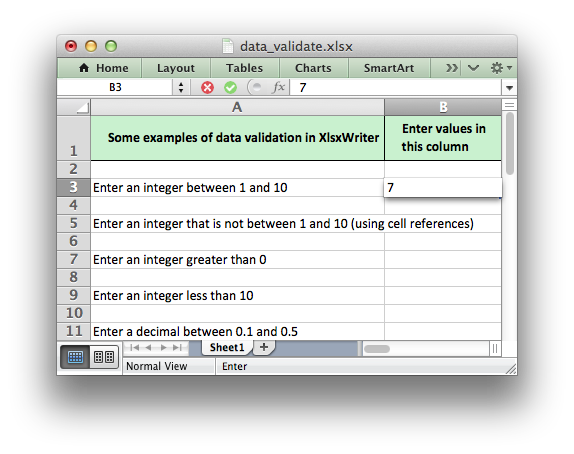
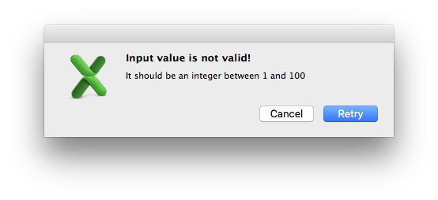
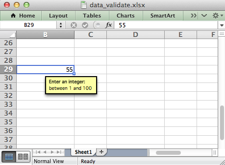

.. _working_with_data_validation:

Working with Data Validation
============================

Data validation is a feature of Excel which allows you to restrict the data
that a users enters in a cell and to display associated help and warning
messages. It also allows you to restrict input to values in a drop down list.

A typical use case might be to restrict data in a cell to integer values in a
certain range, to provide a help message to indicate the required value and to
issue a warning if the input data doesn't meet the stated criteria. In
XlsxWriter we could do that as follows::

    worksheet.data_validation('B25', {'validate': 'integer',
                                      'criteria': 'between',
                                      'minimum': 1,
                                      'maximum': 100,
                                      'input_title': 'Enter an integer:',
                                      'input_message': 'between 1 and 100'})

If the user inputs a value that doesn't match the specified criteria an error
message is displayed:

For more information on data validation see the Microsoft support article
"Description and examples of data validation in Excel":
http://support.microsoft.com/kb/211485.

The following sections describe how to use the ``data_validation()`` method and
its various options.

data_validation()
-----------------

The :func:`data_validation()` method is used to construct an Excel data
validation.

The data validation can be applied to a single cell or a range of cells. As
usual you can use A1 or Row/Column notation, see :ref:`cell_notation`.

With Row/Column notation you must specify all four cells in the range:
``(first_row, first_col, last_row, last_col)``. If you need to refer to a
single cell set the `last_` values equal to the `first_` values. With A1
notation you can refer to a single cell or a range of cells::

    worksheet.data_validation(0, 0, 4, 1, {...})
    worksheet.data_validation('B1',       {...})
    worksheet.data_validation('C1:E5',    {...})

The options parameter in ``data_validation()`` must be a dictionary containing
the parameters that describe the type and style of the data validation. The
main parameters are:

+-------------------+-------------+------------+
| ``validate``      |             |            |
+-------------------+-------------+------------+
| ``criteria``      |             |            |
+-------------------+-------------+------------+
| ``value``         | ``minimum`` | ``source`` |
+-------------------+-------------+------------+
| ``maximum``       |             |            |
+-------------------+-------------+------------+
| ``ignore_blank``  |             |            |
+-------------------+-------------+------------+
| ``dropdown``      |             |            |
+-------------------+-------------+------------+
| ``input_title``   |             |            |
+-------------------+-------------+------------+
| ``input_message`` |             |            |
+-------------------+-------------+------------+
| ``show_input``    |             |            |
+-------------------+-------------+------------+
| ``error_title``   |             |            |
+-------------------+-------------+------------+
| ``error_message`` |             |            |
+-------------------+-------------+------------+
| ``error_type``    |             |            |
+-------------------+-------------+------------+
| ``show_error``    |             |            |
+-------------------+-------------+------------+

These parameters are explained in the following sections. Most of the
parameters are optional, however, you will generally require the three main
options ``validate``, ``criteria`` and ``value``::

    worksheet.data_validation('A1', {'validate': 'integer',
                                     'criteria': '>',
                                     'value': 100})

validate
********

The ``validate`` parameter is used to set the type of data that you wish to
validate::

    worksheet.data_validation('A1', {'validate': 'integer',
                                     'criteria': '>',
                                     'value': 100})

It is always required and it has no default value. Allowable values are::

    integer
    decimal
    list
    date
    time
    length
    custom
    any

* **integer**: restricts the cell to integer values. Excel refers to this as
  'whole number'.
* **decimal**: restricts the cell to decimal values.
* **list**: restricts the cell to a set of user specified values. These can
  be passed in a Python list or as an Excel cell range.
* **date**: restricts the cell to date values specified as a datetime object
  as shown in :ref:`working_with_dates_and_time`.
* **time**: restricts the cell to time values specified as a datetime object
  as shown in :ref:`working_with_dates_and_time`.
* **length**: restricts the cell data based on an integer string length.
  Excel refers to this as 'Text length'.
* **custom**: restricts the cell based on an external Excel formula that
  returns a ``TRUE/FALSE`` value.
* **any**: is used to specify that the type of data is unrestricted. It is
  mainly used for specifying cell input messages without a data validation.

criteria
********

The ``criteria`` parameter is used to set the criteria by which the data in the
cell is validated. It is almost always required except for the ``list`` and
``custom`` validate options. It has no default value::

    worksheet.data_validation('A1', {'validate': 'integer',
                                     'criteria': '>',
                                     'value': 100})

Allowable values are:

+------------------------------+--------+
| ``between``                  |        |
+------------------------------+--------+
| ``not between``              |        |
+------------------------------+--------+
| ``equal to``                 | ``==`` |
+------------------------------+--------+
| ``not equal to``             | ``!=`` |
+------------------------------+--------+
| ``greater than``             | ``>``  |
+------------------------------+--------+
| ``less than``                | ``<``  |
+------------------------------+--------+
| ``greater than or equal to`` | ``>=`` |
+------------------------------+--------+
| ``less than or equal to``    | ``<=`` |
+------------------------------+--------+

You can either use Excel's textual description strings, in the first column
above, or the more common symbolic alternatives. The following are equivalent::

    worksheet.data_validation('A1', {'validate': 'integer',
                                     'criteria': '>',
                                     'value': 100})

    worksheet.data_validation('A1', {'validate': 'integer',
                                     'criteria': 'greater than',
                                     'value': 100})

The ``list`` and ``custom`` validate options don't require a ``criteria``. If
you specify one it will be ignored::

    worksheet.data_validation('B13', {'validate': 'list',
                                      'source': ['open', 'high', 'close']})

    worksheet.data_validation('B23', {'validate': 'custom',
                                      'value': '=AND(F5=50,G5=60)'})

value, minimum, source
**********************

The ``value`` parameter is used to set the limiting value to which the
``criteria`` is applied. It is always required and it has no default value.
You can also use the synonyms ``minimum`` or ``source`` to make the validation
a little clearer and closer to Excel's description of the parameter::

    # Use 'value'
    worksheet.data_validation('A1', {'validate': 'integer',
                                     'criteria': 'greater than',
                                     'value': 100})

    # Use 'minimum'
    worksheet.data_validation('B11', {'validate': 'decimal',
                                      'criteria': 'between',
                                      'minimum': 0.1,
                                      'maximum': 0.5})

    # Use 'source'
    worksheet.data_validation('B10', {'validate': 'list',
                                      'source': '=$E$4:$G$4'})

maximum
*******

The ``maximum`` parameter is used to set the upper limiting value when the
``criteria`` is either ``'between'`` or ``'not between'``::

    worksheet.data_validation('B11', {'validate': 'decimal',
                                      'criteria': 'between',
                                      'minimum': 0.1,
                                      'maximum': 0.5})

ignore_blank
************

The ``ignore_blank`` parameter is used to toggle on and off the 'Ignore blank'
option in the Excel data validation dialog. When the option is on the data
validation is not applied to blank data in the cell. It is on by default::

        worksheet.data_validation('B5', {'validate': 'integer',
                                         'criteria': 'between',
                                         'minimum': 1,
                                         'maximum': 10,
                                         'ignore_blank': False,
                                         })

dropdown
********

The ``dropdown`` parameter is used to toggle on and off the 'In-cell dropdown'
option in the Excel data validation dialog. When the option is on a dropdown
list will be shown for ``list`` validations. It is on by default.

input_title
***********

The ``input_title`` parameter is used to set the title of the input message
that is displayed when a cell is entered. It has no default value and is only
displayed if the input message is displayed. See the ``input_message``
parameter below.

The maximum title length is 32 characters.

input_message
*************

The ``input_message`` parameter is used to set the input message that is
displayed when a cell is entered. It has no default value::

    worksheet.data_validation('B25', {'validate': 'integer',
                                      'criteria': 'between',
                                      'minimum': 1,
                                      'maximum': 100,
                                      'input_title': 'Enter an integer:',
                                      'input_message': 'between 1 and 100'})

The input message generated from the above example is:

The message can be split over several lines using newlines. The maximum message
length is 255 characters.

show_input
**********

The ``show_input`` parameter is used to toggle on and off the 'Show input
message when cell is selected' option in the Excel data validation dialog.
When the option is off an input message is not displayed even if it has been
set using ``input_message``. It is on by default.

error_title
***********

The ``error_title`` parameter is used to set the title of the error message
that is displayed when the data validation criteria is not met. The default
error title is 'Microsoft Excel'. The maximum title length is 32 characters.

error_message
*************

The ``error_message`` parameter is used to set the error message that is
displayed when a cell is entered. The default error message is "The value you
entered is not valid. A user has restricted values that can be entered into
the cell.". A non-default error message can be displayed as follows::

    worksheet.data_validation('B27', {'validate': 'integer',
                                      'criteria': 'between',
                                      'minimum': 1,
                                      'maximum': 100,
                                      'input_title': 'Enter an integer:',
                                      'input_message': 'between 1 and 100',
                                      'error_title': 'Input value not valid!',
                                      'error_message': 'Sorry.'})

The message can be split over several lines using newlines. The maximum message
length is 255 characters.

error_type
**********

The ``error_type`` parameter is used to specify the type of error dialog that
is displayed. There are 3 options::

    'stop'
    'warning'
    'information'

The default is ``'stop'``.

show_error
**********

The ``show_error`` parameter is used to toggle on and off the 'Show error alert
after invalid data is entered' option in the Excel data validation dialog.
When the option is off an error message is not displayed even if it has been
set using ``error_message``. It is on by default.

Data Validation Examples
------------------------

Example 1. Limiting input to an integer greater than a fixed value::

    worksheet.data_validation('A1', {'validate': 'integer',
                                     'criteria': '>',
                                     'value': 0,
                                     })

Example 2. Limiting input to an integer greater than a fixed value where the
value is referenced from a cell::

    worksheet.data_validation('A2', {'validate': 'integer',
                                     'criteria': '>',
                                     'value': '=E3',
                                     })

Example 3. Limiting input to a decimal in a fixed range::

    worksheet.data_validation('A3', {'validate': 'decimal',
                                     'criteria': 'between',
                                     'minimum': 0.1,
                                     'maximum': 0.5,
                                     })

Example 4. Limiting input to a value in a dropdown list::

    worksheet.data_validation('A4', {'validate': 'list',
                                     'source': ['open', 'high', 'close'],
                                     })

Example 5. Limiting input to a value in a dropdown list where the list is
specified as a cell range::

    worksheet.data_validation('A5', {'validate': 'list',
                                     'source': '=$E$4:$G$4',
                                     })

Example 6. Limiting input to a date in a fixed range::

    from datetime import date

    worksheet.data_validation('A6', {'validate': 'date',
                                     'criteria': 'between',
                                     'minimum': date(2013, 1, 1),
                                     'maximum': date(2013, 12, 12),
                                     })

Example 7. Displaying a message when the cell is selected::

    worksheet.data_validation('A7', {'validate': 'integer',
                                     'criteria': 'between',
                                     'minimum': 1,
                                     'maximum': 100,
                                     'input_title': 'Enter an integer:',
                                     'input_message': 'between 1 and 100',
                                     })

See also :ref:`ex_data_valid`.
