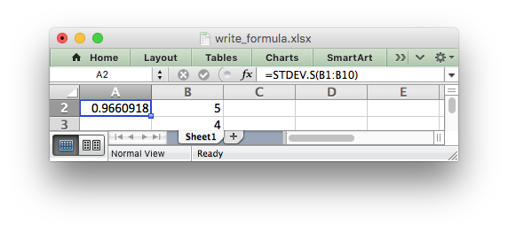

.. _working_with_formulas:

Working with Formulas
=====================

In general a formula in Excel can be used directly in the
:func:`write_formula` method::

    worksheet.write_formula('A1', '=10*B1 + C1')

However, there are a few potential issues and differences that the user should
be aware of. These are explained in the following sections.

.. _formula_syntax:

Non US Excel functions and syntax
---------------------------------

Excel stores formulas in the format of the US English version, regardless
of the language or locale of the end-user's version of Excel. Therefore all
formula function names written using XlsxWriter must be in English::

    worksheet.write_formula('A1', '=SUM(1, 2, 3)')    # OK
    worksheet.write_formula('A2', '=SOMME(1, 2, 3)')  # French. Error on load.

Also, formulas must be written with the US style separator/range operator
which is a comma (not semi-colon). Therefore a formula with multiple values
should be written as follows::

    worksheet.write_formula('A1', '=SUM(1, 2, 3)')   # OK
    worksheet.write_formula('A2', '=SUM(1; 2; 3)')   # Semi-colon. Error on load.

If you have a non-English version of Excel you can use the following
multi-lingual `formula translator <http://en.excel-translator.de/language/>`_
to help you convert the formula. It can also replace semi-colons with commas.

.. _formula_future:

Formulas added in Excel 2010 and later
--------------------------------------

Excel 2010 and later added functions which weren't defined in the original
file specification. These functions are referred to by Microsoft as *future*
functions. Examples of these functions are ``ACOT``, ``CHISQ.DIST.RT`` ,
``CONFIDENCE.NORM``, ``STDEV.P``, ``STDEV.S`` and ``WORKDAY.INTL``.

When written using ``write_formula()`` these functions need to be fully
qualified with a ``_xlfn.`` (or other) prefix as they are shown the list
below. For example::

    worksheet.write_formula('A1', '=_xlfn.STDEV.S(B1:B10)')

They will appear without the prefix in Excel:

The following list is taken from
`MS XLSX extensions documentation on future functions <http://msdn.microsoft.com/en-us/library/dd907480%28v=office.12%29.aspx>`_.

* ``_xlfn.ACOT``
* ``_xlfn.ACOTH``
* ``_xlfn.AGGREGATE``
* ``_xlfn.ARABIC``
* ``_xlfn.BASE``
* ``_xlfn.BETA.DIST``
* ``_xlfn.BETA.INV``
* ``_xlfn.BINOM.DIST``
* ``_xlfn.BINOM.DIST.RANGE``
* ``_xlfn.BINOM.INV``
* ``_xlfn.BITAND``
* ``_xlfn.BITLSHIFT``
* ``_xlfn.BITOR``
* ``_xlfn.BITRSHIFT``
* ``_xlfn.BITXOR``
* ``_xlfn.CEILING.MATH``
* ``_xlfn.CEILING.PRECISE``
* ``_xlfn.CHISQ.DIST``
* ``_xlfn.CHISQ.DIST.RT``
* ``_xlfn.CHISQ.INV``
* ``_xlfn.CHISQ.INV.RT``
* ``_xlfn.CHISQ.TEST``
* ``_xlfn.COMBINA``
* ``_xlfn.CONFIDENCE.NORM``
* ``_xlfn.CONFIDENCE.T``
* ``_xlfn.COT``
* ``_xlfn.COTH``
* ``_xlfn.COVARIANCE.P``
* ``_xlfn.COVARIANCE.S``
* ``_xlfn.CSC``
* ``_xlfn.CSCH``
* ``_xlfn.DAYS``
* ``_xlfn.DECIMAL``
* ``ECMA.CEILING``
* ``_xlfn.ERF.PRECISE``
* ``_xlfn.ERFC.PRECISE``
* ``_xlfn.EXPON.DIST``
* ``_xlfn.F.DIST``
* ``_xlfn.F.DIST.RT``
* ``_xlfn.F.INV``
* ``_xlfn.F.INV.RT``
* ``_xlfn.F.TEST``
* ``_xlfn.FILTERXML``
* ``_xlfn.FLOOR.MATH``
* ``_xlfn.FLOOR.PRECISE``
* ``_xlfn.FORECAST.ETS``
* ``_xlfn.FORECAST.ETS.CONFINT``
* ``_xlfn.FORECAST.ETS.SEASONALITY``
* ``_xlfn.FORECAST.ETS.STAT``
* ``_xlfn.FORECAST.LINEAR``
* ``_xlfn.FORMULATEXT``
* ``_xlfn.GAMMA``
* ``_xlfn.GAMMA.DIST``
* ``_xlfn.GAMMA.INV``
* ``_xlfn.GAMMALN.PRECISE``
* ``_xlfn.GAUSS``
* ``_xlfn.HYPGEOM.DIST``
* ``_xlfn.IFNA``
* ``_xlfn.IMCOSH``
* ``_xlfn.IMCOT``
* ``_xlfn.IMCSC``
* ``_xlfn.IMCSCH``
* ``_xlfn.IMSEC``
* ``_xlfn.IMSECH``
* ``_xlfn.IMSINH``
* ``_xlfn.IMTAN``
* ``_xlfn.ISFORMULA``
* ``ISO.CEILING``
* ``_xlfn.ISOWEEKNUM``
* ``_xlfn.LOGNORM.DIST``
* ``_xlfn.LOGNORM.INV``
* ``_xlfn.MODE.MULT``
* ``_xlfn.MODE.SNGL``
* ``_xlfn.MUNIT``
* ``_xlfn.NEGBINOM.DIST``
* ``NETWORKDAYS.INTL``
* ``_xlfn.NORM.DIST``
* ``_xlfn.NORM.INV``
* ``_xlfn.NORM.S.DIST``
* ``_xlfn.NORM.S.INV``
* ``_xlfn.NUMBERVALUE``
* ``_xlfn.PDURATION``
* ``_xlfn.PERCENTILE.EXC``
* ``_xlfn.PERCENTILE.INC``
* ``_xlfn.PERCENTRANK.EXC``
* ``_xlfn.PERCENTRANK.INC``
* ``_xlfn.PERMUTATIONA``
* ``_xlfn.PHI``
* ``_xlfn.POISSON.DIST``
* ``_xlfn.QUARTILE.EXC``
* ``_xlfn.QUARTILE.INC``
* ``_xlfn.QUERYSTRING``
* ``_xlfn.RANK.AVG``
* ``_xlfn.RANK.EQ``
* ``_xlfn.RRI``
* ``_xlfn.SEC``
* ``_xlfn.SECH``
* ``_xlfn.SHEET``
* ``_xlfn.SHEETS``
* ``_xlfn.SKEW.P``
* ``_xlfn.STDEV.P``
* ``_xlfn.STDEV.S``
* ``_xlfn.T.DIST``
* ``_xlfn.T.DIST.2T``
* ``_xlfn.T.DIST.RT``
* ``_xlfn.T.INV``
* ``_xlfn.T.INV.2T``
* ``_xlfn.T.TEST``
* ``_xlfn.UNICHAR``
* ``_xlfn.UNICODE``
* ``_xlfn.VAR.P``
* ``_xlfn.VAR.S``
* ``_xlfn.WEBSERVICE``
* ``_xlfn.WEIBULL.DIST``
* ``WORKDAY.INTL``
* ``_xlfn.XOR``
* ``_xlfn.Z.TEST``

.. _formula_tables:

Using Tables in Formulas
------------------------

Worksheet tables can be added with XlsxWriter using the :func:`add_table()`
method::

    worksheet.add_table('B3:F7', {options})

By default tables are named ``Table1``, ``Table2``, etc., in the order that
they are added. However it can also be set by the user using the ``name`` parameter::

    worksheet.add_table('B3:F7', {'name': 'SalesData'})

If you need to know the name of the table, for example to use it in a formula,
you can get it as follows::

    table = worksheet.add_table('B3:F7')
    table_name = table.name

When used in a formula a table name such as ``TableX`` should be referred to
as ``TableX[]`` (like a Python list)::

    worksheet.write_formula('A5', '=VLOOKUP("Sales", Table1[], 2, FALSE')

.. _formula_errors:

Dealing with formula errors
---------------------------

If there is an error in the syntax of a formula it is usually displayed in
Excel as ``#NAME?``. Alternatively you may get a warning from Excel when the
file is loaded. If you encounter an error like this you can debug it as
follows:

#. Ensure the formula is valid in Excel by copying and pasting it into a
   cell. Note, this should be done in Excel and not other applications such as
   OpenOffice or LibreOffice since they may have slightly different syntax.

#. Ensure the formula is using comma separators instead of semi-colons, see
   :ref:`formula_syntax` above.

#. Ensure the formula is in English, see :ref:`formula_syntax` above.

#. Ensure that the formula doesn't contain an Excel 2010+ future function as
   listed above (:ref:`formula_future`). If it does then ensure that the
   correct prefix is used.

Finally if you have completed all the previous steps and still get a
``#NAME?`` error you can examine a valid Excel file to see what the correct
syntax should be. To do this you should create a valid formula in Excel and
save the file. You can then examine the XML in the unzipped file.

The following shows how to do that using Linux ``unzip`` and `libxml's xmllint
<http://xmlsoft.org/xmllint.html>`_ to format the XML for clarity::

    $ unzip myfile.xlsx -d myfile
    $ xmllint --format myfile/xl/worksheets/sheet1.xml | grep '<f>'

            <f>SUM(1, 2, 3)</f>

.. _formula_result:

Formula Results
---------------

XlsxWriter doesn't calculate the result of a formula and instead stores the
value 0 as the formula result. It then sets a global flag in the XLSX file to
say that all formulas and functions should be recalculated when the file is
opened.

This is the method recommended in the Excel documentation and in general it
works fine with spreadsheet applications. However, applications that don't
have a facility to calculate formulas will only display the 0
results. Examples of such applications are Excel Viewer, PDF Converters, and
some mobile device applications.

If required, it is also possible to specify the calculated result of the
formula using the optional ``value`` parameter for :func:`write_formula`::

    worksheet.write_formula('A1', '=2+2', num_format, 4)

The ``value`` parameter can be a number, a string, a bool or one of the
following Excel error codes::

    #DIV/0!
    #N/A
    #NAME?
    #NULL!
    #NUM!
    #REF!
    #VALUE!

It is also possible to specify the calculated result of an array formula
created with :func:`write_array_formula`::

    # Specify the result for a single cell range.
    worksheet.write_array_formula('A1:A1', '{=SUM(B1:C1*B2:C2)}', format, 2005)

However, using this parameter only writes a single value to the upper left
cell in the result array. For a multi-cell array formula where the results are
required, the other result values can be specified by using ``write_number()``
to write to the appropriate cell::

    # Specify the results for a multi cell range.
    worksheet.write_array_formula('A1:A3', '{=TREND(C1:C3,B1:B3)}', format, 15)
    worksheet.write_number('A2', 12, format)
    worksheet.write_number('A3', 14, format)
