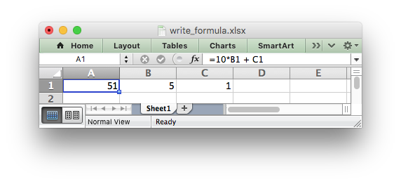
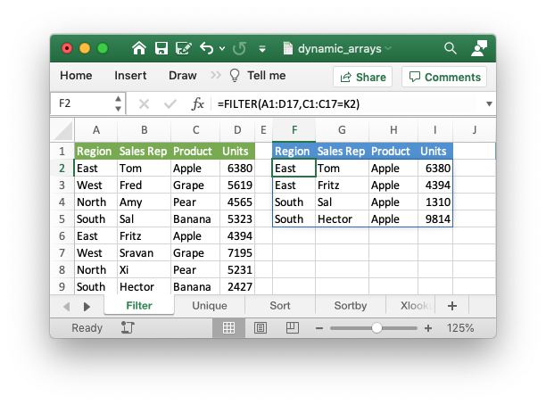
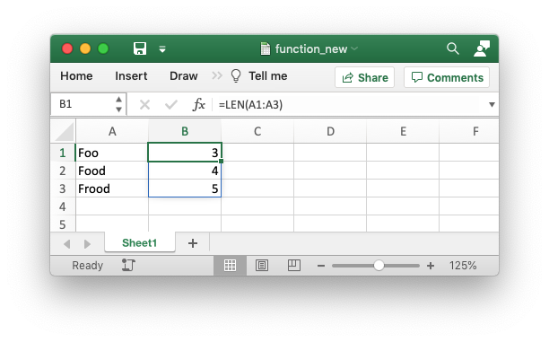
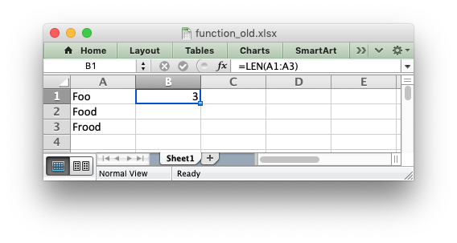
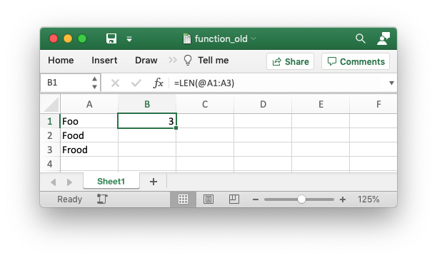
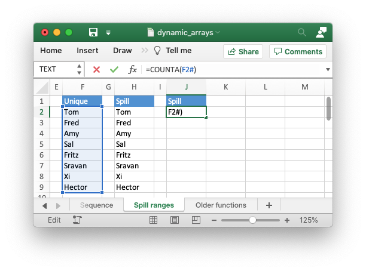
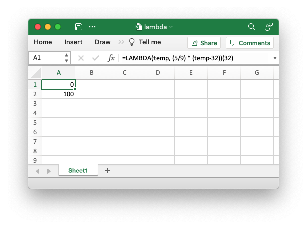

.. SPDX-License-Identifier: BSD-2-Clause
   Copyright 2013-2023, John McNamara, jmcnamara@cpan.org

.. _working_with_formulas:

Working with Formulas
=====================

In general a formula in Excel can be used directly in the
:func:`write_formula` method::

    worksheet.write_formula('A1', '=10*B1 + C1')

However, there are a few potential issues and differences that the user should
be aware of. These are explained in the following sections.

.. _formula_syntax:

Non US Excel functions and syntax
---------------------------------

Excel stores formulas in the format of the US English version, regardless
of the language or locale of the end-user's version of Excel. Therefore all
formula function names written using XlsxWriter must be in English::

    worksheet.write_formula('A1', '=SUM(1, 2, 3)')    # OK
    worksheet.write_formula('A2', '=SOMME(1, 2, 3)')  # French. Error on load.

Also, formulas must be written with the US style separator/range operator
which is a comma (not semi-colon). Therefore a formula with multiple values
should be written as follows::

    worksheet.write_formula('A1', '=SUM(1, 2, 3)')   # OK
    worksheet.write_formula('A2', '=SUM(1; 2; 3)')   # Semi-colon. Error on load.

If you have a non-English version of Excel you can use the following
multi-lingual `formula translator <https://en.excel-translator.de/language/>`_
to help you convert the formula. It can also replace semi-colons with commas.

.. _formula_result:

Formula Results
---------------

XlsxWriter doesn't calculate the result of a formula and instead stores the
value 0 as the formula result. It then sets a global flag in the XLSX file to
say that all formulas and functions should be recalculated when the file is
opened.

This is the method recommended in the Excel documentation and in general it
works fine with spreadsheet applications. However, applications that don't
have a facility to calculate formulas will only display the 0
results. Examples of such applications are Excel Viewer, PDF Converters, and
some mobile device applications.

If required, it is also possible to specify the calculated result of the
formula using the optional ``value`` parameter for :func:`write_formula`::

    worksheet.write_formula('A1', '=2+2', num_format, 4)

The ``value`` parameter can be a number, a string, a bool or one of the
following Excel error codes::

    #DIV/0!
    #N/A
    #NAME?
    #NULL!
    #NUM!
    #REF!
    #VALUE!

It is also possible to specify the calculated result of an array formula
created with :func:`write_array_formula`::

    # Specify the result for a single cell range.
    worksheet.write_array_formula('A1:A1', '{=SUM(B1:C1*B2:C2)}', cell_format, 2005)

However, using this parameter only writes a single value to the upper left
cell in the result array. For a multi-cell array formula where the results are
required, the other result values can be specified by using ``write_number()``
to write to the appropriate cell::

    # Specify the results for a multi cell range.
    worksheet.write_array_formula('A1:A3', '{=TREND(C1:C3,B1:B3)}', cell_format, 15)
    worksheet.write_number('A2', 12, cell_format)
    worksheet.write_number('A3', 14, cell_format)

.. _formula_dynamic_arrays:

Dynamic Array support
---------------------

Excel introduced the concept of "Dynamic Arrays" and new functions that use
them in Office 365. The new functions are:

- ``BYCOL()``
- ``BYROW()``
- ``CHOOSECOLS()``
- ``CHOOSEROWS()``
- ``DROP()``
- ``EXPAND()``
- ``FILTER()``
- ``HSTACK()``
- ``MAKEARRAY()``
- ``MAP()``
- ``RANDARRAY()``
- ``REDUCE()``
- ``SCAN()``
- ``SEQUENCE()``
- ``SORT()``
- ``SORTBY()``
- ``SWITCH()``
- ``TAKE()``
- ``TEXTSPLIT()``
- ``TOCOL()``
- ``TOROW()``
- ``UNIQUE()``
- ``VSTACK()``
- ``WRAPCOLS()``
- ``WRAPROWS()``
- ``XLOOKUP()``

The following special case functions were also added with Dynamic Arrays:

- ``SINGLE()`` - Explained below in :ref:`formula_intersection_operator`.
- ``ANCHORARRAY()`` - Explained below in :ref:`formula_spill_operator`.
- ``LAMBDA()`` and ``LET()`` - Explained below in :ref:`formula_lambda`.

Dynamic arrays are ranges of return values that can change in size based on
the results. For example, a function such as ``FILTER()`` returns an array of
values that can vary in size depending on the filter results. This is
shown in the snippet below from :ref:`ex_dynamic_arrays`::

    worksheet1.write('F2', '=FILTER(A1:D17,C1:C17=K2)')

Which gives the results shown in the image below. The dynamic range here is
"F2:I5" but it could be different based on the filter criteria.

It is also possible to get dynamic array behavior with older Excel
functions. For example, the Excel function ``=LEN(A1)`` applies to a single
cell and returns a single value but it is also possible to apply it to a range
of cells and return a range of values using an array formula like
``{=LEN(A1:A3)}``. This type of "static" array behavior is called a CSE
(Ctrl+Shift+Enter) formula. With the introduction of dynamic arrays in Excel
365 you can now write this function as ``=LEN(A1:A3)`` and get a dynamic range
of return values. In XlsxWriter you can use the :func:`write_array_formula`
worksheet method to get a static/CSE range and
:func:`write_dynamic_array_formula` to get a dynamic range. For example::

    worksheet.write_dynamic_array_formula('B1:B3', '=LEN(A1:A3)')

Which gives the following result:

The difference between the two types of array functions is explained in the
Microsoft documentation on `Dynamic array formulas vs. legacy CSE array
formulas
<https://support.microsoft.com/en-us/office/dynamic-array-formulas-vs-legacy-cse-array-formulas-ca421f1b-fbb2-4c99-9924-df571bd4f1b4>`_. Note
the use of the word "legacy" here. This, and the documentation itself, is a
clear indication of the future importance of dynamic arrays in Excel.

For a wider and more general introduction to dynamic arrays see the following:
`Dynamic array formulas in Excel
<https://exceljet.net/dynamic-array-formulas-in-excel>`_.

.. _formula_intersection_operator:

Dynamic Arrays - The Implicit Intersection Operator "@"
-------------------------------------------------------

The Implicit Intersection Operator, "@", is used by Excel 365 to indicate a
position in a formula that is implicitly returning a single value when a range
or an array could be returned.

We can see how this operator works in practice by considering the formula we
used in the last section: ``=LEN(A1:A3)``. In Excel versions without support
for dynamic arrays, i.e. prior to Excel 365, this formula would operate on a
single value from the input range and return a single value, like this:

There is an implicit conversion here of the range of input values, "A1:A3", to
a single value "A1". Since this was the default behavior of older versions of
Excel this conversion isn't highlighted in any way. But if you open the same
file in Excel 365 it will appear as follows:

The result of the formula is the same (this is important to note) and it still
operates on, and returns, a single value. However the formula now contains a
"@" operator to show that it is implicitly using a single value from the given
range.

Finally, if you entered this formula in Excel 365, or with
:func:`write_dynamic_array_formula` in XlsxWriter, it would operate on the
entire range and return an array of values:

If you are encountering the Implicit Intersection Operator "@" for the first
time then it is probably from a point of view of "why is Excel/XlsxWriter
putting @s in my formulas". In practical terms if you encounter this operator,
and you don't intend it to be there, then you should probably write the
formula as a CSE or dynamic array function using :func:`write_array_formula`
or :func:`write_dynamic_array_formula` (see the previous section on
:ref:`formula_dynamic_arrays`).

A full explanation of this operator is shown in the Microsoft documentation on
the `Implicit intersection operator: @
<https://support.microsoft.com/en-us/office/implicit-intersection-operator-ce3be07b-0101-4450-a24e-c1c999be2b34?ui=en-us&rs=en-us&ad=us>`_.

One important thing to note is that the "@" operator isn't stored with the
formula. It is just displayed by Excel 365 when reading "legacy"
formulas. However, it is possible to write it to a formula, if necessary,
using ``SINGLE()`` or ``_xlfn.SINGLE()``. The unusual cases where this may be
necessary are shown in the linked document in the previous paragraph.

.. _formula_spill_operator:

Dynamic Arrays - The Spilled Range Operator "#"
-----------------------------------------------

In the section above on :ref:`formula_dynamic_arrays` we saw that dynamic
array formulas can return variable sized ranges of results. The Excel
documentation refers to this as a "Spilled" range/array from the idea that the
results spill into the required number of cells. This is explained in the
Microsoft documentation on `Dynamic array formulas and spilled array behavior
<https://support.microsoft.com/en-us/office/dynamic-array-formulas-and-spilled-array-behavior-205c6b06-03ba-4151-89a1-87a7eb36e531>`_.

Since a spilled range is variable in size a new operator is required to refer
to the range. This operator is the `Spilled range operator
<https://support.microsoft.com/en-us/office/spilled-range-operator-3dd5899f-bca2-4b9d-a172-3eae9ac22efd>`_
and it is represented by "#". For example, the range ``F2#`` in the image
below is used to refer to a dynamic array returned by ``UNIQUE()`` in the cell
``F2``. This example is taken from the XlsxWriter program :ref:`ex_dynamic_arrays`.

Unfortunately, Excel doesn't store the formula like this and in XlsxWriter you
need to use the explicit function ``ANCHORARRAY()`` to refer to a spilled
range. The example in the image above was generated using the following::

    worksheet9.write('J2', '=COUNTA(ANCHORARRAY(F2))')  # Same as '=COUNTA(F2#)' in Excel.

.. _formula_lambda:

The Excel 365 LAMBDA() function
-------------------------------

Recent versions of Excel 365 have introduced a powerful new
function/feature called ``LAMBDA()``. This is similar to the `lambda
<https://docs.python.org/3/howto/functional.html#small-functions-and-the-lambda-expression>`_
function in Python (and other languages).

Consider the following Excel example which converts the variable ``temp`` from Fahrenheit to Celsius::

    LAMBDA(temp, (5/9) * (temp-32))

This could be called in Excel with an argument::

    =LAMBDA(temp, (5/9) * (temp-32))(212)

Or assigned to a defined name and called as a user defined function::

    =ToCelsius(212)

This is similar to this example in Python::

    >>> to_celsius = lambda temp: (5.0/9.0) * (temp-32)
    >>> to_celsius(212)
    100.0

A XlsxWriter program that replicates the Excel is shown in :ref:`ex_lambda`.

The formula is written as follows::

    worksheet.write('A2', '=LAMBDA(_xlpm.temp, (5/9) * (_xlpm.temp-32))(32)')

Note, that the parameters in the ``LAMBDA()`` function must have a "_xlpm."
prefix for compatibility with how the formulas are stored in Excel. These
prefixes won't show up in the formula, as shown in the image.

The ``LET()`` function is often used in conjunction with ``LAMBDA()`` to assign
names to calculation results.

.. _formula_future:

Formulas added in Excel 2010 and later
--------------------------------------

Excel 2010 and later added functions which weren't defined in the original
file specification. These functions are referred to by Microsoft as *future*
functions. Examples of these functions are ``ACOT``, ``CHISQ.DIST.RT`` ,
``CONFIDENCE.NORM``, ``STDEV.P``, ``STDEV.S`` and ``WORKDAY.INTL``.

When written using ``write_formula()`` these functions need to be fully
qualified with a ``_xlfn.`` (or other) prefix as they are shown the list
below. For example::

    worksheet.write_formula('A1', '=_xlfn.STDEV.S(B1:B10)')

These functions will appear without the prefix in Excel:

.. image:: _images/working_with_formulas2.png

Alternatively, you can enable the ``use_future_functions`` option in the
:func:`Workbook` constructor, which will add the prefix as required::

    workbook = Workbook('write_formula.xlsx', {'use_future_functions': True})

    # ...

    worksheet.write_formula('A1', '=STDEV.S(B1:B10)')

If the formula already contains a ``_xlfn.`` prefix, on any function, then the
formula will be ignored and won't be expanded any further.

.. Note::

   Enabling the `use_future_functions` option adds an overhead to all formula
   processing in XlsxWriter. If your application has a lot of formulas or is
   performance sensitive then it is best to use the explicit ``_xlfn.`` prefix
   instead.

The following list is taken from
`MS XLSX extensions documentation on future functions <http://msdn.microsoft.com/en-us/library/dd907480%28v=office.12%29.aspx>`_.

* ``_xlfn.ACOTH``
* ``_xlfn.ACOT``
* ``_xlfn.AGGREGATE``
* ``_xlfn.ARABIC``
* ``_xlfn.ARRAYTOTEXT``
* ``_xlfn.BASE``
* ``_xlfn.BETA.DIST``
* ``_xlfn.BETA.INV``
* ``_xlfn.BINOM.DIST.RANGE``
* ``_xlfn.BINOM.DIST``
* ``_xlfn.BINOM.INV``
* ``_xlfn.BITAND``
* ``_xlfn.BITLSHIFT``
* ``_xlfn.BITOR``
* ``_xlfn.BITRSHIFT``
* ``_xlfn.BITXOR``
* ``_xlfn.CEILING.MATH``
* ``_xlfn.CEILING.PRECISE``
* ``_xlfn.CHISQ.DIST.RT``
* ``_xlfn.CHISQ.DIST``
* ``_xlfn.CHISQ.INV.RT``
* ``_xlfn.CHISQ.INV``
* ``_xlfn.CHISQ.TEST``
* ``_xlfn.COMBINA``
* ``_xlfn.CONCAT``
* ``_xlfn.CONFIDENCE.NORM``
* ``_xlfn.CONFIDENCE.T``
* ``_xlfn.COTH``
* ``_xlfn.COT``
* ``_xlfn.COVARIANCE.P``
* ``_xlfn.COVARIANCE.S``
* ``_xlfn.CSCH``
* ``_xlfn.CSC``
* ``_xlfn.DAYS``
* ``_xlfn.DECIMAL``
* ``ECMA.CEILING``
* ``_xlfn.ERF.PRECISE``
* ``_xlfn.ERFC.PRECISE``
* ``_xlfn.EXPON.DIST``
* ``_xlfn.F.DIST.RT``
* ``_xlfn.F.DIST``
* ``_xlfn.F.INV.RT``
* ``_xlfn.F.INV``
* ``_xlfn.F.TEST``
* ``_xlfn.FILTERXML``
* ``_xlfn.FLOOR.MATH``
* ``_xlfn.FLOOR.PRECISE``
* ``_xlfn.FORECAST.ETS.CONFINT``
* ``_xlfn.FORECAST.ETS.SEASONALITY``
* ``_xlfn.FORECAST.ETS.STAT``
* ``_xlfn.FORECAST.ETS``
* ``_xlfn.FORECAST.LINEAR``
* ``_xlfn.FORMULATEXT``
* ``_xlfn.GAMMA.DIST``
* ``_xlfn.GAMMA.INV``
* ``_xlfn.GAMMALN.PRECISE``
* ``_xlfn.GAMMA``
* ``_xlfn.GAUSS``
* ``_xlfn.HYPGEOM.DIST``
* ``_xlfn.IFNA``
* ``_xlfn.IFS``
* ``_xlfn.IMCOSH``
* ``_xlfn.IMCOT``
* ``_xlfn.IMCSCH``
* ``_xlfn.IMCSC``
* ``_xlfn.IMSECH``
* ``_xlfn.IMSEC``
* ``_xlfn.IMSINH``
* ``_xlfn.IMTAN``
* ``_xlfn.ISFORMULA``
* ``_xlfn.ISOMITTED``
* ``_xlfn.ISOWEEKNUM``
* ``_xlfn.LET``
* ``_xlfn.LOGNORM.DIST``
* ``_xlfn.LOGNORM.INV``
* ``_xlfn.MAXIFS``
* ``_xlfn.MINIFS``
* ``_xlfn.MODE.MULT``
* ``_xlfn.MODE.SNGL``
* ``_xlfn.MUNIT``
* ``_xlfn.NEGBINOM.DIST``
* ``NETWORKDAYS.INTL``
* ``_xlfn.NORM.DIST``
* ``_xlfn.NORM.INV``
* ``_xlfn.NORM.S.DIST``
* ``_xlfn.NORM.S.INV``
* ``_xlfn.NUMBERVALUE``
* ``_xlfn.PDURATION``
* ``_xlfn.PERCENTILE.EXC``
* ``_xlfn.PERCENTILE.INC``
* ``_xlfn.PERCENTRANK.EXC``
* ``_xlfn.PERCENTRANK.INC``
* ``_xlfn.PERMUTATIONA``
* ``_xlfn.PHI``
* ``_xlfn.POISSON.DIST``
* ``_xlfn.QUARTILE.EXC``
* ``_xlfn.QUARTILE.INC``
* ``_xlfn.QUERYSTRING``
* ``_xlfn.RANK.AVG``
* ``_xlfn.RANK.EQ``
* ``_xlfn.RRI``
* ``_xlfn.SECH``
* ``_xlfn.SEC``
* ``_xlfn.SHEETS``
* ``_xlfn.SHEET``
* ``_xlfn.SKEW.P``
* ``_xlfn.STDEV.P``
* ``_xlfn.STDEV.S``
* ``_xlfn.T.DIST.2T``
* ``_xlfn.T.DIST.RT``
* ``_xlfn.T.DIST``
* ``_xlfn.T.INV.2T``
* ``_xlfn.T.INV``
* ``_xlfn.T.TEST``
* ``_xlfn.TEXTAFTER``
* ``_xlfn.TEXTBEFORE``
* ``_xlfn.TEXTJOIN``
* ``_xlfn.UNICHAR``
* ``_xlfn.UNICODE``
* ``_xlfn.VALUETOTEXT``
* ``_xlfn.VAR.P``
* ``_xlfn.VAR.S``
* ``_xlfn.WEBSERVICE``
* ``_xlfn.WEIBULL.DIST``
* ``WORKDAY.INTL``
* ``_xlfn.XMATCH``
* ``_xlfn.XOR``
* ``_xlfn.Z.TEST``

The dynamic array functions shown in the :ref:`formula_dynamic_arrays` section
above are also future functions:

* ``_xlfn.ANCHORARRAY``
* ``_xlfn.BYCOL``
* ``_xlfn.BYROW``
* ``_xlfn.CHOOSECOLS``
* ``_xlfn.CHOOSEROWS``
* ``_xlfn.DROP``
* ``_xlfn.EXPAND``
* ``_xlfn._xlws.FILTER``
* ``_xlfn.HSTACK``
* ``_xlfn.LAMBDA``
* ``_xlfn.MAKEARRAY``
* ``_xlfn.MAP``
* ``_xlfn.RANDARRAY``
* ``_xlfn.REDUCE``
* ``_xlfn.SCAN``
* ``_xlfn.SINGLE``
* ``_xlfn.SEQUENCE``
* ``_xlfn._xlws.SORT``
* ``_xlfn.SORTBY``
* ``_xlfn.SWITCH``
* ``_xlfn.TAKE``
* ``_xlfn.TEXTSPLIT``
* ``_xlfn.TOCOL``
* ``_xlfn.TOROW``
* ``_xlfn.UNIQUE``
* ``_xlfn.VSTACK``
* ``_xlfn.WRAPCOLS``
* ``_xlfn.WRAPROWS``
* ``_xlfn.XLOOKUP``

However, since these functions are part of a powerful new feature in Excel,
and likely to be very important to end users, they are converted automatically
from their shorter version to the explicit future function version by
XlsxWriter, even without the ``use_future_function`` option. If you need to
override the automatic conversion you can use the explicit versions with the
prefixes shown above.

.. _formula_tables:

Using Tables in Formulas
------------------------

Worksheet tables can be added with XlsxWriter using the :func:`add_table()`
method::

    worksheet.add_table('B3:F7', {options})

By default tables are named ``Table1``, ``Table2``, etc., in the order that
they are added. However it can also be set by the user using the ``name`` parameter::

    worksheet.add_table('B3:F7', {'name': 'SalesData'})

When used in a formula a table name such as ``TableX`` should be referred to
as ``TableX[]`` (like a Python list)::

    worksheet.write_formula('A5', '=VLOOKUP("Sales", Table1[], 2, FALSE')

.. _formula_errors:

Dealing with formula errors
---------------------------

If there is an error in the syntax of a formula it is usually displayed in
Excel as ``#NAME?``. Alternatively you may get a warning from Excel when the
file is loaded. If you encounter an error like this you can debug it as
follows:

#. Ensure the formula is valid in Excel by copying and pasting it into a
   cell. Note, this should be done in Excel and not other applications such as
   OpenOffice or LibreOffice since they may have slightly different syntax.

#. Ensure the formula is using comma separators instead of semi-colons, see
   :ref:`formula_syntax` above.

#. Ensure the formula is in English, see :ref:`formula_syntax` above.

#. Ensure that the formula doesn't contain an Excel 2010+ future function as
   listed above (:ref:`formula_future`). If it does then ensure that the
   correct prefix is used.

#. If the function loads in Excel but appears with one or more ``@`` symbols
   added then it is probably an array function and should be written using
   :func:`write_array_formula` or :func:`write_dynamic_array_formula` (see the
   sections above on :ref:`formula_dynamic_arrays` and
   :ref:`formula_intersection_operator`).

Finally if you have completed all the previous steps and still get a
``#NAME?`` error you can examine a valid Excel file to see what the correct
syntax should be. To do this you should create a valid formula in Excel and
save the file. You can then examine the XML in the unzipped file.

The following shows how to do that using Linux ``unzip`` and `libxml's xmllint
<http://xmlsoft.org/xmllint.html>`_ to format the XML for clarity::

    $ unzip myfile.xlsx -d myfile
    $ xmllint --format myfile/xl/worksheets/sheet1.xml | grep '</f>'

            <f>SUM(1, 2, 3)</f>
