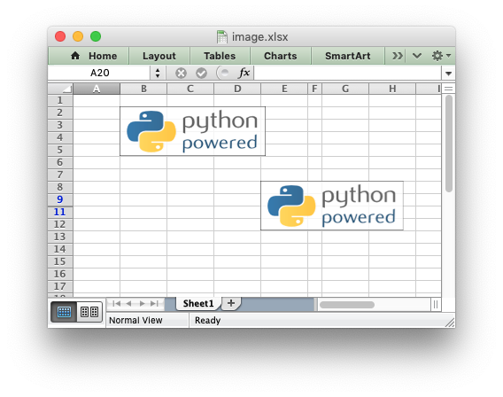
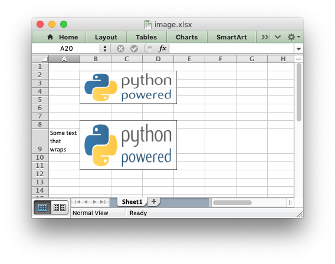
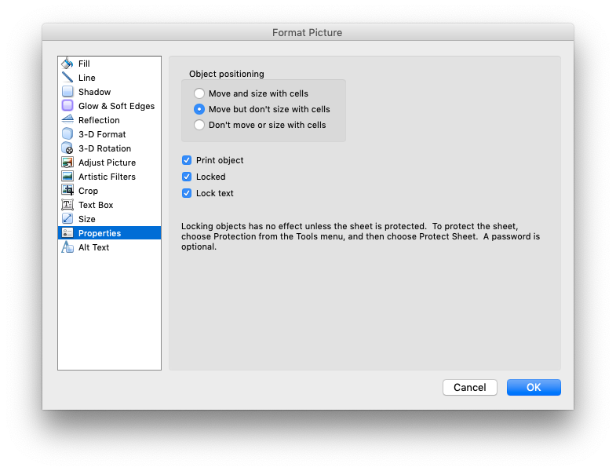
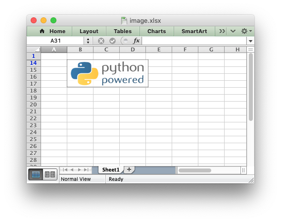

.. SPDX-License-Identifier: BSD-2-Clause
   Copyright 2013-2021, John McNamara, jmcnamara@cpan.org

.. _object_position:

Working with Object Positioning
===============================

XlsxWriter positions worksheet objects such as images, charts and textboxes in
worksheets by calculating precise coordinates based on the object size, it's
DPI (for images) and any scaling that the user specifies. It also takes into
account the heights and widths of the rows and columns that the object
crosses. In this way objects maintain their original sizes even if the rows or
columns underneath change size or are hidden.

For example::

    import xlsxwriter

    workbook = xlsxwriter.Workbook('image.xlsx')
    worksheet = workbook.add_worksheet()

    # Original image.
    worksheet.insert_image('B2', 'logo.png')

    # Same size as original, despite row/col changes.
    worksheet.insert_image('E8', 'logo.png')

    # Make column F narrower.
    worksheet.set_column('F:F', 2)

    # Hide row 10 (zero indexed).
    worksheet.set_row(9, None, None, {'hidden': True})

    workbook.close()

As can be seen the inserted image sizes are the same even though the second
image crosses changed rows and columns.

However, there are two cases where the image scale may change with row or
columns changes. These are explained in the next two sections.

.. _object_position_auto_row_height:

Object scaling due to automatic row height adjustment
-----------------------------------------------------

The scaling of a image may be affected if is crosses a row that has its
default height changed due to a font that is larger than the default font size
or that has text wrapping turned on. In these cases Excel will automatically
calculate a row height based on the text when it loads the file. Since this
row height isn't available to XlsxWriter when it creates the file the object
may appear as if it is sized incorrectly. For example::

    import xlsxwriter

    workbook = xlsxwriter.Workbook('image.xlsx')
    worksheet = workbook.add_worksheet()
    wrap_format = workbook.add_format({'text_wrap': True})

    worksheet.write('A9', 'Some text that wraps', wrap_format)

    worksheet.insert_image('B2', 'logo.png')
    worksheet.insert_image('B8', 'logo.png')

    workbook.close()

As can be seen the second inserted image is distorted, compared to the first,
due to the row being scaled automatically. To avoid this you should explicitly
set the height of the row using ``set_row()`` if it crosses an inserted
object.

Object Positioning with Cell Moving and Sizing
----------------------------------------------

Excel supports three options for "Object Positioning" within a worksheet:

Image, chart and textbox objects in XlsxWriter emulate these options using the
``object_position`` parameter::

    worksheet.insert_image('B3', 'python.png', {'object_position': 1})

Where ``object_position`` has one of the following allowable values:

1. Move and size with cells.
2. Move but don’t size with cells.
3. Don’t move or size with cells.
4. Same as Option 1 to "move and size with cells" except XlsxWriter applies
   hidden cells after the object is inserted.

Option 4 appears in Excel as Option 1. However, the worksheet object is sized
to take hidden rows or columns into account. This allows the user to hide an
image in a cell, possibly as part of an autofilter. For example::

    import xlsxwriter

    workbook = xlsxwriter.Workbook('image.xlsx')
    worksheet = workbook.add_worksheet()

    worksheet.insert_image('B2', 'logo.png')
    worksheet.insert_image('B9', 'logo.png', {'object_position': 4})

    # Hide some rows.
    for row in range(1, 13):
        worksheet.set_row(row, None, None, {'hidden': True})

    workbook.close()

In this example the first inserted image is visible over the hidden rows
whilst the second image is hidden with the rows. Unhiding the rows in Excel
would reveal the second image.

Image sizing and DPI
--------------------

When an image is imported into Excel the DPI (dots per inch) resolution of the
image is taken into account. Excel sizes the image according to a base DPI
of 96. Therefore an image with a DPI of 72 may appear slightly larger when
imported into Excel while an image with a DPI of 200 may appear twice as
small. XlsxWriter also reads the DPI of the images that the user inserts into
a worksheet and stores the image dimensions in the same way that Excel
does. If it cannot determine the DPI of the image it uses a default of 96.

Reporting issues with image insertion
-------------------------------------

A lot of work has gone into ensuring that XlsxWriter inserts images into
worksheets in exactly the same way that Excel does, even though the required
calculations and units are arcane. There are over 80 test cases that check
image insertion against files created in Excel to ensure that XlsxWriter's
handling of images is correct.

As such, before reporting any issues with image handling in XlsxWriter please
check how the same image is handled in Excel (not OpenOffice, LibreOffice or
other third party applications). If you do report an issue please use the
XlsxWriter
`Issue tracker is on GitHub <https://github.com/jmcnamara/XlsxWriter/issues>`_
and attach the image that demonstrates the issue.
