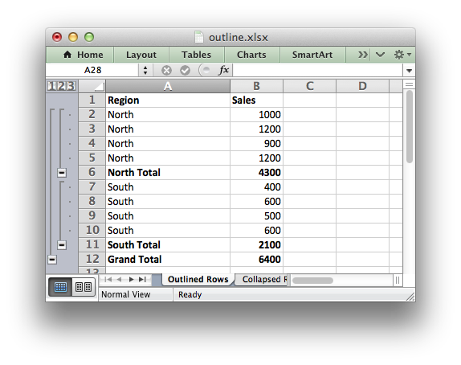
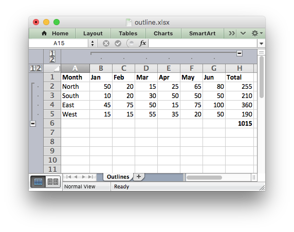

.. _outlines:

Working with Outlines and Grouping
==================================

Excel allows you to group rows or columns so that they can be hidden or
displayed with a single mouse click. This feature is referred to as outlines
and grouping.

Outlines can reduce complex data down to a few salient sub-totals or summaries.

For example the following is a worksheet with three outlines. Rows 2-11 are
grouped at level 1 and rows 2-5 and 7-10 are grouped at level 2. The lines at
the left hand side are called outline level bars and the level is shown by the
small numeral above the outline.

Clicking the minus sign on each of the level 2 outlines will collapse and hide
the data as shown below. The minus sign changes to a plus sign to indicate
that the data in the outline is hidden.

.. image:: _images/outline5.png

This shows the usefulness of outlines: with 2 mouse clicks we have reduced the
amount of visual data down to 2 sub-totals and a master total.

Clicking on the minus sign on the level 1 outline will collapse the remaining
rows as follows:

.. image:: _images/outline6.png

Outlines and Grouping in XlsxWriter
-----------------------------------

Grouping in ``XlsxWriter`` is achieved by setting the outline level via the
:func:`set_row()` and :func:`set_column()` worksheet methods::

    worksheet.set_row(row, height, format, options)
    worksheet.set_column(first_col, last_col, width, format, options)

Adjacent row or columns with the same outline level are grouped together into a
single outline.

The ``'options'`` parameter is a dictionary with the following possible keys:

* ``'hidden'``
* ``'level'``
* ``'collapsed'``

Options can be set as follows::

    worksheet.set_row(0, 20, cell_format, {'hidden': True})

    # Or use defaults for other properties and set the options only.
    worksheet.set_row(0, None, None, {'hidden': True})

The following example sets an outline level of 1 for rows 1 and 2
(zero-indexed) and columns B to G. The parameters ``height`` and
``cell_format`` are assigned default values::

    worksheet.set_row(1, None, None, {'level': 1})
    worksheet.set_row(2, None, None, {'level': 1})
    worksheet.set_column('B:G', None, None, {'level': 1})

Excel allows up to 7 outline levels. Therefore the ``level`` parameter should
be in the range ``0 <= level <= 7``.

.. image:: _images/outline4.png

Rows and columns can be collapsed by setting the ``hidden`` flag for the hidden
rows/columns and setting the ``collapsed`` flag for the row/column that has
the collapsed ``'+'`` symbol::

    worksheet.set_row(1, None, None, {'level': 1, 'hidden': True})
    worksheet.set_row(2, None, None, {'level': 1, 'hidden': True})
    worksheet.set_row(3, None, None, {'collapsed': True})

    worksheet.set_column('B:G', None, None, {'level': 1, 'hidden': True})
    worksheet.set_column('H:H', None, None, {'collapsed': True})

.. Note::

   Setting the ``collapsed`` flag is particularly important for
   compatibility with non-Excel spreadsheets.

For a more complete examples see :ref:`ex_outline1` and :ref:`ex_outline2`.

Some additional outline properties can be set via the :func:`outline_settings`
worksheet method.

