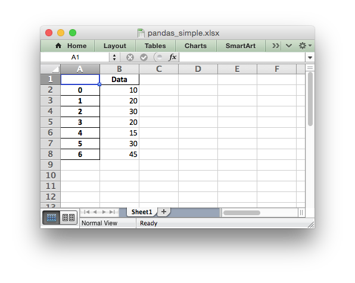
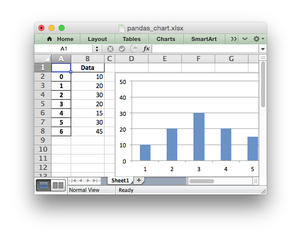
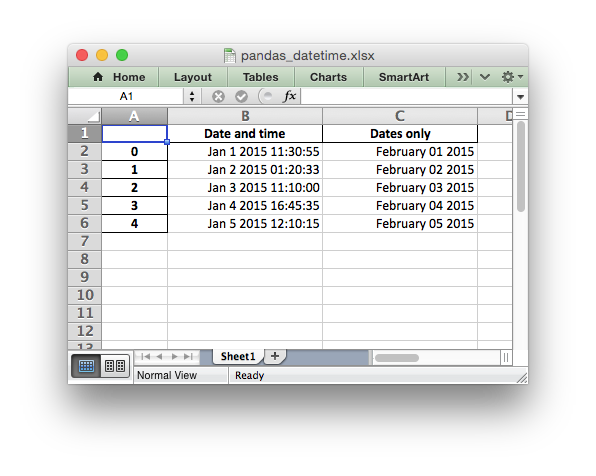
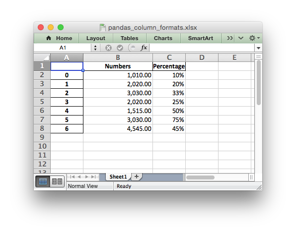
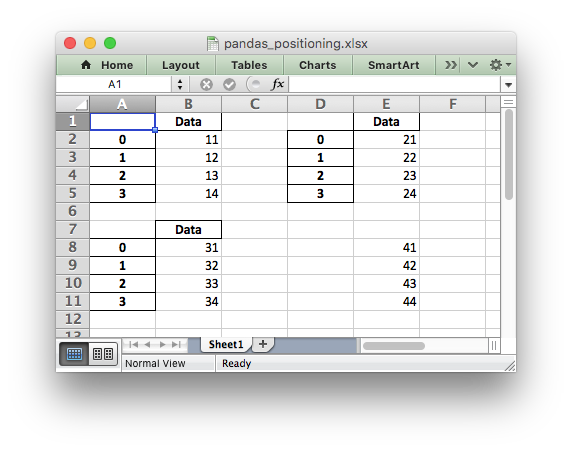

.. _ewx_pandas:

Working with Python Pandas and XlsxWriter
=========================================

Python `Pandas <http://pandas.pydata.org/>`_ is a Python data analysis
library. It can read, filter and re-arrange small and large data sets and
output them in a range of formats including Excel.

Pandas writes Excel files using the `Xlwt
<https://pypi.python.org/pypi/xlwt>`_ module for xls files and the `Openpyxl
<https://pypi.python.org/pypi/openpyxl>`_ or XlsxWriter modules for xlsx
files.

Using XlsxWriter with Pandas
----------------------------

To use XlsxWriter with Pandas you specify it as the Excel writer *engine*::

    import pandas as pd

    # Create a Pandas dataframe from the data.
    df = pd.DataFrame({'Data': [10, 20, 30, 20, 15, 30, 45]})

    # Create a Pandas Excel writer using XlsxWriter as the engine.
    writer = pd.ExcelWriter('pandas_simple.xlsx', engine='xlsxwriter')

    # Convert the dataframe to an XlsxWriter Excel object.
    df.to_excel(writer, sheet_name='Sheet1')

    # Close the Pandas Excel writer and output the Excel file.
    writer.save()

The output from this would look like the following:

See the full example at :ref:`ex_pandas_simple`.

Accessing XlsxWriter from Pandas
--------------------------------

In order to apply XlsxWriter features such as Charts, Conditional Formatting
and Column Formatting to the Pandas output we need to access the underlying
:ref:`workbook <Workbook>` and :ref:`worksheet <Worksheet>` objects. After
that we can treat them as normal XlsxWriter objects.

Continuing on from the above example we do that as follows::

    import pandas as pd

    # Create a Pandas dataframe from the data.
    df = pd.DataFrame({'Data': [10, 20, 30, 20, 15, 30, 45]})

    # Create a Pandas Excel writer using XlsxWriter as the engine.
    writer = pd.ExcelWriter('pandas_simple.xlsx', engine='xlsxwriter')

    # Convert the dataframe to an XlsxWriter Excel object.
    df.to_excel(writer, sheet_name='Sheet1')

    # Get the xlsxwriter objects from the dataframe writer object.
    workbook  = writer.book
    worksheet = writer.sheets['Sheet1']

This is equivalent to the following code when using XlsxWriter on its own::

    workbook  = xlsxwriter.Workbook('filename.xlsx')
    worksheet = workbook.add_worksheet()

The Workbook and Worksheet objects can then be used to access other XlsxWriter
features, see below.

Adding Charts to Dataframe output
---------------------------------

Once we have the Workbook and Worksheet objects, as shown in the previous
section, we we can use them to apply other features such as adding a chart::

    # Get the xlsxwriter objects from the dataframe writer object.
    workbook  = writer.book
    worksheet = writer.sheets['Sheet1']

    # Create a chart object.
    chart = workbook.add_chart({'type': 'column'})

    # Configure the series of the chart from the dataframe data.
    chart.add_series({'values': '=Sheet1!$B$2:$B$8'})

    # Insert the chart into the worksheet.
    worksheet.insert_chart('D2', chart)

The output would look like this:

See the full example at :ref:`ex_pandas_chart`.

.. Note::

   The above example uses a fixed string ``=Sheet1!$B$2:$B$8`` for the data
   range. It is also possible to use a ``(row, col)`` range which can be
   varied based on the length of the dataframe. See for example
   :ref:`ex_pandas_chart_line` and :ref:`cell_notation`.

Adding Conditional Formatting to Dataframe output
-------------------------------------------------

Another option is to apply a conditional format like this::

    # Apply a conditional format to the cell range.
    worksheet.conditional_format('B2:B8', {'type': '3_color_scale'})

Which would give:

.. image:: _images/pandas_conditional.png

See the full example at :ref:`ex_pandas_conditional`.

Formatting of the Dataframe output
----------------------------------

XlsxWriter and Pandas provide very little support for formatting the output
data from a dataframe apart from default formatting such as the header and
index cells and any cells that contain dates of datetimes. In addition it
isn't possible to format any cells that already have a default format applied.

If you require very controlled formatting of the dataframe output then you
would probably be better off using Xlsxwriter directly with raw data taken
from Pandas. However, some formatting options are available.

For example it is possible to set the default date and datetime formats via
the Pandas interface::

    writer = pd.ExcelWriter("pandas_datetime.xlsx",
                            engine='xlsxwriter',
                            datetime_format='mmm d yyyy hh:mm:ss',
                            date_format='mmmm dd yyyy')

Which would give:

See the full example at :ref:`ex_pandas_datetime`.

It is possible to format any other, non date/datetime column data using
:func:`set_column()`::

    # Add some cell formats.
    format1 = workbook.add_format({'num_format': '#,##0.00'})
    format2 = workbook.add_format({'num_format': '0%'})

    # Set the column width and format.
    worksheet.set_column('B:B', 18, format1)

    # Set the format but not the column width.
    worksheet.set_column('C:C', None, format2)

Note: This feature requires Pandas >= 0.16.

See the full example at :ref:`ex_pandas_column_formats`.

Handling multiple Pandas Dataframes
-----------------------------------

It is possible to write more than one dataframe to a worksheet or to several
worksheets. For example to write multiple dataframes to multiple worksheets::

    # Write each dataframe to a different worksheet.
    df1.to_excel(writer, sheet_name='Sheet1')
    df2.to_excel(writer, sheet_name='Sheet2')
    df3.to_excel(writer, sheet_name='Sheet3')

See the full example at :ref:`ex_pandas_multiple`.

It is also possible to position multiple dataframes within the same
worksheet::

    # Position the dataframes in the worksheet.
    df1.to_excel(writer, sheet_name='Sheet1')  # Default position, cell A1.
    df2.to_excel(writer, sheet_name='Sheet1', startcol=3)
    df3.to_excel(writer, sheet_name='Sheet1', startrow=6)

    # Write the dataframe without the header and index.
    df4.to_excel(writer, sheet_name='Sheet1',
                 startrow=7, startcol=4, header=False, index=False)

See the full example at :ref:`ex_pandas_positioning`.

Passing XlsxWriter constructor options to Pandas
------------------------------------------------

XlsxWriter supports several :func:`Workbook` constructor options such as
``strings_to_urls()``. These can also be applied to the ``Workbook`` object
created by Pandas as follows::

    writer = pd.ExcelWriter('pandas_example.xlsx',
                            engine='xlsxwriter',
                            options={'strings_to_urls': False})

Saving the Dataframe output to a string
---------------------------------------

It is also possible to write the Pandas XlsxWriter DataFrame output to a
string or byte array::

    import pandas as pd
    import StringIO

    # Create a Pandas dataframe from the data.
    df = pd.DataFrame({'Data': [10, 20, 30, 20, 15, 30, 45]})

    # Note, Python 2 example. For Python 3 use: output = io.BytesIO().
    output = StringIO.StringIO()

    # Use the StringIO object as the filehandle.
    writer = pd.ExcelWriter(output, engine='xlsxwriter')

    # Write the data frame to the StringIO object.
    pd.DataFrame().to_excel(writer, sheet_name='Sheet1')

    writer.save()
    xlsx_data = output.getvalue()

    # Do something with the data...

Note: This feature requires Pandas >= 0.17.

Additional Pandas and Excel Information
---------------------------------------

Here are some additional resources in relation to Pandas, Excel and XlsxWriter.

* The XlsxWriter Pandas examples later in the document: :ref:`pandas_examples`.

* The Pandas documentation on the `pandas.DataFrame.to_excel() method
  <http://pandas.pydata.org/pandas-docs/stable/generated/pandas.DataFrame.to_excel.html>`_.

* A more detailed tutorial on `Using Pandas and XlsxWriter to create Excel
  charts
  <https://pandas-xlsxwriter-charts.readthedocs.io/>`_.

* The series of articles on the "Practical Business Python" website about
  `Using Pandas and Excel <http://pbpython.com/tag/excel.html>`_.
