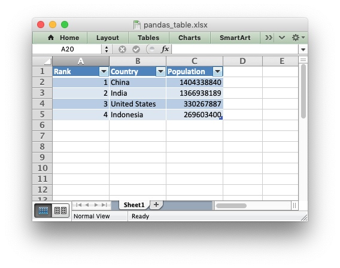
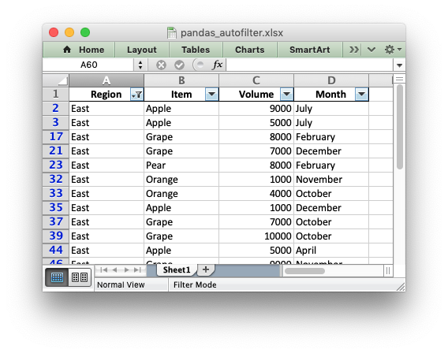

.. SPDX-License-Identifier: BSD-2-Clause
   Copyright 2013-2023, John McNamara, jmcnamara@cpan.org

.. _ewx_pandas:

Working with Python Pandas and XlsxWriter
=========================================

Python `Pandas <https://pandas.pydata.org/>`_ is a Python data analysis
library. It can read, filter and re-arrange small and large data sets and
output them in a range of formats including Excel.

Pandas writes Excel files using the `Xlwt
<https://pypi.org/project/xlwt/>`_ module for xls files and the `Openpyxl
<https://pypi.org/project/openpyxl/>`_ or XlsxWriter modules for xlsx
files.

Using XlsxWriter with Pandas
----------------------------

To use XlsxWriter with Pandas you specify it as the Excel writer *engine*::

    import pandas as pd

    # Create a Pandas dataframe from the data.
    df = pd.DataFrame({'Data': [10, 20, 30, 20, 15, 30, 45]})

    # Create a Pandas Excel writer using XlsxWriter as the engine.
    writer = pd.ExcelWriter('pandas_simple.xlsx', engine='xlsxwriter')

    # Convert the dataframe to an XlsxWriter Excel object.
    df.to_excel(writer, sheet_name='Sheet1')

    # Close the Pandas Excel writer and output the Excel file.
    writer.close()

The output from this would look like the following:

.. image:: _images/pandas_simple.png

See the full example at :ref:`ex_pandas_simple`.

Accessing XlsxWriter from Pandas
--------------------------------

In order to apply XlsxWriter features such as Charts, Conditional Formatting
and Column Formatting to the Pandas output we need to access the underlying
:ref:`workbook <Workbook>` and :ref:`worksheet <Worksheet>` objects. After
that we can treat them as normal XlsxWriter objects.

Continuing on from the above example we do that as follows::

    import pandas as pd

    # Create a Pandas dataframe from the data.
    df = pd.DataFrame({'Data': [10, 20, 30, 20, 15, 30, 45]})

    # Create a Pandas Excel writer using XlsxWriter as the engine.
    writer = pd.ExcelWriter('pandas_simple.xlsx', engine='xlsxwriter')

    # Convert the dataframe to an XlsxWriter Excel object.
    df.to_excel(writer, sheet_name='Sheet1')

    # Get the xlsxwriter objects from the dataframe writer object.
    workbook  = writer.book
    worksheet = writer.sheets['Sheet1']

This is equivalent to the following code when using XlsxWriter on its own::

    workbook  = xlsxwriter.Workbook('filename.xlsx')
    worksheet = workbook.add_worksheet()

The Workbook and Worksheet objects can then be used to access other XlsxWriter
features, see below.

Adding Charts to Dataframe output
---------------------------------

Once we have the Workbook and Worksheet objects, as shown in the previous
section, we we can use them to apply other features such as adding a chart::

    # Get the xlsxwriter objects from the dataframe writer object.
    workbook  = writer.book
    worksheet = writer.sheets['Sheet1']

    # Create a chart object.
    chart = workbook.add_chart({'type': 'column'})

    # Get the dimensions of the dataframe.
    (max_row, max_col) = df.shape

    # Configure the series of the chart from the dataframe data.
    chart.add_series({'values': ['Sheet1', 1, 1, max_row, 1]})

    # Insert the chart into the worksheet.
    worksheet.insert_chart(1, 3, chart)

The output would look like this:

.. image:: _images/pandas_chart.png

See the full example at :ref:`ex_pandas_chart`.

Adding Conditional Formatting to Dataframe output
-------------------------------------------------

Another option is to apply a conditional format like this::

    # Apply a conditional format to the required cell range.
    worksheet.conditional_format(1, max_col, max_row, max_col,
                                 {'type': '3_color_scale'})

Which would give:

.. image:: _images/pandas_conditional.png

See the full example at :ref:`ex_pandas_conditional` and the section of the
docs on :ref:`working_with_conditional_formats`.

Formatting of the Dataframe output
----------------------------------

XlsxWriter and Pandas provide very little support for formatting the output
data from a dataframe apart from default formatting such as the header and
index cells and any cells that contain dates or datetimes. In addition it
isn't possible to format any cells that already have a default format applied.

If you require very controlled formatting of the dataframe output then you
would probably be better off using Xlsxwriter directly with raw data taken
from Pandas. However, some formatting options are available.

For example it is possible to set the default date and datetime formats via
the Pandas interface::

    writer = pd.ExcelWriter("pandas_datetime.xlsx",
                            engine='xlsxwriter',
                            datetime_format='mmm d yyyy hh:mm:ss',
                            date_format='mmmm dd yyyy')

Which would give:

.. image:: _images/pandas_datetime.png

See the full example at :ref:`ex_pandas_datetime`.

It is possible to format any other, non date/datetime column data using
:func:`set_column()`::

    # Add some cell formats.
    format1 = workbook.add_format({'num_format': '#,##0.00'})
    format2 = workbook.add_format({'num_format': '0%'})

    # Set the column width and format.
    worksheet.set_column(1, 1, 18, format1)

    # Set the format but not the column width.
    worksheet.set_column(2, 2, None, format2)

.. image:: _images/pandas_column_formats.png

See the full example at :ref:`ex_pandas_column_formats`.

Formatting of the Dataframe headers
-----------------------------------

Pandas writes the dataframe header with a default cell format. Since it is a
cell format it cannot be overridden using :func:`set_row()`. If you wish to
use your own format for the headings then the best approach is to turn off the
automatic header from Pandas and write your own. For example::

    # Turn off the default header and skip one row to allow us to insert a
    # user defined header.
    df.to_excel(writer, sheet_name='Sheet1', startrow=1, header=False)

    # Get the xlsxwriter workbook and worksheet objects.
    workbook  = writer.book
    worksheet = writer.sheets['Sheet1']

    # Add a header format.
    header_format = workbook.add_format({
        'bold': True,
        'text_wrap': True,
        'valign': 'top',
        'fg_color': '#D7E4BC',
        'border': 1})

    # Write the column headers with the defined format.
    for col_num, value in enumerate(df.columns.values):
        worksheet.write(0, col_num + 1, value, header_format)

.. image:: _images/pandas_header_format.png

See the full example at :ref:`ex_pandas_header_format`.

Adding a Dataframe to a Worksheet Table
---------------------------------------

As explained in :ref:`tables`, tables in Excel are a way of grouping a range
of cells into a single entity, like this:

The way to do this with a Pandas dataframe is to first write the data without
the index or header, and by starting 1 row forward to allow space for the
table header::

    df.to_excel(writer, sheet_name='Sheet1',
                startrow=1, header=False, index=False)

We then create a list of headers to use in ``add_table()``::

    column_settings = [{'header': column} for column in df.columns]

Finally we add the Excel table structure, based on the dataframe `shape` and
with the column headers we generated from the dataframe columns::

    (max_row, max_col) = df.shape

    worksheet.add_table(0, 0, max_row, max_col - 1, {'columns': column_settings})

See the full example at :ref:`ex_pandas_table`.

Adding an autofilter to a Dataframe output
------------------------------------------

As explained in :ref:`working_with_autofilters`, autofilters in Excel are a
way of filtering a 2d range of data to only display rows that match a user
defined criteria.

The way to do this with a Pandas dataframe is to first write the data without
the index (unless you want to include it in the filtered data)::

    df.to_excel(writer, sheet_name='Sheet1', index=False)

We then get the dataframe `shape` and add the autofilter::

    worksheet.autofilter(0, 0, max_row, max_col - 1)

.. image:: _images/autofilter1.png

We can also add an optional filter criteria. The placeholder "Region" in the
filter is ignored and can be any string that adds clarity to the expression::

    worksheet.filter_column(0, 'Region == East')

However, it isn't enough to just apply the criteria. The rows that don't match
must also be hidden. We use Pandas to figure our which rows to hide::

    for row_num in (df.index[(df['Region'] != 'East')].tolist()):
        worksheet.set_row(row_num + 1, options={'hidden': True})

This gives us a filtered worksheet like this:

See the full example at :ref:`ex_pandas_autofilter`.

Handling multiple Pandas Dataframes
-----------------------------------

It is possible to write more than one dataframe to a worksheet or to several
worksheets. For example to write multiple dataframes to multiple worksheets::

    # Write each dataframe to a different worksheet.
    df1.to_excel(writer, sheet_name='Sheet1')
    df2.to_excel(writer, sheet_name='Sheet2')
    df3.to_excel(writer, sheet_name='Sheet3')

See the full example at :ref:`ex_pandas_multiple`.

It is also possible to position multiple dataframes within the same
worksheet::

    # Position the dataframes in the worksheet.
    df1.to_excel(writer, sheet_name='Sheet1')  # Default position, cell A1.
    df2.to_excel(writer, sheet_name='Sheet1', startcol=3)
    df3.to_excel(writer, sheet_name='Sheet1', startrow=6)

    # Write the dataframe without the header and index.
    df4.to_excel(writer, sheet_name='Sheet1',
                 startrow=7, startcol=4, header=False, index=False)

.. image:: _images/pandas_positioning.png

See the full example at :ref:`ex_pandas_positioning`.

Passing XlsxWriter constructor options to Pandas
------------------------------------------------

XlsxWriter supports several :func:`Workbook` constructor options such as
``strings_to_urls()``. These can also be applied to the ``Workbook`` object
created by Pandas using the ``engine_kwargs`` keyword::

    writer = pd.ExcelWriter('pandas_example.xlsx',
                            engine='xlsxwriter',
                            engine_kwargs={'options': {'strings_to_numbers': True}})

Note, versions of Pandas prior to 1.3.0 used this syntax::

    writer = pd.ExcelWriter('pandas_example.xlsx',
                            engine='xlsxwriter',
                            options={'strings_to_numbers': True})

Saving the Dataframe output to a string
---------------------------------------

It is also possible to write the Pandas XlsxWriter DataFrame output to a
byte array::

    import pandas as pd
    import io

    # Create a Pandas dataframe from the data.
    df = pd.DataFrame({'Data': [10, 20, 30, 20, 15, 30, 45]})

    output = io.BytesIO()

    # Use the BytesIO object as the filehandle.
    writer = pd.ExcelWriter(output, engine='xlsxwriter')

    # Write the data frame to the BytesIO object.
    df.to_excel(writer, sheet_name='Sheet1')

    writer.close()
    xlsx_data = output.getvalue()

    # Do something with the data...

Note: This feature requires Pandas >= 0.17.

Additional Pandas and Excel Information
---------------------------------------

Here are some additional resources in relation to Pandas, Excel and XlsxWriter.

* The XlsxWriter Pandas examples later in the document: :ref:`pandas_examples`.

* The Pandas documentation on the `pandas.DataFrame.to_excel() method
  <https://pandas.pydata.org/pandas-docs/stable/generated/pandas.DataFrame.to_excel.html>`_.

* A more detailed tutorial on `Using Pandas and XlsxWriter to create Excel
  charts
  <https://pandas-xlsxwriter-charts.readthedocs.io/>`_.

* The series of articles on the "Practical Business Python" website about
  `Using Pandas and Excel <https://pbpython.com/tag/excel.html>`_.
