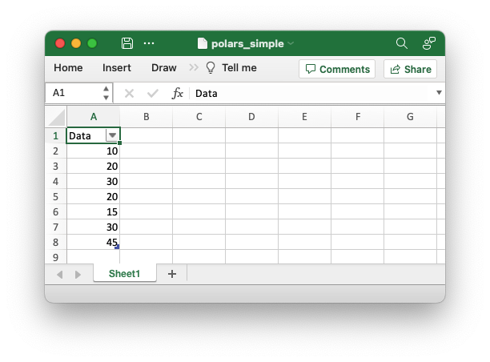
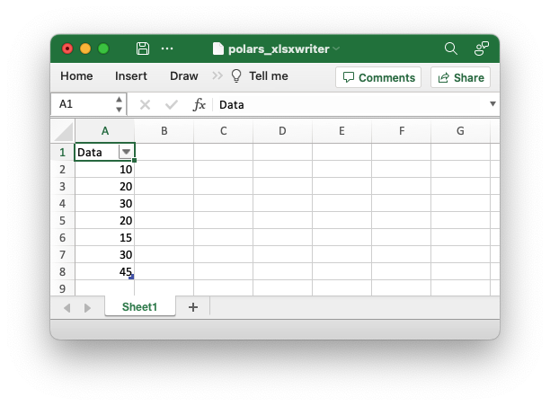
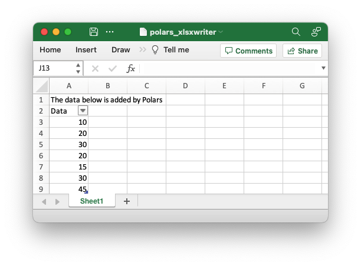
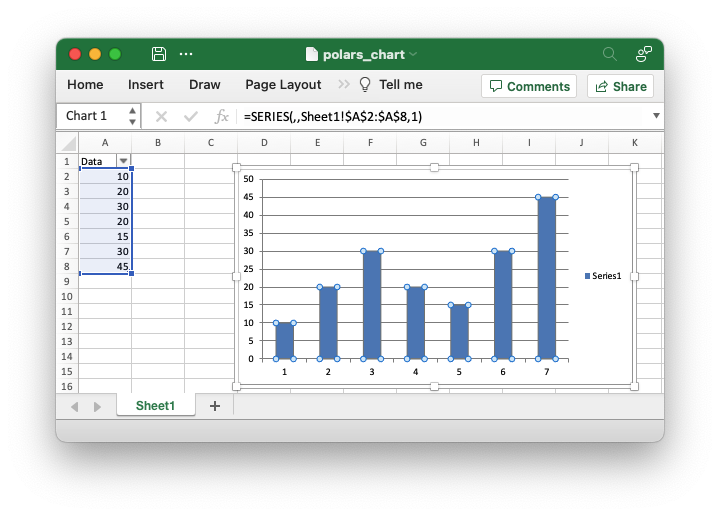
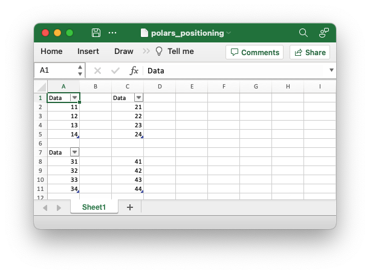
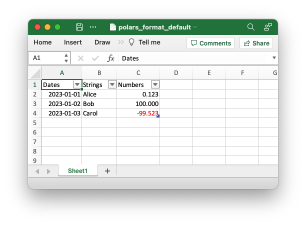
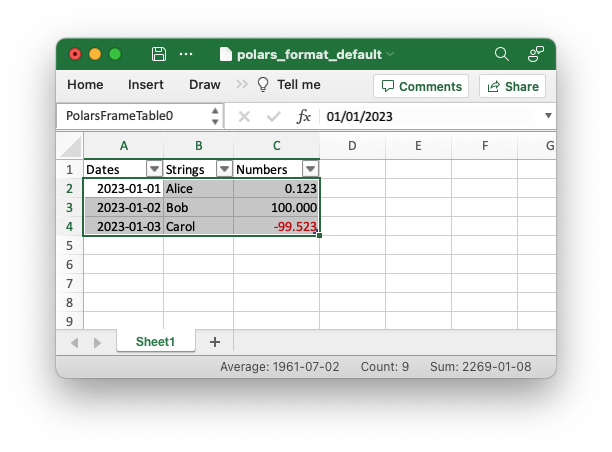
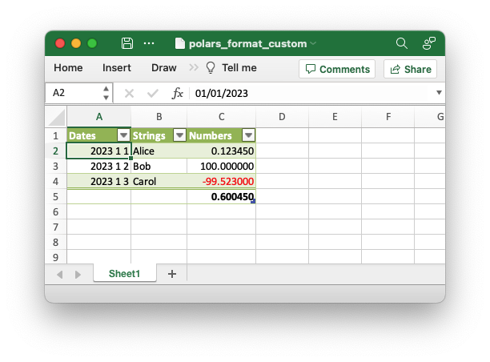
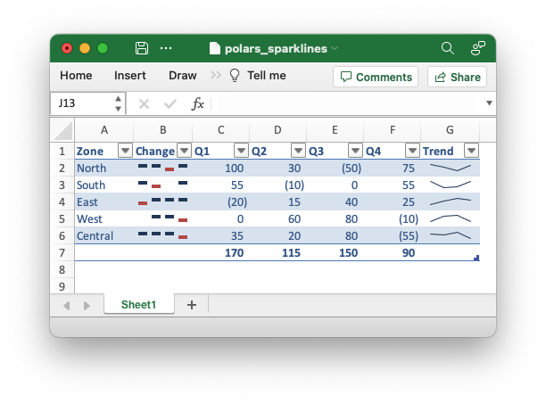

.. SPDX-License-Identifier: BSD-2-Clause
   Copyright 2013-2023, John McNamara, jmcnamara@cpan.org

.. _ewx_polars:

Working with Polars and XlsxWriter
==================================

`Polars <https://www.pola.rs>`_ is a fast dataframe library for Rust and Python.

Polars provides very tight integration of XlsxWriter and supports a lot of
features such as conditional formats, tables, autofilters, autofit and others
without having to use the external library directly. At the same time it allows
use of native XlsxWriter workbook and worksheets objects to take advantage of
any features that it doesn't support.

Creating an Excel file from a dataframe with Polars is straightforward and
doesn't require any direct invocation of XlsxWriter. All that is required is to
use the ``write_excel()`` method with a Polars dataframe::

    import polars as pl

    df = pl.DataFrame({'Data': [10, 20, 30, 20, 15, 30, 45]})

    df.write_excel(workbook='polars_simple.xlsx')

This is a complete example and the output from this would look like the
following:

One interesting aspect of the Polars output is that it writes the dataframe as
an :ref:`Excel Data Table <tables>`. We will discuss this and other XlsxWriter
features that are available from ``write_excel()`` in the sections below.

The Polars ``write_excel()`` API
--------------------------------

The following are the parameters supported by the ``write_excel()`` API to
control the output and formatting of the Excel file:

- ``workbook``:

  The `workbook` parameter can be a string representation of a filename (like in
  the example above), a :class:`Path <pathlib.Path>` object, a :class:`BytesIO
  <io.BytesIO>` object to write the file to memory, or a :ref:`Workbook
  <Workbook>` object created by XlsxWriter. If a ``workbook`` parameter isn't
  specified it will default to the filename ``"dataframe.xlsx"``.

- ``worksheet``:

  Name of the target worksheet. If ``None`` it will create and write to
  ``"Sheet1"`` (or ``"Sheet2"``. ``"Sheet3"`` in subsequent writes). Writing to
  an existing worksheet requires a valid name.

- ``position``:

  The position of the dataframe table in Excel cell notation such as ``"A1"`` or
  a ``(row, col)`` integer tuple. See :ref:`cell_notation` for more details.

- ``table_style``:

  A named Excel table style, such as "Table Style Medium 4", or a dictionary of
  ``{"option": bool,}`` values containing one or more of the following keys
  that are used with :ref:`worksheet.add_table() <tables>`:

  - ``style``
  - ``first_column``
  - ``last_column``
  - ``banded_columns``
  - ``banded_rows``

- ``table_name``:

  The name of the output dataframe :ref:`table <tables>` object in the
  worksheet. This name can be referred to in formulas or charts, or by
  subsequent xlsxwriter operations. It defaults to a name like
  ``PolarsFrameTable0``.

- ``column_widths``:

  A ``{"col": width,}`` dictionary that sets (or overrides if autofitting)
  column widths in integer pixel units.

- ``column_totals``:

  Option to add a total row to the dataframe table. If ``True``, all numeric
  columns will have an associated total using table ``sum`` function. If given a
  list of column names, those listed will have a sum total. For more control it
  is possible to pass a ``{"col": "fn",}`` dict where ``"fn"`` is a valid table
  function such as ``average``, ``count_nums``, ``count``, ``max``, ``min``,
  ``std_dev``, ``sum`` and ``var``, see :ref:`tables`.

- ``column_formats``:

  A ``{"col": "fmt",}`` dictionary matching specific columns to a particular
  Excel format string, such as ``"dd/mm/yyyy;@"``, ``"0.00%"``,
  ``"($#,##0_);[Red]($#,##0)"``, etc. (Formats defined here will override those
  defined in ``dtype_formats``), see below.

- ``conditional_formats``:

  This option is a  ``{"col": str,}`` or ``{"col": options,}`` dictionary that
  defines conditional formatting for the specified columns. If supplying a
  string typename, it should be one of the recognized xlsxwriter types such as
  ``"3_color_scale"``, ``"data_bar"``, see
  :ref:`working_with_conditional_formats`. If supplying the full definition
  dictionary you have complete flexibility to apply any supported conditional
  format, including icon sets, formulas, etc.

- ``dtype_formats``:

  This option is a ``{dtype: "fmt",}`` dictionary that sets the default Excel
  number format for the given dtype. (This is overridden on a per-column basis
  by ``column_formats``.) It is also valid to use dtype groups such as
  ``polars.datatypes.FLOAT_DTYPES`` as the dtype/format key, to simplify setting
  uniform int/float formats.

- ``sparklines``:

  This option is a ``{"col": colnames,}``or ``{"col": params,}`` dictionary that
  defines one or more sparklines to be written into a new column in the table.
  If passing a list of colnames (used as the source of the sparkline data) the
  default sparkline settings are used (a line with no markers). For more control
  an XlsxWriter compliant parameter dictionary can be supplied (see
  :ref:`sparklines`).

  In this case three additional polars-specific keys are available: "columns",
  "insert_before", and "insert_after". These allow you to define the source
  columns and position the sparkline(s) with respect to other table columns. If
  no position directive is given, sparklines are added to the right side of the
  table in the order in which they are defined.

- ``float_precision``:

  This sets the default number of decimals displayed for floating point columns.
  Note that this is purely a formatting directive, the actual values are not
  rounded.

- ``has_header``:

  The option controls if the dataframe table should be created with a header
  row. This is on by default.

- ``autofilter``:

  The option controls if the dataframe table will have an autofilter in the
  header row. This is on by default.

- ``autofit``:

  Set the option to autofit the individual column widths in the output data.
  This uses the worksheet :func:`autofit` method and is subject to its
  limitations.

- ``hidden_columns``:

  This option can be used to set a list of table columns to hide in the
  worksheet.

- ``hide_gridlines``:

  This option is used to control the display of gridlines on the output
  worksheet.

Sharing XlsxWriter workbooks with Polars
----------------------------------------

In a majority of use cases you will be able to control the output workbook and
worksheets via the ``write_excel()`` APIs but there may be some situations you
may wish to start a normal XlsxWriter workbook and then add Polars data to it.

To do this you can create a :ref:`workbook <Workbook>` object and pass it to the
``workbook`` parameter of Polars ``write_excel()``::

    import xlsxwriter
    import polars as pl

    df = pl.DataFrame({'Data': [10, 20, 30, 20, 15]})

    with xlsxwriter.Workbook('polars_xlsxwriter.xlsx') as workbook:
        df.write_excel(workbook=workbook)

Output:

As can be seen from the image, Polars creates a new worksheet and adds the data
to it. However, you can also add Polars data to a worksheet created from
XlsxWriter::

    import xlsxwriter
    import polars as pl

    df = pl.DataFrame({'Data': [10, 20, 30, 20, 15, 30, 45]})

    with xlsxwriter.Workbook('polars_xlsxwriter.xlsx') as workbook:
        # Create a new worksheet.
        worksheet = workbook.add_worksheet()

        # Do something with the worksheet.
        worksheet.write('A1', 'The data below is added by Polars')

        # Write the Polars data to the worksheet created above, at an offset to
        # avoid overwriting the previous text.
        df.write_excel(workbook=workbook, worksheet="Sheet1", position='A2')

Output:

(See the example at :ref:`ex_polars_xlsxwriter`.)

Adding Charts to Dataframe output
---------------------------------

With the techniques shown above we can get access to the Workbook and Worksheet
objects and then use them to apply other features such as adding a chart::

    import xlsxwriter
    import polars as pl

    df = pl.DataFrame({'Data': [10, 20, 30, 20, 15, 30, 45]})

    with xlsxwriter.Workbook('polars_chart.xlsx') as workbook:
        # Create the worksheet so we can reuse it later.
        worksheet = workbook.add_worksheet()

        # Write the Polars data to the worksheet created above.
        df.write_excel(workbook=workbook, worksheet="Sheet1")

        # Create a chart object.
        chart = workbook.add_chart({'type': 'column'})

        # Get the dimensions of the dataframe.
        (max_row, max_col) = df.shape

        # Configure the series of the chart from the dataframe data.
        chart.add_series({'values': ['Sheet1', 1, max_col - 1, max_row, max_col - 1]})

        # Insert the chart into the worksheet.
        worksheet.insert_chart(1, 3, chart)

The output would look like this:

(See the example at :ref:`ex_polars_chart`.)

Adding Conditional Formatting to Dataframe output
-------------------------------------------------

Following on from the technique shown in the previous sections we could also add
a conditional format to the dataframe data like this::

    import xlsxwriter
    import polars as pl

    with xlsxwriter.Workbook('polars_conditional.xlsx') as workbook:
        df = pl.DataFrame({'Data': [10, 20, 30, 20, 15, 30, 45]})

        worksheet = workbook.add_worksheet()

        # Write the Polars data to the worksheet created above.
        df.write_excel(workbook=workbook, worksheet="Sheet1")

        # Get the dimensions of the dataframe.
        (max_row, max_col) = df.shape

        # Apply a conditional format to the required cell range.
        worksheet.conditional_format(1, max_col - 1, max_row, max_col - 1,
                                    {'type': '3_color_scale'})

However, this can also be done directly and more succinctly using the Polars
``write_excel()`` APIs::

    import polars as pl

    df = pl.DataFrame({'Data': [10, 20, 30, 20, 15, 30, 45]})

    df.write_excel(
        workbook='pandas_conditional.xlsx',
        conditional_formats={"Data": {'type': '3_color_scale'}},
    )

Which would give:

.. image:: _images/polars_conditional.png

See the full example at :ref:`ex_polars_conditional` and the section of the docs
on :ref:`working_with_conditional_formats`.

Handling multiple Polars Dataframes
-----------------------------------

It is possible to write more than one dataframe to a worksheet or to several
worksheets. For example to write multiple dataframes to multiple worksheets::

    with xlsxwriter.Workbook('polars_multiple.xlsx') as workbook:
        df1.write_excel(workbook=workbook, table_name="Table1")
        df2.write_excel(workbook=workbook, table_name="Table2")
        df3.write_excel(workbook=workbook, table_name="Table3")

(See the full example at :ref:`ex_polars_multiple`.)

It is also possible to position multiple dataframes within the same
worksheet::

    with xlsxwriter.Workbook('polars_positioning.xlsx') as workbook:
        # Write the dataframe to the default worksheet and position: Sheet1!A1.
        df1.write_excel(workbook=workbook)

        # Write the dataframe using a cell string position.
        df2.write_excel(workbook=workbook, worksheet='Sheet1', position='C1')

        # Write the dataframe using a (row, col) tuple position.
        df3.write_excel(workbook=workbook, worksheet='Sheet1', position=(6, 0))

        # Write the dataframe without the header.
        df4.write_excel(
            workbook=workbook,
            worksheet='Sheet1',
            position='C8',
            has_header=False)

Output:

(See the full example at :ref:`ex_polars_positioning`.)

Formatting the dataframe output
-------------------------------

Polars uses some sensible default formatting for different data types. For
example consider this dataframe comprised of dates, strings and positive and
negative numbers::

    from datetime import date
    import polars as pl

    df = pl.DataFrame(
        {
            "Dates": [date(2023, 1, 1), date(2023, 1, 2), date(2023, 1, 3)],
            "Strings": ["Alice", "Bob", "Carol"],
            "Numbers": [0.12345, 100, -99.523],
        }
    )

    df.write_excel(workbook='polars_format_default.xlsx', autofit=True)

(See the full example at :ref:`ex_polars_format_default`).

As can be seen the dates are formatted with a ``"yyyy-mm-dd"`` style format and
the numbers are formatted to 3 decimal places with negative numbers shown in red
(using the number format ``"#,##0.000;[Red]-#,##0.000"``). We also used the
``autofit`` parameter in this example to autofit the column widths.

One thing to note from the previous examples is that the Polars dataframes are
added to the Excel worksheet as :ref:`Excel Data Tables <tables>`. This can be
seen from the green corner symbol in the bottom right of the dataframe values
and from the table view:

Tables are a useful Excel data representation that is analogous to a Python
dataframe. We can also use the table properties as well as some of the Polars
``write_excel()`` options to add some more formatting to the previous example::

    from datetime import date
    import polars as pl

    # Create a Pandas dataframe with some sample data.
    df = pl.DataFrame(
        {
            'Dates': [date(2023, 1, 1), date(2023, 1, 2), date(2023, 1, 3)],
            'Strings': ['Alice', 'Bob', 'Carol'],
            'Numbers': [0.12345, 100, -99.523],
        }
    )

    # Write the dataframe to a new Excel file with formatting options.
    df.write_excel(
        workbook='polars_format_custom.xlsx',

        # Set an alternative table style.
        table_style='Table Style Medium 4',

        # See the floating point precision for reals.
        float_precision=6,

        # Set an alternative number/date format for Polar Date types.
        dtype_formats={pl.Date: "yyyy mm dd;@"},

        # Add totals to the numeric columns.
        column_totals=True,

        # Autofit the column widths.
        autofit=True,
    )

(See the full example at :ref:`ex_polars_format_custom`).

Adding Sparklines to the output dataframe
-----------------------------------------

We can also add :ref:`sparklines <sparklines>` to the dataframe output::

    import polars as pl
    from polars.datatypes import INTEGER_DTYPES

    df = pl.DataFrame(
        {
            "Zone": ["North", "South", "East", "West", "Central"],
            "Q1": [100, 55, -20, 0, 35],
            "Q2": [30, -10, 15, 60, 20],
            "Q3": [-50, 0, 40, 80, 80],
            "Q4": [75, 55, 25, -10, -55],
        }
    )

    # Write the dataframe with sparklines and some additional formatting.
    df.write_excel(
        workbook="polars_sparklines.xlsx",

        # Set an alternative table style.
        table_style="Table Style Light 2",

        # Specify an Excel number format for integer types.
        dtype_formats={INTEGER_DTYPES: "#,##0_);(#,##0)"},

        # Configure sparklines to the dataframe.
        sparklines={
            # We use the default options with just  the source columns.
            "Trend": ["Q1", "Q2", "Q3", "Q4"],

            # We also add a customized sparkline type, with a positioning directive.
            "Change": {
                "columns": ["Q1", "Q2", "Q3", "Q4"],
                "insert_after": "Zone",
                "type": "win_loss",
            },
        },
        column_totals=["Q1", "Q2", "Q3", "Q4"],

        # Hide the default gridlines on the worksheet.
        hide_gridlines=True,
    )

Output:

(See the full example at :ref:`ex_polars_sparklines`).

See also  :ref:`sparklines`.
