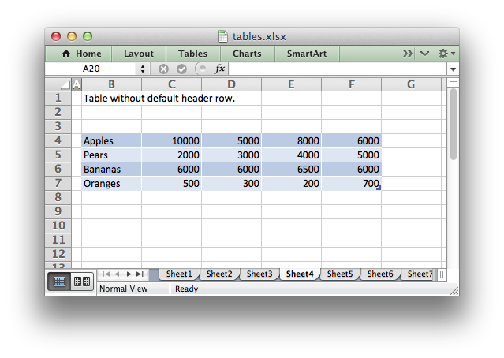
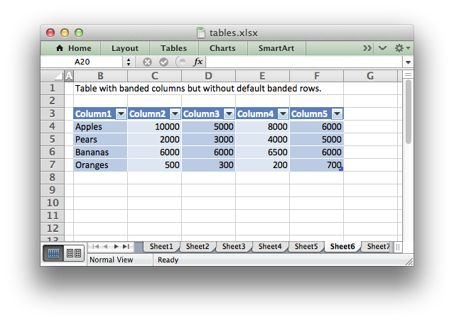
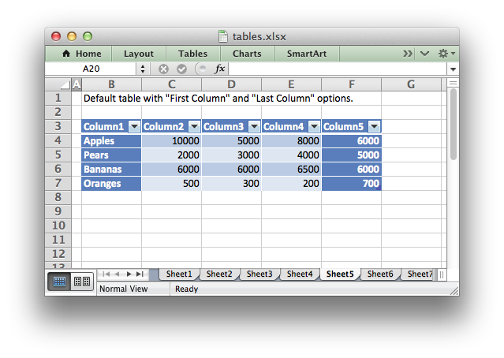
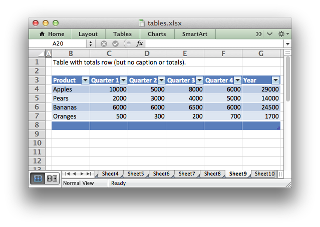
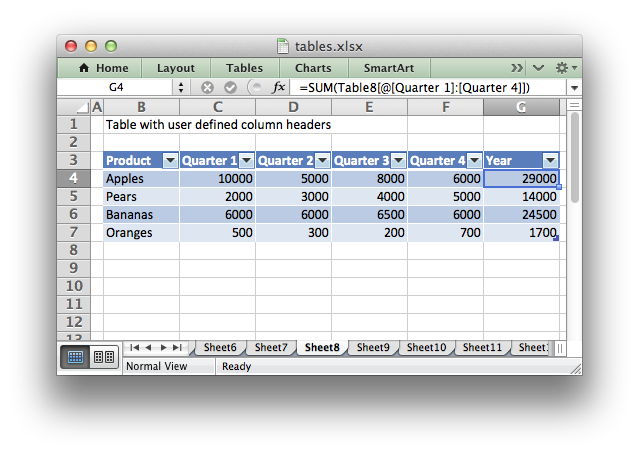

.. _tables:

Working with Worksheet Tables
=============================

Tables in Excel are a way of grouping a range of cells into a single entity
that has common formatting or that can be referenced from formulas. Tables can
have column headers, autofilters, total rows, column formulas and default
formatting.

.. image:: _images/tables12.png

For more information see
`An Overview of Excel Tables <http://office.microsoft.com/en-us/excel-help/overview-of-excel-tables-HA010048546.aspx>`_
in the Microsoft Office documentation.

.. Note::

   Tables aren't available in XlsxWriter when :func:`Workbook`
   ``'constant_memory'`` mode is enabled.

add_table()
-----------

Tables are added to a worksheet using the :func:`add_table()` method::

    worksheet.add_table('B3:F7', {options})

The data range can be specified in 'A1' or 'Row/Column' notation (see
:ref:`cell_notation`)::

    worksheet.add_table('B3:F7')
    # Same as:
    worksheet.add_table(2, 1, 6, 5)

.. image:: _images/tables1.png

The options parameter should be a dict containing the parameters that describe
the table options and data. The available options are:

+----------------+
| data           |
+----------------+
| autofilter     |
+----------------+
| header_row     |
+----------------+
| banded_columns |
+----------------+
| banded_rows    |
+----------------+
| first_column   |
+----------------+
| last_column    |
+----------------+
| style          |
+----------------+
| total_row      |
+----------------+
| columns        |
+----------------+
| name           |
+----------------+

These options are explained below. There are no required parameters and the
options parameter is itself optional if no options are specified (as shown
above).

data
----

The ``data`` parameter can be used to specify the data in the cells of the
table::

    data = [
        ['Apples', 10000, 5000, 8000, 6000],
        ['Pears',   2000, 3000, 4000, 5000],
        ['Bananas', 6000, 6000, 6500, 6000],
        ['Oranges',  500,  300,  200,  700],

    ]

    worksheet.add_table('B3:F7', {'data': data})

.. image:: _images/tables2.png

Table data can also be written separately, as an array or individual cells::

    # These statements are the same as the single statement above.
    worksheet.add_table('B3:F7')
    worksheet.write_row('B4', data[0])
    worksheet.write_row('B5', data[1])
    worksheet.write_row('B6', data[2])
    worksheet.write_row('B7', data[3])

Writing the cell data separately is occasionally required when you need to
control the ``write_()`` methods used to populate the cells or if you wish to
modify individual cell formatting.

The ``data`` structure should be an list of lists holding row data as shown
above.

header_row
----------

The ``header_row`` parameter can be used to turn on or off the header row in
the table. It is on by default::

    # Turn off the header row.
    worksheet.add_table('B4:F7', {'header_row': False})

The header row will contain default captions such as ``Column 1``,
``Column 2``, etc. These captions can be overridden using the ``columns``
parameter below.

autofilter
----------

The ``autofilter`` parameter can be used to turn on or off the autofilter in
the header row. It is on by default::

    # Turn off the default autofilter.
    worksheet.add_table('B3:F7', {'autofilter': False})

.. image:: _images/tables3.png

The ``autofilter`` is only shown if the ``header_row`` is on. Filter conditions
within the table are not supported.

banded_rows
-----------

The ``banded_rows`` parameter can be used to create rows of alternating color
in the table. It is on by default::

    # Turn off banded rows.
    worksheet.add_table('B3:F7', {'banded_rows': False})

banded_columns
--------------

The ``banded_columns`` parameter can be used to used to create columns of
alternating color in the table. It is off by default::

    # Turn on banded columns.
    worksheet.add_table('B3:F7', {'banded_columns': True})

See the above image.

first_column
------------

The ``first_column`` parameter can be used to highlight the first column of the
table. The type of highlighting will depend on the ``style`` of the table. It
may be bold text or a different color. It is off by default::

    # Turn on highlighting for the first column in the table.
    worksheet.add_table('B3:F7', {'first_column': True})

last_column
-----------

The ``last_column`` parameter can be used to highlight the last column of the
table. The type of highlighting will depend on the ``style`` of the table. It
may be bold text or a different color. It is off by default::

    # Turn on highlighting for the last column in the table.
    worksheet.add_table('B3:F7', {'last_column': True})

See the above image.

style
-----

The ``style`` parameter can be used to set the style of the table. Standard
Excel table format names should be used (with matching capitalization)::

    worksheet.add_table('B3:F7', {'data': data,
                                  'style': 'Table Style Light 11'})

.. image:: _images/tables11.png

The default table style is 'Table Style Medium 9'.

name
----

By default tables are named ``Table1``, ``Table2``, etc. The ``name``
parameter can be used to set the name of the table::

    worksheet.add_table('B3:F7', {'name': 'SalesData'})

If you override the table name you must ensure that it doesn't clash with an
existing table name and that it follows Excel's requirements for table names,
see the `Microsoft Office documentation
<http://office.microsoft.com/en-001/excel-help/define-and-use-names-in-formulas-HA010147120.aspx>`_.

If you need to know the name of the table, for example to use it in a formula,
you can get it as follows::

    table = worksheet.add_table('B3:F7')
    table_name = table.name

total_row
---------

The ``total_row`` parameter can be used to turn on the total row in the last
row of a table. It is distinguished from the other rows by a different
formatting and also with dropdown ``SUBTOTAL`` functions::

    worksheet.add_table('B3:F7', {'total_row': True})

The default total row doesn't have any captions or functions. These must by
specified via the ``columns`` parameter below.

columns
-------

The ``columns`` parameter can be used to set properties for columns within the
table.

.. image:: _images/tables7.png

The sub-properties that can be set are:

+----------------+
| header         |
+----------------+
| header_format  |
+----------------+
| formula        |
+----------------+
| total_string   |
+----------------+
| total_function |
+----------------+
| total_value    |
+----------------+
| format         |
+----------------+

The column data must be specified as a list of dicts. For example to override
the default 'Column n' style table headers::

    worksheet.add_table('B3:F7', {'data': data,
                                  'columns': [{'header': 'Product'},
                                              {'header': 'Quarter 1'},
                                              {'header': 'Quarter 2'},
                                              {'header': 'Quarter 3'},
                                              {'header': 'Quarter 4'},
                                              ]})

See the resulting image above.

If you don't wish to specify properties for a specific column you pass an empty
hash ref and the defaults will be applied::

            ...
            columns, [
                {header, 'Product'},
                {header, 'Quarter 1'},
                {},                     # Defaults to 'Column 3'.
                {header, 'Quarter 3'},
                {header, 'Quarter 4'},
            ]
            ...

Column formulas can by applied using the column ``formula`` property::

    formula = '=SUM(Table8[@[Quarter 1]:[Quarter 4]])'

    worksheet.add_table('B3:G7', {'data': data,
                                  'columns': [{'header': 'Product'},
                                              {'header': 'Quarter 1'},
                                              {'header': 'Quarter 2'},
                                              {'header': 'Quarter 3'},
                                              {'header': 'Quarter 4'},
                                              {'header': 'Year',
                                               'formula': formula},
                                              ]})

The Excel 2007 style ``[#This Row]`` and Excel 2010 style ``@`` structural
references are supported within the formula. However, other Excel 2010
additions to structural references aren't supported and formulas should
conform to Excel 2007 style formulas. See the Microsoft documentation on
`Using structured references with Excel tables <http://office.microsoft.com/en-us/excel-help/using-structured-references-with-excel-tables-HA010155686.aspx>`_
for details.

As stated above the ``total_row`` table parameter turns on the "Total" row in
the table but it doesn't populate it with any defaults. Total captions and
functions must be specified via the ``columns`` property and the
``total_string`` and ``total_function`` sub properties::

    options = {'data': data,
               'total_row': 1,
               'columns': [{'header': 'Product', 'total_string': 'Totals'},
                           {'header': 'Quarter 1', 'total_function': 'sum'},
                           {'header': 'Quarter 2', 'total_function': 'sum'},
                           {'header': 'Quarter 3', 'total_function': 'sum'},
                           {'header': 'Quarter 4', 'total_function': 'sum'},
                           {'header': 'Year',
                            'formula': '=SUM(Table10[@[Quarter 1]:[Quarter 4]])',
                            'total_function': 'sum'
                            },
                           ]}

    # Add a table to the worksheet.
    worksheet.add_table('B3:G8', options)

The supported totals row ``SUBTOTAL`` functions are:

+------------+
| average    |
+------------+
| count_nums |
+------------+
| count      |
+------------+
| max        |
+------------+
| min        |
+------------+
| std_dev    |
+------------+
| sum        |
+------------+
| var        |
+------------+

User defined functions or formulas aren't supported.

It is also possible to set a calculated value for the ``total_function`` using
the ``total_value`` sub property. This is only necessary when creating
workbooks for applications that cannot calculate the value of formulas
automatically. This is similar to setting the ``value`` optional property in
:func:`write_formula`::

    options = {'data': data,
               'total_row': 1,
               'columns': [{'total_string': 'Totals'},
                           {'total_function': 'sum', 'total_value': 150},
                           {'total_function': 'sum', 'total_value': 200},
                           {'total_function': 'sum', 'total_value': 333},
                           {'total_function': 'sum', 'total_value': 124},
                           {'formula': '=SUM(Table10[@[Quarter 1]:[Quarter 4]])',
                            'total_function': 'sum',
                            'total_value': 807}]}

Formatting can also be applied to columns, to the column data using ``format`` and to the header using ``header_format``::

    currency_format = workbook.add_format({'num_format': '$#,##0'})
    wrap_format     = workbook.add_format({'text_wrap': 1})

    worksheet.add_table('B3:D8', {'data': data,
                                  'total_row': 1,
                                  'columns': [{'header': 'Product'},
                                              {'header': 'Quarter 1',
                                               'total_function': 'sum',
                                               'format': currency_format},
                                              {'header': 'Quarter 2',
                                               'header_format': wrap_format,
                                               'total_function': 'sum',
                                               'format': currency_format}]})

.. image:: _images/tables12.png

Standard XlsxWriter :ref:`Format object <format>` objects are used for this
formatting. However, they should be limited to numerical formats for the
columns and simple formatting like text wrap for the headers. Overriding other
table formatting may produce inconsistent results.

Example
-------

All of the images shown above are taken from :ref:`ex_tables`.
