.. SPDX-License-Identifier: BSD-2-Clause
   Copyright (c) 2013-2025, John McNamara, jmcnamara@cpan.org

.. _working_with_textboxes:

Working with Textboxes
======================

This section explains how to work with some of the options and features of
textboxes in XlsxWriter::

    import xlsxwriter

    workbook = xlsxwriter.Workbook('textbox.xlsx')
    worksheet = workbook.add_worksheet()

    text = 'Formatted textbox'

    options = {
        'width': 256,
        'height': 100,
        'x_offset': 10,
        'y_offset': 10,

        'font': {'color': 'red',
                 'size': 14},
        'align': {'vertical': 'middle',
                  'horizontal': 'center'
                  },
        'gradient': {'colors': ['#DDEBCF',
                                '#9CB86E',
                                '#156B13']},
    }

    worksheet.insert_textbox('B2', text, options)

    workbook.close()

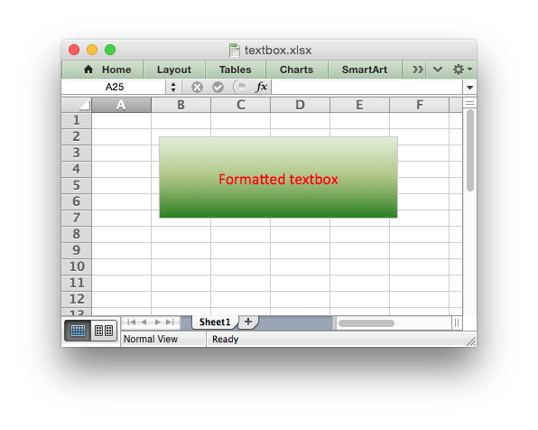

See also :ref:`ex_textbox`.

Textbox options
---------------

This Worksheet :func:`insert_textbox()` method is used to insert a textbox
into a worksheet::

    worksheet.insert_textbox('B2', 'A simple textbox with some text')

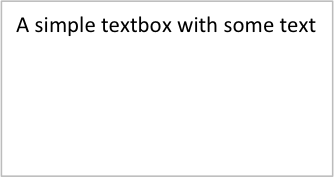

The text can contain newlines to wrap the text::

    worksheet.insert_textbox('B2', 'Line 1\nLine 2\n\nMore text')

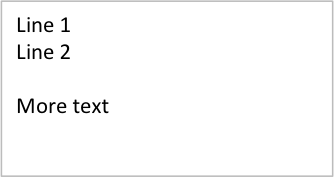

This :func:`insert_textbox()` takes an optional ``dict`` parameter that can be
used to control the size, positioning and format of the textbox::

    worksheet.insert_textbox('B2', 'Some text', {'width': 256, 'height': 100})

The available options are::

    # Size and position
    width
    height
    x_scale
    y_scale
    x_offset
    y_offset
    object_position

    # Formatting
    line
    border
    fill
    gradient
    font
    align
    text_rotation

    # Links
    textlink
    url
    tip

    # Accessibility
    description
    decorative

These options are explained in the sections below. They are similar or
identical to position and formatting parameters used in charts.

Textbox size and positioning
----------------------------

The :func:`insert_textbox()` options to control the size and positioning of a
textbox are::

    width
    height
    x_scale
    y_scale
    x_offset
    y_offset
    object_position

The ``width`` and ``height`` are in pixels. The default textbox size is 192 x
120 pixels (or equivalent to 3 default columns x 6 default rows).

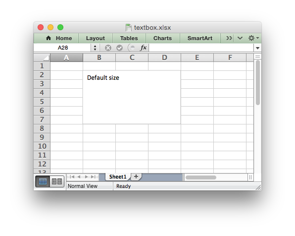

The size of the textbox can be modified by setting the ``width`` and
``height`` or by setting the ``x_scale`` and ``y_scale``::

    worksheet.insert_textbox('B2', 'Size adjusted textbox',
                             {'width': 288, 'height': 30})

    # or ...
    worksheet.insert_textbox('B2', 'Size adjusted textbox',
                             {'x_scale': 1.5, 'y_scale': 0.25})

The ``x_offset`` and ``y_offset`` position the top left corner of the textbox in
the cell that it is inserted into.

The ``object_position`` parameter can be used to control the object
positioning of the image::

    worksheet.insert_textbox('B2', "Don't move or size with cells",
                             {'object_position': 3})

Where ``object_position`` has the following allowable values:

1. Move and size with cells (the default).
2. Move but don't size with cells.
3. Don't move or size with cells.

See :ref:`object_position` for more detailed information about the positioning
and scaling of images within a worksheet.

Textbox Formatting
------------------

The following formatting properties can be set for textbox objects::

    line
    border
    fill
    gradient
    font
    align
    text_rotation

Textbox formatting properties are set using the options dict::

    worksheet.insert_textbox('B2', 'A textbox with a color text',
                                    {'font': {'color': 'green'}})

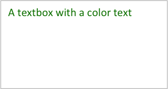

In some cases the format properties can be nested::

    worksheet.insert_textbox('B2', 'Some text in a textbox with formatting',
                             {'font': {'color': 'white'},
                              'align': {'vertical': 'middle',
                                        'horizontal': 'center'
                                        },
                              'gradient': {'colors': ['green', 'white']}})

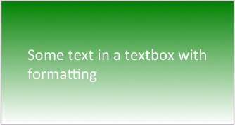

.. _textbox_formatting_line:

Textbox formatting: Line
------------------------

The line format is used to specify properties of the border in a textbox. The
following properties can be set for ``line`` formats in a textbox::

    none
    color
    width
    dash_type

The ``none`` property is used to turn the ``line`` off (it is always on by
default)::

    worksheet.insert_textbox('B2', 'A textbox with no border line',
                             {'line': {'none': True}})

The ``color`` property sets the color of the ``line``::

    worksheet.insert_textbox('B2', 'A textbox with a color border',
                             {'line': {'color': 'red'}})

.. image:: _images/textbox13.png

The color can be a :ref:`Color() <Color>` instance, a HTML style ``#RRGGBB``
string or a limited number of named colors, see :ref:`colors`::

    worksheet.insert_textbox('B2', 'A textbox with a color border',
                             {'line': {'color': '#FF9900'}})

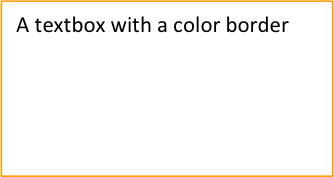

The ``width`` property sets the width of the ``line``. It should be specified
in increments of 0.25 of a point as in Excel::

    worksheet.insert_textbox('B2', 'A textbox with larger border',
                             {'line': {'width': 3.25}})

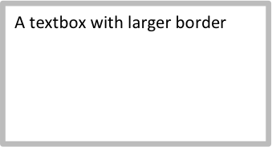

The ``dash_type`` property sets the dash style of the line::

    worksheet.insert_textbox('B2', 'A textbox a dash border',
                             {'line': {'dash_type': 'dash_dot'}})

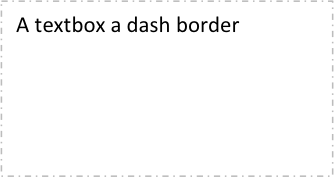

The following ``dash_type`` values are available. They are shown in the order
that they appear in the Excel dialog::

    solid
    round_dot
    square_dot
    dash
    dash_dot
    long_dash
    long_dash_dot
    long_dash_dot_dot

The default line style is ``solid``.

More than one ``line`` property can be specified at a time::

    worksheet.insert_textbox('B2', 'A textbox with border formatting',
                             {'line': {'color': 'red',
                                       'width': 1.25,
                                       'dash_type': 'square_dot'}})

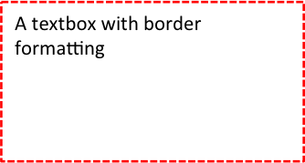

.. _textbox_formatting_border:

Textbox formatting: Border
--------------------------

The ``border`` property is a synonym for ``line``.

Excel uses a common dialog for setting object formatting but depending on
context it may refer to a *line* or a *border*. For formatting these can be
used interchangeably.

.. _textbox_formatting_fill:

Textbox formatting: Solid Fill
------------------------------

The solid fill format is used to specify a fill for a textbox object.

The following properties can be set for ``fill`` formats in a textbox::

    none
    color

The ``none`` property is used to turn the ``fill`` property off (to make the
textbox transparent)::

    worksheet.insert_textbox('B2', 'A textbox with no fill',
                             {'fill': {'none': True}})

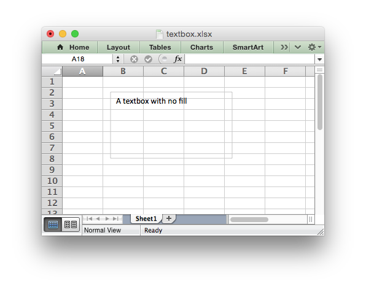

The ``color`` property sets the color of the ``fill`` area::

    worksheet.insert_textbox('B2', 'A textbox with color fill',
                             {'fill': {'color': '#FF9900'}})

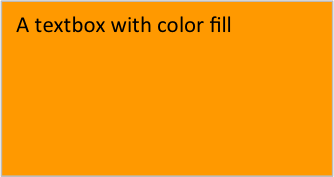

The color can be a :ref:`Color() <Color>` instance, a HTML style ``#RRGGBB``
string or a limited number of named colors, see :ref:`colors`::

    worksheet.insert_textbox('B2', 'A textbox with color fill',
                             {'fill': {'color': 'red'}})

.. _textbox_formatting_gradient:

Textbox formatting: Gradient Fill
---------------------------------

The gradient fill format is used to specify a gradient fill for a textbox. The
following properties can be set for ``gradient`` fill formats in a textbox::

    colors:    a list of colors
    positions: an optional list of positions for the colors
    type:      the optional type of gradient fill
    angle:     the optional angle of the linear fill

If gradient fill is used on a textbox object it overrides the solid fill
properties of the object.

The ``colors`` property sets a list of colors that define the ``gradient``::

    worksheet.insert_textbox('B2', 'A textbox with gradient fill',
                             {'gradient': {'colors': ['gray', 'white']}})

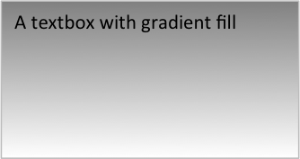

Excel allows between 2 and 10 colors in a gradient but it is unlikely that
you will require more than 2 or 3.

As with solid fill it is also possible to set the colors of a gradient with a
Html style ``#RRGGBB`` string or a limited number of named colors, see
:ref:`colors`::

    worksheet.insert_textbox('B2', 'A textbox with gradient fill',
                             {'gradient': {'colors': ['#DDEBCF',
                                                      '#9CB86E',
                                                      '#156B13']}})

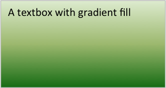

The ``positions`` defines an optional list of positions, between 0 and 100, of
where the colors in the gradient are located. Default values are provided for
``colors`` lists of between 2 and 4 but they can be specified if required::

    worksheet.insert_textbox('B2', 'A textbox with gradient fill',
                             {'gradient': {'colors':    ['#DDEBCF', '#156B13'],
                                           'positions': [10,        90]}})

The ``type`` property can have one of the following values::

    linear        (the default)
    radial
    rectangular
    path

For example::

    worksheet.insert_textbox('B2', 'A textbox with gradient fill',
                             {'gradient': {'colors': ['#DDEBCF', '#9CB86E', '#156B13'],
                                           'type': 'radial'}})

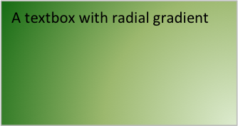

If ``type`` isn't specified it defaults to ``linear``.

For a ``linear`` fill the angle of the gradient can also be specified (the
default angle is 90 degrees)::

    worksheet.insert_textbox('B2', 'A textbox with angle gradient',
                             {'gradient': {'colors': ['#DDEBCF', '#9CB86E', '#156B13'],
                                           'angle': 45}})

.. _textbox_fonts:

Textbox formatting: Fonts
-------------------------

The following font properties can be set for the entire textbox::

    name
    size
    bold
    italic
    underline
    color

These properties correspond to the equivalent Worksheet cell Format object
properties. See the :ref:`format` section for more details about Format
properties and how to set them.

The font properties are:

* ``name``: Set the font name::

    {'font':  {'name': 'Arial'}}

  .. image:: _images/textbox46.png

* ``size``: Set the font size::

    {'font':  {'name': 'Arial', 'size': 7}}

  .. image:: _images/textbox47.png

* ``bold``: Set the font bold property::

    {'font':  {'bold': True}}

  .. image:: _images/textbox45.png

* ``italic``: Set the font italic property::

    {'font':  {'italic': True}}

  .. image:: _images/textbox48.png

* ``underline``: Set the font underline property::

    {'font':  {'underline': True}}

  .. image:: _images/textbox49.png

* ``color``: Set the font color property. Can be a color index, a color name
  or HTML style RGB color::

    {'font': {'color': 'red' }}
    {'font': {'color': '#92D050'}}

Here is an example of Font formatting in a textbox::

    worksheet.insert_textbox('B2', 'Some font formatting',
                             {'font': {'bold': True,
                                       'italic': True,
                                       'underline': True,
                                       'name': 'Arial',
                                       'color': 'red',
                                       'size': 14}})

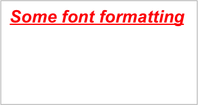

.. _textbox_align:

Textbox formatting: Align
-------------------------

The ``align`` property is used to set the text alignment for the entire textbox::

    worksheet.insert_textbox('B2', 'Alignment: middle - center',
                             {'align': {'vertical': 'middle',
                                        'horizontal': 'center'}})

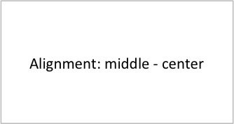

The alignment properties that can be set in Excel for a textbox are::

    {'align': {'vertical': 'top'}}      # Default
    {'align': {'vertical': 'middle'}}
    {'align': {'vertical': 'bottom'}}

    {'align': {'horizontal': 'left'}}   # Default
    {'align': {'horizontal': 'center'}}

    {'align': {'text': 'left'}}         # Default
    {'align': {'text': 'center'}}
    {'align': {'text': 'right'}}

The ``vertical`` and ``horizontal`` alignments set the layout for the text
area within the textbox. The ``text`` alignment sets the layout for the text
within that text area::

    worksheet.insert_textbox('H2',
                             'Long text line that wraps and is centered',
                             {'align': {'vertical': 'middle',
                                        'horizontal': 'center',
                                        'text': 'center'}})

The default textbox alignment is::

    worksheet.insert_textbox('B2', 'Default alignment',
                             {'align': {'vertical': 'top',
                                        'horizontal': 'left',
                                        'text': 'left'}})

    # Same as this:
    worksheet.insert_textbox('B2', 'Default alignment')

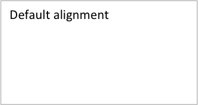

.. _textbox_formatting_rotation:

Textbox formatting: Text Rotation
---------------------------------

The ``text_rotation`` option can be used to set the text rotation for the
entire textbox::

    worksheet.insert_textbox('B2', 'Text rotated up',
                             {'text_rotation': 90})

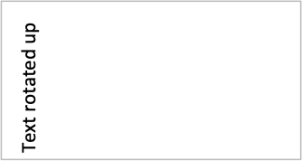

Textboxes in Excel only support a limited number of rotation options. These
are::

      90:     Rotate text up
     -90:     Rotate text down
     270:     Vertical text (stacked)
     271:     Vertical text (stacked) - for East Asian fonts

.. _textbox_textlink:

Textbox Textlink
----------------

The ``textlink`` property is used to link/get the text for a textbox from a
cell in the worksheet. When you use this option the actual text in the textbox
can be left blank or set to ``None``::

    worksheet.insert_textbox('A1', '', {'textlink': '=$A$1'})

The reference can also be to a cell in another worksheet::

    worksheet.insert_textbox('A2', None, {'textlink': '=Sheet2!A1'})

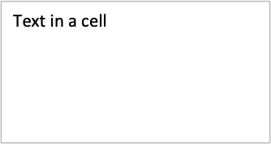

.. _textbox_hyperlink:

Textbox Hyperlink
-----------------

The ``url`` parameter can used to add a hyperlink/url to a textbox::

    worksheet.insert_textbox('A1', 'This is some text',
                             {'url': 'https://github.com/jmcnamara'})

The ``tip`` parameter adds an optional mouseover tooltip::

    worksheet.insert_textbox('A1', 'This is some text',
                             {'url': 'https://github.com/jmcnamara',
                              'tip': 'GitHub'})

See also :func:`write_url` for details on supported URIs.

.. _textbox_description:

Textbox Description
-------------------

The ``description`` property can be used to specify a description or "alt
text" string for the textbox. In general this would be used to provide a text
description of the textbox to help accessibility. It is an optional parameter
and has no default. It can be used as follows::

 worksheet.insert_textbox('A1', 'This is some text',
                          {'description': 'Textbox showing data input instructions'})

.. image:: _images/alt_text3.png

.. _textbox_decorative:

Textbox Decorative
------------------

The optional ``decorative`` property is also used to help accessibility. It is
used to mark the object as decorative, and thus uninformative, for automated
screen readers. As in Excel, if this parameter is in use the ``description``
field isn't written. It is used as follows::

 worksheet.insert_textbox('A1', 'This is some text', {'decorative': True})
