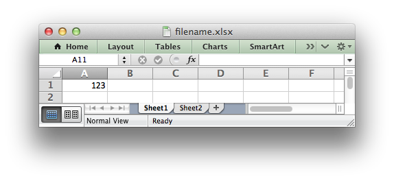
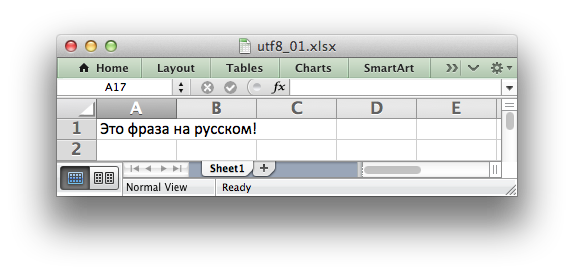
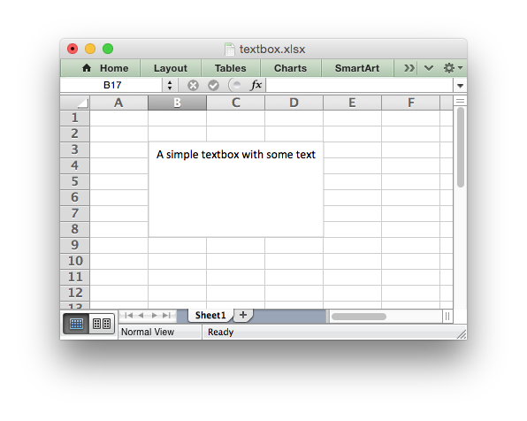
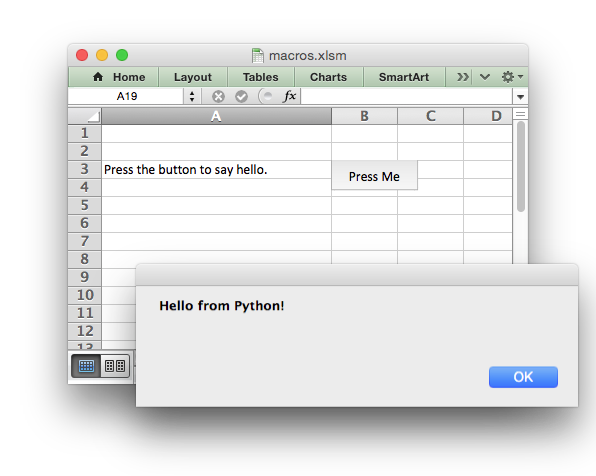
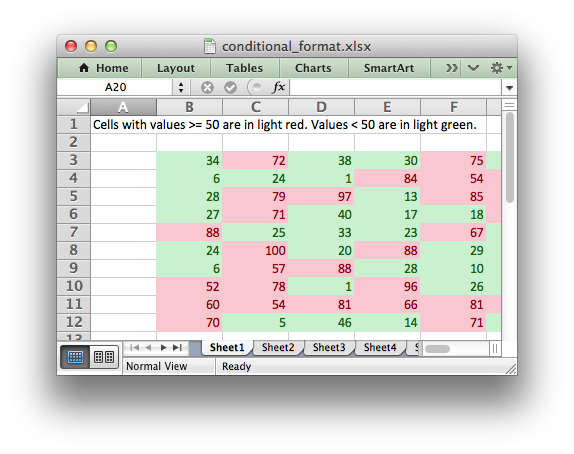
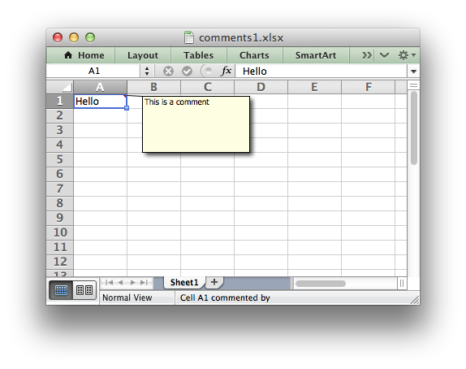
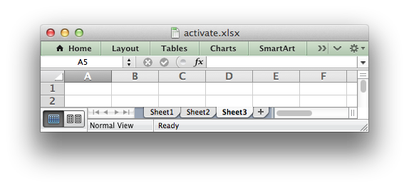
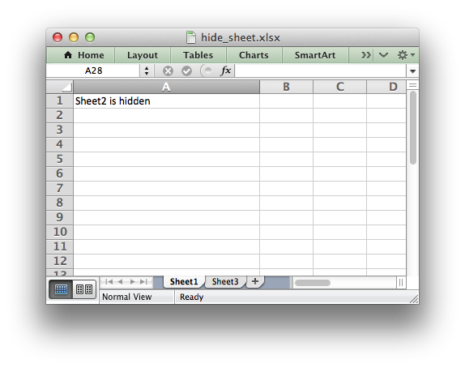
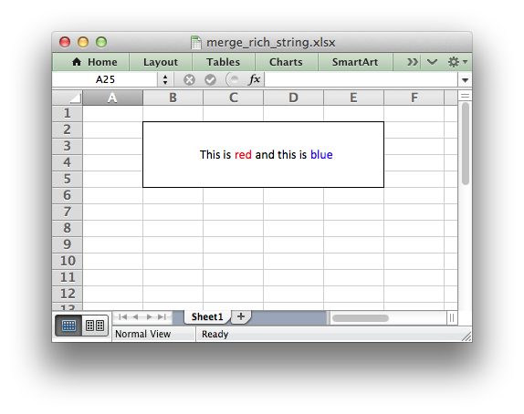

.. _worksheet:

The Worksheet Class
===================

The worksheet class represents an Excel worksheet. It handles operations such
as writing data to cells or formatting worksheet layout.

A worksheet object isn't instantiated directly. Instead a new worksheet is
created by calling the :func:`add_worksheet()` method from a :func:`Workbook`
object::

    workbook   = xlsxwriter.Workbook('filename.xlsx')

    worksheet1 = workbook.add_worksheet()
    worksheet2 = workbook.add_worksheet()

    worksheet1.write('A1', 123)

    workbook.close()

XlsxWriter supports Excels worksheet limits of 1,048,576 rows by 16,384
columns.

worksheet.write()
-----------------

.. py:function:: write(row, col, *args)

   Write generic data to a worksheet cell.

   :param row:         The cell row (zero indexed).
   :param col:         The cell column (zero indexed).
   :param \*args:      The additional args that are passed to the sub methods
                       such as number, string and cell_format.

Excel makes a distinction between data types such as strings, numbers, blanks,
formulas and hyperlinks. To simplify the process of writing data to an
XlsxWriter file the ``write()`` method acts as a general alias for several
more specific methods:

* :func:`write_string()`
* :func:`write_number()`
* :func:`write_blank()`
* :func:`write_formula()`
* :func:`write_datetime()`
* :func:`write_boolean()`
* :func:`write_url()`

The rules for handling data in ``write()`` are as follows:

* Data types ``float``, ``int``, ``long``, :class:`decimal.Decimal` and
  :class:`fractions.Fraction`  are written using :func:`write_number()`.

* Data types :class:`datetime.datetime`, :class:`datetime.date`
  :class:`datetime.time` or :class:`datetime.timedelta` are written using
  :func:`write_datetime()` .

* ``None`` and empty strings ``""`` are written using :func:`write_blank()`.

* Data type ``bool`` is written using :func:`write_boolean()`.

Strings are then handled as follows:

* Strings that start with ``"="`` are take to match a formula and are written
  using :func:`write_formula()`. This can be overridden, see below.

* Strings that match supported URL types are written using
  :func:`write_url()`. This can be overridden, see below.

* When the :func:`Workbook` constructor ``strings_to_numbers`` option is
  ``True`` strings that convert to numbers using :func:`float()` are written
  using :func:`write_number()` in order to avoid Excel warnings about "Numbers
  Stored as Text". See the note below.

* Strings that don't match any of the above criteria are written using
  :func:`write_string()`.

If none of the above types are matched the value is evaluated with ``float()``
to see if it corresponds to a user defined float type. If it does then it is
written using :func:`write_number()`.

Finally, if none of these rules are matched then a ``TypeError`` exception is
raised.

Here are some examples::

    worksheet.write(0, 0, 'Hello')          # write_string()
    worksheet.write(1, 0, 'World')          # write_string()
    worksheet.write(2, 0, 2)                # write_number()
    worksheet.write(3, 0, 3.00001)          # write_number()
    worksheet.write(4, 0, '=SIN(PI()/4)')   # write_formula()
    worksheet.write(5, 0, '')               # write_blank()
    worksheet.write(6, 0, None)             # write_blank()

This creates a worksheet like the following:

.. image:: _images/worksheet01.png

.. note::

   The :func:`Workbook` constructor option takes three optional arguments
   that can be used to override string handling in the ``write()`` function.
   These options are shown below with their default values::

       xlsxwriter.Workbook(filename, {'strings_to_numbers':  False,
                                      'strings_to_formulas': True,
                                      'strings_to_urls':     True})

The ``write()`` method supports two forms of notation to designate the position
of cells: **Row-column** notation and **A1** notation::

    # These are equivalent.
    worksheet.write(0, 0, 'Hello')
    worksheet.write('A1', 'Hello')

See :ref:`cell_notation` for more details.

The ``cell_format`` parameter in the sub ``write`` methods is used to apply
formatting to the cell. This parameter is optional but when present it should
be a valid :ref:`Format <format>` object::

    cell_format = workbook.add_format({'bold': True, 'italic': True})

    worksheet.write(0, 0, 'Hello', cell_format)  # Cell is bold and italic.

worksheet.write_string()
------------------------

.. py:function:: write_string(row, col, string[, cell_format])

   Write a string to a worksheet cell.

   :param row:         The cell row (zero indexed).
   :param col:         The cell column (zero indexed).
   :param string:      String to write to cell.
   :param cell_format: Optional Format object.
   :type  row:         int
   :type  col:         int
   :type  string:      string
   :type  cell_format: :ref:`Format <format>`

The ``write_string()`` method writes a string to the cell specified by ``row``
and ``column``::

    worksheet.write_string(0, 0, 'Your text here')
    worksheet.write_string('A2', 'or here')

Both row-column and A1 style notation are supported, as shown above. See
:ref:`cell_notation` for more details.

The ``cell_format`` parameter is used to apply formatting to the cell. This
parameter is optional but when present is should be a valid
:ref:`Format <format>` object.

Unicode strings are supported in UTF-8 encoding. This generally requires that
your source file in also UTF-8 encoded::

    # _*_ coding: utf-8

    worksheet.write('A1', u'Some UTF-8 text')

Alternatively, you can read data from an encoded file, convert it to UTF-8
during reading and then write the data to an Excel file. There are several
sample``unicode_\*.py`` programs like this in the ``examples`` directory of the XlsxWriter source tree.

The maximum string size supported by Excel is 32,767 characters. Strings longer
than this will be truncated by ``write_string()``.

.. note::

   Even though Excel allows strings of 32,767 characters it can only
   **display** 1000 in a cell. However, all 32,767 characters are displayed in the
   formula bar.

worksheet.write_number()
------------------------

.. py:function:: write_number(row, col, number[, cell_format])

   Write a number to a worksheet cell.

   :param row:         The cell row (zero indexed).
   :param col:         The cell column (zero indexed).
   :param number:      Number to write to cell.
   :param cell_format: Optional Format object.
   :type  row:         int
   :type  col:         int
   :type  number:      int or float
   :type  cell_format: :ref:`Format <format>`

The ``write_number()`` method writes numeric types to the cell specified by
``row`` and ``column``::

    worksheet.write_number(0, 0, 123456)
    worksheet.write_number('A2', 2.3451)

Both row-column and A1 style notation are supported, as shown above. See
:ref:`cell_notation` for more details.

The numeric types supported are ``float``, ``int``, ``long``,
:class:`decimal.Decimal` and :class:`fractions.Fraction` or anything that can
be converted via ``float()``.

When written to an Excel file numbers are converted to IEEE-754 64-bit
double-precision floating point. This means that, in most cases, the maximum
number of digits that can be stored in Excel without losing precision is 15.

.. note::
   NAN and INF are not supported and will raise a TypeError exception.

The ``cell_format`` parameter is used to apply formatting to the cell. This
parameter is optional but when present is should be a valid
:ref:`Format <format>` object.

worksheet.write_formula()
-------------------------

.. py:function:: write_formula(row, col, formula[, cell_format[, value]])

   Write a formula to a worksheet cell.

   :param row:         The cell row (zero indexed).
   :param col:         The cell column (zero indexed).
   :param formula:     Formula to write to cell.
   :param cell_format: Optional Format object.
   :param value:       Optional result. The value if the formula was calculated.
   :type  row:         int
   :type  col:         int
   :type  formula:     string
   :type  cell_format: :ref:`Format <format>`

The ``write_formula()`` method writes a formula or function to the cell
specified by ``row`` and ``column``::

    worksheet.write_formula(0, 0, '=B3 + B4')
    worksheet.write_formula(1, 0, '=SIN(PI()/4)')
    worksheet.write_formula(2, 0, '=SUM(B1:B5)')
    worksheet.write_formula('A4', '=IF(A3>1,"Yes", "No")')
    worksheet.write_formula('A5', '=AVERAGE(1, 2, 3, 4)')
    worksheet.write_formula('A6', '=DATEVALUE("1-Jan-2013")')

Both row-column and A1 style notation are supported, as shown above. See
:ref:`cell_notation` for more details.

Array formulas are also supported::

    worksheet.write_formula('A7', '{=SUM(A1:B1*A2:B2)}')

See also the ``write_array_formula()`` method below.

The ``cell_format`` parameter is used to apply formatting to the cell. This
parameter is optional but when present is should be a valid
:ref:`Format <format>` object.

If required, it is also possible to specify the calculated result of the
formula using the optional ``value`` parameter. This is occasionally
necessary when working with non-Excel applications that don't calculate the
result of the formula::

    worksheet.write('A1', '=2+2', num_format, 4)

See :ref:`formula_result` for more details.

Excel stores formulas in US style formatting regardless of the Locale or
Language of the Excel version::

    worksheet.write_formula('A1', '=SUM(1, 2, 3)')    # OK
    worksheet.write_formula('A2', '=SOMME(1, 2, 3)')  # French. Error on load.

See :ref:`formula_syntax` for a full explanation.

Excel 2010 and 2013 added functions which weren't defined in the original file
specification. These functions are referred to as *future* functions. Examples
of these functions are ``ACOT``, ``CHISQ.DIST.RT`` , ``CONFIDENCE.NORM``,
``STDEV.P``, ``STDEV.S`` and ``WORKDAY.INTL``. In XlsxWriter these require a
prefix::

    worksheet.write_formula('A1', '=_xlfn.STDEV.S(B1:B10)')

See :ref:`formula_future` for a detailed explanation and full list of
functions that are affected.

worksheet.write_array_formula()
-------------------------------

.. py:function:: write_array_formula(first_row, first_col, last_row, \
                                    last_col, formula[, cell_format[, value]])

   Write an array formula to a worksheet cell.

   :param first_row:   The first row of the range. (All zero indexed.)
   :param first_col:   The first column of the range.
   :param last_row:    The last row of the range.
   :param last_col:    The last col of the range.
   :param formula:     Array formula to write to cell.
   :param cell_format: Optional Format object.
   :param value:       Optional result. The value if the formula was calculated.
   :type  first_row:   int
   :type  first_col:   int
   :type  last_row:    int
   :type  last_col:    int
   :type  formula:     string
   :type  cell_format: :ref:`Format <format>`

The ``write_array_formula()`` method writes an array formula to a cell range. In
Excel an array formula is a formula that performs a calculation on a set of
values. It can return a single value or a range of values.

An array formula is indicated by a pair of braces around the formula:
``{=SUM(A1:B1*A2:B2)}``.

For array formulas that return a range of values you must specify the range
that the return values will be written to::

    worksheet.write_array_formula(0, 0, 2, 0, '{=TREND(C1:C3,B1:B3)}')
    worksheet.write_array_formula('A1:A3',    '{=TREND(C1:C3,B1:B3)}')

Both row-column and A1 style notation are supported, as shown above. See
:ref:`cell_notation` for more details.

If the array formula returns a single value then the ``first_`` and ``last_``
parameters should be the same::

    worksheet.write_array_formula('A1:A1', '{=SUM(B1:C1*B2:C2)}')

It this case however it is easier to just use the ``write_formula()`` or
``write()`` methods::

    # Same as above but more concise.
    worksheet.write('A1', '{=SUM(B1:C1*B2:C2)}')
    worksheet.write_formula('A1', '{=SUM(B1:C1*B2:C2)}')

The ``cell_format`` parameter is used to apply formatting to the cell. This
parameter is optional but when present is should be a valid
:ref:`Format <format>` object.

If required, it is also possible to specify the calculated result of the
formula (see discussion of formulas and the ``value`` parameter for the
``write_formula()`` method above). However, using this parameter only writes a
single value to the upper left cell in the result array. See
:ref:`formula_result` for more details.

See also :ref:`ex_array_formula`.

worksheet.write_blank()
-----------------------

.. py:function:: write_blank(row, col, blank[, cell_format])

   Write a blank worksheet cell.

   :param row:         The cell row (zero indexed).
   :param col:         The cell column (zero indexed).
   :param blank:       None or empty string. The value is ignored.
   :param cell_format: Optional Format object.
   :type  row:         int
   :type  col:         int
   :type  cell_format: :ref:`Format <format>`

Write a blank cell specified by ``row`` and ``column``::

    worksheet.write_blank(0, 0, None, format)
    worksheet.write_blank('A2', None, format)

Both row-column and A1 style notation are supported, as shown above. See
:ref:`cell_notation` for more details.

This method is used to add formatting to a cell which doesn't contain a string
or number value.

Excel differentiates between an "Empty" cell and a "Blank" cell. An "Empty"
cell is a cell which doesn't contain data or formatting whilst a "Blank" cell
doesn't contain data but does contain formatting. Excel stores "Blank" cells
but ignores "Empty" cells.

As such, if you write an empty cell without formatting it is ignored::

    worksheet.write('A1', None, format)  # write_blank()
    worksheet.write('A2', None)          # Ignored

This seemingly uninteresting fact means that you can write arrays of data
without special treatment for ``None`` or empty string values.

worksheet.write_boolean()
-------------------------

.. py:function:: write_boolean(row, col, boolean[, cell_format])

   Write a boolean value to a worksheet cell.

   :param row:         The cell row (zero indexed).
   :param col:         The cell column (zero indexed).
   :param boolean:     Boolean value to write to cell.
   :param cell_format: Optional Format object.
   :type  row:         int
   :type  col:         int
   :type  boolean:     bool
   :type  cell_format: :ref:`Format <format>`

The ``write_boolean()`` method writes a boolean value to the cell specified by
``row`` and ``column``::

    worksheet.write_boolean(0, 0, True)
    worksheet.write_boolean('A2', False)

Both row-column and A1 style notation are supported, as shown above. See
:ref:`cell_notation` for more details.

The ``cell_format`` parameter is used to apply formatting to the cell. This
parameter is optional but when present is should be a valid
:ref:`Format <format>` object.

worksheet.write_datetime()
--------------------------

.. py:function:: write_datetime(row, col, datetime [, cell_format])

   Write a date or time to a worksheet cell.

   :param row:         The cell row (zero indexed).
   :param col:         The cell column (zero indexed).
   :param datetime:    A datetime.datetime, .date, .time or .delta object.
   :param cell_format: Optional Format object.
   :type  row:         int
   :type  col:         int
   :type  formula:     string
   :type  datetime:    :mod:`datetime`
   :type  cell_format: :ref:`Format <format>`

The ``write_datetime()`` method can be used to write a date or time to the cell
specified by ``row`` and ``column``::

    worksheet.write_datetime(0, 0, datetime, date_format)
    worksheet.write_datetime('A2', datetime, date_format)

Both row-column and A1 style notation are supported, as shown above. See
:ref:`cell_notation` for more details.

The datetime should be a :class:`datetime.datetime`, :class:`datetime.date`
:class:`datetime.time` or :class:`datetime.timedelta` object. The
:mod:`datetime` class is part of the standard Python libraries.

There are many ways to create datetime objects, for example the
:meth:`datetime.datetime.strptime` method::

    date_time = datetime.datetime.strptime('2013-01-23', '%Y-%m-%d')

See the :mod:`datetime` documentation for other date/time creation methods.

A date/time should have a ``cell_format`` of type :ref:`Format <format>`,
otherwise it will appear as a number::

    date_format = workbook.add_format({'num_format': 'd mmmm yyyy'})

    worksheet.write_datetime('A1', date_time, date_format)

If required, a default date format string can be set using the :func:`Workbook`
constructor ``default_date_format`` option.

See :ref:`working_with_dates_and_time` for more details and also
:ref:`Timezone Handling in XlsxWriter <timezone_handling>`.

worksheet.write_url()
---------------------

.. py:function:: write_url(row, col, url[, cell_format[, string[, tip]]])

   Write a hyperlink to a worksheet cell.

   :param row:         The cell row (zero indexed).
   :param col:         The cell column (zero indexed).
   :param url:         Hyperlink url.
   :param cell_format: Optional Format object. Defaults to the Excel hyperlink style.
   :param string:      An optional display string for the hyperlink.
   :param tip:         An optional tooltip.
   :type  row:         int
   :type  col:         int
   :type  url:         string
   :type  string:      string
   :type  tip:         string
   :type  cell_format: :ref:`Format <format>`

The ``write_url()`` method is used to write a hyperlink in a worksheet cell.
The url is comprised of two elements: the displayed string and the
non-displayed link. The displayed string is the same as the link unless an
alternative string is specified.

    worksheet.write_url(0, 0, 'https://www.python.org/')
    worksheet.write_url('A2', 'https://www.python.org/')

Both row-column and A1 style notation are supported, as shown above. See
:ref:`cell_notation` for more details.

The ``cell_format`` parameter is used to apply formatting to the cell. This
parameter is optional and the default Excel hyperlink style will be used if it
isn't specified. If required you can access the default url format using the
Workbook :func:`get_default_url_format` method::

    url_format = workbook.get_default_url_format()

Four web style URI's are supported: ``http://``, ``https://``, ``ftp://`` and
``mailto:``::

    worksheet.write_url('A1', 'ftp://www.python.org/')
    worksheet.write_url('A2', 'https://www.python.org/')
    worksheet.write_url('A3', 'mailto:jmcnamara@cpan.org')

All of the these URI types are recognized by the :func:`write()` method, so the
following are equivalent::

    worksheet.write_url('A2', 'https://www.python.org/')
    worksheet.write    ('A2', 'https://www.python.org/')  # Same.

You can display an alternative string using the ``string`` parameter::

    worksheet.write_url('A1', 'https://www.python.org', string='Python home')

.. Note::

  If you wish to have some other cell data such as a number or a formula you
  can overwrite the cell using another call to ``write_*()``::

    worksheet.write_url('A1', 'https://www.python.org/')

    # Overwrite the URL string with a formula. The cell will still be a link.
    # Note the use of the default url format for consistency with other links.
    url_format = workbook.get_default_url_format()
    worksheet.write_formula('A1', '=1+1', url_format)

There are two local URIs supported: ``internal:`` and ``external:``. These are
used for hyperlinks to internal worksheet references or external workbook and
worksheet references::

    # Link to a cell on the current worksheet.
    worksheet.write_url('A1',  'internal:Sheet2!A1')

    # Link to a cell on another worksheet.
    worksheet.write_url('A2',  'internal:Sheet2!A1:B2')

    # Worksheet names with spaces should be single quoted like in Excel.
    worksheet.write_url('A3',  "internal:'Sales Data'!A1")

    # Link to another Excel workbook.
    worksheet.write_url('A4', r'external:c:\temp\foo.xlsx')

    # Link to a worksheet cell in another workbook.
    worksheet.write_url('A5', r'external:c:\foo.xlsx#Sheet2!A1')

    # Link to a worksheet in another workbook with a relative link.
    worksheet.write_url('A7', r'external:..\foo.xlsx#Sheet2!A1')

    # Link to a worksheet in another workbook with a network link.
    worksheet.write_url('A8', r'external:\\NET\share\foo.xlsx')

Worksheet references are typically of the form ``Sheet1!A1``. You can also link
to a worksheet range using the standard Excel notation: ``Sheet1!A1:B2``.

In external links the workbook and worksheet name must be separated by the
``#`` character: ``external:Workbook.xlsx#Sheet1!A1'``.

You can also link to a named range in the target worksheet. For example say you
have a named range called ``my_name`` in the workbook ``c:\temp\foo.xlsx`` you
could link to it as follows::

    worksheet.write_url('A14', r'external:c:\temp\foo.xlsx#my_name')

Excel requires that worksheet names containing spaces or non alphanumeric
characters are single quoted as follows ``'Sales Data'!A1``.

Links to network files are also supported. Network files normally begin with
two back slashes as follows ``\\NETWORK\etc``. In order to generate this in a
single or double quoted string you will have to escape the backslashes,
``'\\\\NETWORK\\etc'`` or use a raw string ``r'\\NETWORK\etc'``.

Alternatively, you can avoid most of these quoting problems by using forward
slashes. These are translated internally to backslashes::

    worksheet.write_url('A14', "external:c:/temp/foo.xlsx")
    worksheet.write_url('A15', 'external://NETWORK/share/foo.xlsx')

See also :ref:`ex_hyperlink`.

.. note::
   XlsxWriter will escape the following characters in URLs as required
   by Excel: ``\s " < > \ [ ] ` ^ { }`` unless the URL already contains ``%xx``
   style escapes. In which case it is assumed that the URL was escaped
   correctly by the user and will by passed directly to Excel.

.. note::
   Excel limits hyperlink links and anchor/locations to 255 characters each.

worksheet.write_rich_string()
-----------------------------

.. py:function:: write_rich_string(row, col, *string_parts[, cell_format])

   Write a "rich" string with multiple formats to a worksheet cell.

   :param row:          The cell row (zero indexed).
   :param col:          The cell column (zero indexed).
   :param string_parts: String and format pairs.
   :param cell_format:  Optional Format object.
   :type  row:          int
   :type  col:          int
   :type  string_parts: list
   :type  cell_format:  :ref:`Format <format>`

The ``write_rich_string()`` method is used to write strings with multiple
formats. For example to write the string "This is **bold** and this is
*italic*" you would use the following::

    bold   = workbook.add_format({'bold': True})
    italic = workbook.add_format({'italic': True})

    worksheet.write_rich_string('A1',
                                'This is ',
                                bold, 'bold',
                                ' and this is ',
                                italic, 'italic')

.. image:: _images/rich_strings_small.png

Both row-column and A1 style notation are supported. The following are
equivalent::

    worksheet.write_rich_string(0, 0, 'This is ', bold, 'bold')
    worksheet.write_rich_string('A1', 'This is ', bold, 'bold')

See :ref:`cell_notation` for more details.

The basic rule is to break the string into fragments and put a
:func:`Format <format>` object before the fragment that you want to format.
For example::

    # Unformatted string.
    'This is an example string'

    # Break it into fragments.
    'This is an ', 'example', ' string'

    # Add formatting before the fragments you want formatted.
    'This is an ', format, 'example', ' string'

    # In XlsxWriter.
    worksheet.write_rich_string('A1',
                                'This is an ', format, 'example', ' string')

String fragments that don't have a format are given a default format. So for
example when writing the string "Some **bold** text" you would use the first
example below but it would be equivalent to the second::

    # Some bold format and a default format.
    bold    = workbook.add_format({'bold': True})
    default = workbook.add_format()

    # With default formatting:
    worksheet.write_rich_string('A1',
                                'Some ',
                                bold, 'bold',
                                ' text')

    # Or more explicitly:
    worksheet.write_rich_string('A1',
                                 default, 'Some ',
                                 bold,    'bold',
                                 default, ' text')

In Excel only the font properties of the format such as font name, style, size,
underline, color and effects are applied to the string fragments in a rich
string. Other features such as border, background, text wrap and alignment
must be applied to the cell.

The ``write_rich_string()`` method allows you to do this by using the last
argument as a cell format (if it is a format object). The following example
centers a rich string in the cell::

    bold   = workbook.add_format({'bold': True})
    center = workbook.add_format({'align': 'center'})

    worksheet.write_rich_string('A5',
                                'Some ',
                                bold, 'bold text',
                                ' centered',
                                center)

See also :ref:`ex_rich_strings` and :ref:`ex_merge_rich`.

worksheet.write_row()
---------------------

.. py:function:: write_row(row, col, data[, cell_format])

   Write a row of data starting from (row, col).

   :param row:         The cell row (zero indexed).
   :param col:         The cell column (zero indexed).
   :param data:        Cell data to write. Variable types.
   :param cell_format: Optional Format object.
   :type  row:         int
   :type  col:         int
   :type  cell_format: :ref:`Format <format>`

The ``write_row()`` method can be used to write a list of data in one go. This
is useful for converting the results of a database query into an Excel
worksheet. The :func:`write()` method is  called for each element of the data.
For example::

    # Some sample data.
    data = ('Foo', 'Bar', 'Baz')

    # Write the data to a sequence of cells.
    worksheet.write_row('A1', data)

    # The above example is equivalent to:
    worksheet.write('A1', data[0])
    worksheet.write('B1', data[1])
    worksheet.write('C1', data[2])

Both row-column and A1 style notation are supported. The following are
equivalent::

    worksheet.write_row(0, 0, data)
    worksheet.write_row('A1', data)

See :ref:`cell_notation` for more details.

worksheet.write_column()
------------------------

.. py:function:: write_column(row, col, data[, cell_format])

   Write a column of data starting from (row, col).

   :param row:         The cell row (zero indexed).
   :param col:         The cell column (zero indexed).
   :param data:        Cell data to write. Variable types.
   :param cell_format: Optional Format object.
   :type  row:         int
   :type  col:         int
   :type  cell_format: :ref:`Format <format>`

The ``write_column()`` method can be used to write a list of data in one go.
This is useful for converting the results of a database query into an Excel
worksheet. The :func:`write()` method is  called for each element of the data.
For example::

    # Some sample data.
    data = ('Foo', 'Bar', 'Baz')

    # Write the data to a sequence of cells.
    worksheet.write_column('A1', data)

    # The above example is equivalent to:
    worksheet.write('A1', data[0])
    worksheet.write('A2', data[1])
    worksheet.write('A3', data[2])

Both row-column and A1 style notation are supported. The following are
equivalent::

    worksheet.write_column(0, 0, data)
    worksheet.write_column('A1', data)

See :ref:`cell_notation` for more details.

worksheet.set_row()
-------------------

.. py:function:: set_row(row, height, cell_format, options)

   Set properties for a row of cells.

   :param int row:      The worksheet row (zero indexed).
   :param float height: The row height.
   :param cell_format:  Optional Format object.
   :type  cell_format:  :ref:`Format <format>`
   :param dict options: Optional row parameters: hidden, level, collapsed.

The ``set_row()`` method is used to change the default properties of a row. The
most common use for this method is to change the height of a row::

    worksheet.set_row(0, 20)  # Set the height of Row 1 to 20.

The other common use for ``set_row()`` is to set the :ref:`Format <format>` for
all cells in the row::

    cell_format = workbook.add_format({'bold': True})

    worksheet.set_row(0, 20, cell_format)

If you wish to set the format of a row without changing the height you can pass
``None`` as the height parameter or use the default row height of 15::

    worksheet.set_row(1, None, cell_format)
    worksheet.set_row(1, 15,   cell_format)  # Same as above.

The ``cell_format`` parameter will be applied to any cells in the row that
don't have a format. As with Excel it is overridden by an explicit cell
format. For example::

    worksheet.set_row(0, None, format1)      # Row 1 has format1.

    worksheet.write('A1', 'Hello')           # Cell A1 defaults to format1.
    worksheet.write('B1', 'Hello', format2)  # Cell B1 keeps format2.

The ``options`` parameter is a dictionary with the following possible keys:

* ``'hidden'``
* ``'level'``
* ``'collapsed'``

Options can be set as follows::

    worksheet.set_row(0, 20, cell_format, {'hidden': True})

    # Or use defaults for other properties and set the options only.
    worksheet.set_row(0, None, None, {'hidden': True})

The ``'hidden'`` option is used to hide a row. This can be used, for example,
to hide intermediary steps in a complicated calculation::

    worksheet.set_row(0, 20, cell_format, {'hidden': True})

The ``'level'`` parameter is used to set the outline level of the row. Outlines
are described in :ref:`outlines`. Adjacent rows with the same outline level
are grouped together into a single outline.

The following example sets an outline level of 1 for some rows::

    worksheet.set_row(0, None, None, {'level': 1})
    worksheet.set_row(1, None, None, {'level': 1})
    worksheet.set_row(2, None, None, {'level': 1})

Excel allows up to 7 outline levels. The ``'level'`` parameter should be in the
range ``0 <= level <= 7``.

The ``'hidden'`` parameter can also be used to hide collapsed outlined rows
when used in conjunction with the ``'level'`` parameter::

    worksheet.set_row(1, None, None, {'hidden': 1, 'level': 1})
    worksheet.set_row(2, None, None, {'hidden': 1, 'level': 1})

The ``'collapsed'`` parameter is used in collapsed outlines to indicate which
row has the collapsed ``'+'`` symbol::

    worksheet.set_row(3, None, None, {'collapsed': 1})

worksheet.set_column()
----------------------

.. py:function:: set_column(first_col, last_col, width, cell_format, options)

   Set properties for one or more columns of cells.

   :param int first_col: First column (zero-indexed).
   :param int last_col:  Last column (zero-indexed). Can be same as first_col.
   :param float width:   The width of the column(s).
   :param cell_format:   Optional Format object.
   :type  cell_format:   :ref:`Format <format>`
   :param dict options:  Optional parameters: hidden, level, collapsed.

The ``set_column()``  method can be used to change the default properties of a
single column or a range of columns::

    worksheet.set_column(1, 3, 30)  # Width of columns B:D set to 30.

If ``set_column()`` is applied to a single column the value of ``first_col``
and ``last_col`` should be the same::

    worksheet.set_column(1, 1, 30)  # Width of column B set to 30.

It is also possible, and generally clearer, to specify a column range using the
form of A1 notation used for columns. See :ref:`cell_notation` for more
details.

Examples::

    worksheet.set_column(0, 0, 20)   # Column  A   width set to 20.
    worksheet.set_column(1, 3, 30)   # Columns B-D width set to 30.
    worksheet.set_column('E:E', 20)  # Column  E   width set to 20.
    worksheet.set_column('F:H', 30)  # Columns F-H width set to 30.

The ``width`` parameter sets the column width in the same units used by Excel
which is: the number of characters in the default font. The default width is
8.43 in the default font of Calibri 11. The actual relationship between a
string width and a column width in Excel is complex. See the `following
explanation of column widths <https://support.microsoft.com/en-us/kb/214123>`_
from the Microsoft support documentation for more details.

There is no way to specify "AutoFit" for a column in the Excel file
format. This feature is only available at runtime from within Excel. It is
possible to simulate "AutoFit" in your application by tracking the maximum
width of the data in the column as your write it and then adjusting the column
width at the end.

As usual the ``cell_format`` :ref:`Format <format>`  parameter is optional. If
you wish to set the format without changing the width you can pass ``None`` as
the width parameter::

    cell_format = workbook.add_format({'bold': True})

    worksheet.set_column(0, 0, None, cell_format)

The ``cell_format`` parameter will be applied to any cells in the column that
don't have a format. For example::

    worksheet.set_column('A:A', None, format1)  # Col 1 has format1.

    worksheet.write('A1', 'Hello')              # Cell A1 defaults to format1.
    worksheet.write('A2', 'Hello', format2)     # Cell A2 keeps format2.

A  row format takes precedence over a default column format::

    worksheet.set_row(0, None, format1)         # Set format for row 1.
    worksheet.set_column('A:A', None, format2)  # Set format for col 1.

    worksheet.write('A1', 'Hello')              # Defaults to format1
    worksheet.write('A2', 'Hello')              # Defaults to format2

The ``options`` parameter is a dictionary with the following possible keys:

* ``'hidden'``
* ``'level'``
* ``'collapsed'``

Options can be set as follows::

    worksheet.set_column('D:D', 20, cell_format, {'hidden': 1})

    # Or use defaults for other properties and set the options only.
    worksheet.set_column('E:E', None, None, {'hidden': 1})

The ``'hidden'`` option is used to hide a column. This can be used, for
example, to hide intermediary steps in a complicated calculation::

    worksheet.set_column('D:D', 20,  cell_format, {'hidden': 1})

The ``'level'`` parameter is used to set the outline level of the column.
Outlines are described in :ref:`outlines`. Adjacent columns with the same
outline level are grouped together into a single outline.

The following example sets an outline level of 1 for columns B to G::

    worksheet.set_column('B:G', None, None, {'level': 1})

Excel allows up to 7 outline levels. The ``'level'`` parameter should be in the
range ``0 <= level <= 7``.

The ``'hidden'`` parameter can also be used to hide collapsed outlined columns
when used in conjunction with the ``'level'`` parameter::

    worksheet.set_column('B:G', None, None, {'hidden': 1, 'level': 1})

The ``'collapsed'`` parameter is used in collapsed outlines to indicate which
column has the collapsed ``'+'`` symbol::

    worksheet.set_column('H:H', None, None, {'collapsed': 1})

worksheet.insert_image()
------------------------

.. py:function:: insert_image(row, col, image[, options])

   Insert an image in a worksheet cell.

   :param row:         The cell row (zero indexed).
   :param col:         The cell column (zero indexed).
   :param image:       Image filename (with path if required).
   :param options:     Optional parameters for image position, scale and url.
   :type  row:         int
   :type  col:         int
   :type  image:       string
   :type  options:     dict

This method can be used to insert a image into a worksheet. The image can be in
PNG, JPEG, BMP, WMF or EMF format (see the notes about BMP and EMF below)::

    worksheet.insert_image('B2', 'python.png')

.. image:: _images/insert_image.png

Both row-column and A1 style notation are supported. The following are
equivalent::

    worksheet.insert_image(1, 1, 'python.png')
    worksheet.insert_image('B2', 'python.png')

See :ref:`cell_notation` for more details.

A file path can be specified with the image name::

    worksheet1.insert_image('B10', '../images/python.png')
    worksheet2.insert_image('B20', r'c:\images\python.png')

The ``insert_image()`` method takes optional parameters in a dictionary to
position and scale the image. The available parameters with their default
values are::

    {
        'x_offset':    0,
        'y_offset':    0,
        'x_scale':     1,
        'y_scale':     1,
        'url':         None,
        'tip':         None,
        'image_data':  None,
        'positioning': None,
    }

The offset values are in pixels::

    worksheet1.insert_image('B2', 'python.png', {'x_offset': 15, 'y_offset': 10})

The offsets can be greater than the width or height of the underlying cell.
This can be occasionally useful if you wish to align two or more images
relative to the same cell.

The ``x_scale`` and ``y_scale`` parameters can be used to scale the image
horizontally and vertically::

    worksheet.insert_image('B3', 'python.png', {'x_scale': 0.5, 'y_scale': 0.5})

The ``url`` parameter can used to add a hyperlink/url to the image. The ``tip``
parameter gives an option mouseover tooltip for images with hyperlinks::

    worksheet.insert_image('B4', 'python.png', {'url': 'https://python.org'})

See also :func:`write_url` for details on supported URIs.

The ``image_data`` parameter is used to add an in-memory byte stream in
:class:`io.BytesIO` format::

    worksheet.insert_image('B5', 'python.png', {'image_data': image_data})

This is generally used for inserting images from URLs::

    url = 'https://python.org/logo.png'
    image_data = io.BytesIO(urllib2.urlopen(url).read())

    worksheet.insert_image('B5', url, {'image_data': image_data})

When using the ``image_data`` parameter a filename must still be passed to
``insert_image()`` since it is required by Excel. In the previous example
the filename is extracted from the URL string. See also
:ref:`ex_images_bytesio`.

The ``positioning`` parameter can be used to control the object positioning
of the image::

    worksheet.insert_image('B3', 'python.png', {'positioning': 1})

Where ``positioning`` has the following allowable values:

1. Move and size with cells.
2. Move but don't size with cells (the default).
3. Don't move or size with cells.

.. Note::
  The scaling of a image may be affected if is crosses a row that has its
  default height changed due to a font that is larger than the default font
  size or that has text wrapping turned on. To avoid this you should
  explicitly set the height of the row using ``set_row()`` if it crosses an
  inserted image.

.. Note::
   BMP images are only supported for backward compatibility. In general it is
   best to avoid BMP images since they aren't compressed. If used, BMP images
   must be 24 bit, true color, bitmaps.

.. Note::
   EMF images can have very small differences in width and height when
   compared to Excel files. Despite a lot of effort and testing it wasn't
   possible to match exactly Excel's calculations for handling the dimensions
   of EMF files. However, the differences are are small (< 1%) and in general
   aren't visible.

See also :ref:`ex_insert_image`.

worksheet.insert_chart()
------------------------

.. py:function:: insert_chart(row, col, chart[, options])

   Write a string to a worksheet cell.

   :param row:         The cell row (zero indexed).
   :param col:         The cell column (zero indexed).
   :param chart:       A chart object.
   :param options:     Optional parameters to position and scale the chart.
   :type  row:         int
   :type  col:         int
   :type  options:     dict

This method can be used to insert a chart into a worksheet. A chart object is
created via the Workbook :func:`add_chart()` method where the chart type is
specified::

    chart = workbook.add_chart({type, 'column'})

It is then inserted into a worksheet as an embedded chart::

    worksheet.insert_chart('B5', chart)

.. image:: _images/chart_simple.png
   :scale: 75 %

.. Note::

   A chart can only be inserted into a worksheet once. If several similar
   charts are required then each one must be created separately with
   :func:`add_chart()`.

See :ref:`chart_class`, :ref:`working_with_charts` and :ref:`chart_examples`.

Both row-column and A1 style notation are supported. The following are
equivalent::

    worksheet.insert_chart(4, 1, chart)
    worksheet.insert_chart('B5', chart)

See :ref:`cell_notation` for more details.

The ``insert_chart()`` method takes optional parameters in a dictionary to
position and scale the chart. The available parameters with their default
values are::

    {
        'x_offset': 0,
        'y_offset': 0,
        'x_scale':  1,
        'y_scale':  1,
    }

The offset values are in pixels::

    worksheet.insert_chart('B5', chart, {'x_offset': 25, 'y_offset': 10})

The ``x_scale`` and ``y_scale`` parameters can be used to scale the chart
horizontally and vertically::

    worksheet.insert_chart('B5', chart, {'x_scale': 0.5, 'y_scale': 0.5})

These properties can also be set via the Chart :func:`set_size` method.

.. Note::
  The scaling of a chart may be affected if is crosses a row that has its
  default height changed due to a font that is larger than the default font
  size or that has text wrapping turned on. To avoid this you should
  explicitly set the height of the row using ``set_row()`` if it crosses an
  inserted chart.

worksheet.insert_textbox()
--------------------------

.. py:function:: insert_textbox(row, col, textbox[, options])

   Write a string to a worksheet cell.

   :param row:         The cell row (zero indexed).
   :param col:         The cell column (zero indexed).
   :param text:        The text in the textbox.
   :param options:     Optional parameters to position and scale the textbox.
   :type  row:         int
   :type  col:         int
   :type  text:        string
   :type  options:     dict

This method can be used to insert a textbox into a worksheet::

    worksheet.insert_textbox('B2', 'A simple textbox with some text')

Both row-column and A1 style notation are supported. The following are
equivalent::

    worksheet.insert_textbox(1, 1, 'Some text')
    worksheet.insert_textbox('B2', 'Some text')

See :ref:`cell_notation` for more details.

The size and formatting of the textbox can be controlled via the ``options`` dict::

    # Size and position
    width
    height
    x_scale
    y_scale
    x_offset
    y_offset

    # Formatting
    line
    border
    fill
    gradient
    font
    align

These options are explained in more detail in the
:ref:`working_with_textboxes` section.

See also :ref:`ex_textbox`.

.. Note::
  The scaling of a textbox may be affected if is crosses a row that has its
  default height changed due to a font that is larger than the default font
  size or that has text wrapping turned on. To avoid this you should
  explicitly set the height of the row using ``set_row()`` if it crosses an
  inserted chart.

worksheet.insert_button()
-------------------------

.. py:function:: insert_button(row, col[, options])

   Insert a VBA button control on a worksheet.

   :param row:         The cell row (zero indexed).
   :param col:         The cell column (zero indexed).
   :param options:     Optional parameters to position and scale the button.
   :type  row:         int
   :type  col:         int
   :type  options:     dict

The ``insert_button(``) method can be used to insert an Excel form button into a worksheet.

This method is generally only useful when used in conjunction with the
Workbook :func:`add_vba_project` method to tie the button to a macro from an
embedded VBA project::

    # Add the VBA project binary.
    workbook.add_vba_project('./vbaProject.bin')

    # Add a button tied to a macro in the VBA project.
    worksheet.insert_button('B3', {'macro':   'say_hello',
                                   'caption': 'Press Me'})

See :ref:`macros` and :ref:`ex_macros` for more details.

Both row-column and A1 style notation are supported. The following are
equivalent::

    worksheet.insert_button(2, 1, {'macro':   'say_hello',
                                   'caption': 'Press Me'})

    worksheet.insert_button('B3', {'macro':   'say_hello',
                                   'caption': 'Press Me'})

See :ref:`cell_notation` for more details.

The ``insert_button()`` method takes optional parameters in a dictionary to
position and scale the chart. The available parameters with their default
values are::

    {
        'macro':    None,
        'caption':  'Button 1',
        'width':    64,
        'height':   20.
        'x_offset': 0,
        'y_offset': 0,
        'x_scale':  1,
        'y_scale':  1,
    }

The ``macro`` option is used to set the macro that the button will invoke when
the user clicks on it. The macro should be included using the Workbook
``add_vba_project()`` method shown above.

The ``caption`` is used to set the caption on the button. The default is
``Button n`` where ``n`` is the button number.

The default button ``width`` is 64 pixels which is the width of a default cell
and the default button ``height`` is 20 pixels which is the height of a
default cell.

The offset and scale options are the same as for ``insert_chart()``, see above.

worksheet.data_validation()
---------------------------

.. py:function:: data_validation(first_row, first_col, last_row, \
                                 last_col, options)

   Write a conditional format to range of cells.

   :param first_row:   The first row of the range. (All zero indexed.)
   :param first_col:   The first column of the range.
   :param last_row:    The last row of the range.
   :param last_col:    The last col of the range.
   :param options:     Data validation options.
   :type  first_row:   int
   :type  first_col:   int
   :type  last_row:    int
   :type  last_col:    int
   :type  options:     dict

The ``data_validation()`` method is used to construct an Excel data validation
or to limit the user input to a dropdown list of values::

    worksheet.data_validation('B3', {'validate': 'integer',
                                     'criteria': 'between',
                                     'minimum': 1,
                                     'maximum': 10})

    worksheet.data_validation('B13', {'validate': 'list',
                                      'source': ['open', 'high', 'close']})

.. image:: _images/data_validate1.png

The data validation can be applied to a single cell or a range of cells. As
usual you can use A1 or Row/Column notation, see :ref:`cell_notation`::

    worksheet.data_validation(1, 1, {'validate': 'list',
                                     'source': ['open', 'high', 'close']})

    worksheet.data_validation('B2', {'validate': 'list',
                                     'source': ['open', 'high', 'close']})

With Row/Column notation you must specify all four cells in the range:
``(first_row, first_col, last_row, last_col)``. If you need to refer to a
single cell set the `last_` values equal to the `first_` values. With A1
notation you can refer to a single cell or a range of cells::

    worksheet.data_validation(0, 0, 4, 1, {...})
    worksheet.data_validation('B1',       {...})
    worksheet.data_validation('C1:E5',    {...})

The options parameter in ``data_validation()`` must be a dictionary containing
the parameters that describe the type and style of the data validation. There
are a lot of available options which are described in detail in a separate
section: :ref:`working_with_data_validation`. See also :ref:`ex_data_valid`.

worksheet.conditional_format()
------------------------------

.. py:function:: conditional_format(first_row, first_col, last_row, \
                                    last_col, options)

   Write a conditional format to range of cells.

   :param first_row:   The first row of the range. (All zero indexed.)
   :param first_col:   The first column of the range.
   :param last_row:    The last row of the range.
   :param last_col:    The last col of the range.
   :param options:     Conditional formatting options.
   :type  first_row:   int
   :type  first_col:   int
   :type  last_row:    int
   :type  last_col:    int
   :type  options:     dict

The ``conditional_format()`` method is used to add formatting to a cell or
range of cells based on user defined criteria::

    worksheet.conditional_format('B3:K12', {'type':     'cell',
                                            'criteria': '>=',
                                            'value':    50,
                                            'format':   format1})

The conditional format can be applied to a single cell or a range of cells. As
usual you can use A1 or Row/Column notation, see :ref:`cell_notation`::

    worksheet.conditional_format(0, 0, 2, 1, {'type':     'cell',
                                              'criteria': '>=',
                                              'value':    50,
                                              'format':   format1})

    # This is equivalent to the following:
    worksheet.conditional_format('A1:B3', {'type':     'cell',
                                            'criteria': '>=',
                                            'value':    50,
                                            'format':   format1})

With Row/Column notation you must specify all four cells in the range:
``(first_row, first_col, last_row, last_col)``. If you need to refer to a
single cell set the `last_` values equal to the `first_` values. With A1
notation you can refer to a single cell or a range of cells::

    worksheet.conditional_format(0, 0, 4, 1, {...})
    worksheet.conditional_format('B1',       {...})
    worksheet.conditional_format('C1:E5',    {...})

The options parameter in ``conditional_format()`` must be a dictionary
containing the parameters that describe the type and style of the conditional
format. There are a lot of available options which are described in detail in
a separate section: :ref:`working_with_conditional_formats`. See also
:ref:`ex_cond_format`.

worksheet.add_table()
---------------------

.. py:function:: add_table(first_row, first_col, last_row, last_col, options)

   Add an Excel table to a worksheet.

   :param first_row:   The first row of the range. (All zero indexed.)
   :param first_col:   The first column of the range.
   :param last_row:    The last row of the range.
   :param last_col:    The last col of the range.
   :param options:     Table formatting options. (Optional)
   :type  first_row:   int
   :type  first_col:   int
   :type  last_row:    int
   :type  last_col:    int
   :type  options:     dict

The ``add_table()`` method is used to group a range of cells into an Excel
Table::

    worksheet.add_table('B3:F7', { ... })

This method contains a lot of parameters and is described in :ref:`tables`.

Both row-column and A1 style notation are supported. The following are
equivalent::

    worksheet.add_table(2, 1, 6, 5, { ... })
    worksheet.add_table('B3:F7',    { ... })

See :ref:`cell_notation` for more details.

See also the examples in :ref:`ex_tables`.

.. Note::

   Tables aren't available in XlsxWriter when :func:`Workbook`
   ``'constant_memory'`` mode is enabled.

worksheet.add_sparkline()
-------------------------

.. py:function:: add_sparkline(row, col, options)

    Add sparklines to a worksheet.

   :param int row:      The cell row (zero indexed).
   :param int col:      The cell column (zero indexed).
   :param dict options: Sparkline formatting options.

Sparklines are small charts that fit in a single cell and are used to show
trends in data.

.. image:: _images/sparklines1.png

The ``add_sparkline()`` worksheet method is used to add sparklines to a cell or
a range of cells::

    worksheet.add_sparkline('F1', {'range': 'A1:E1'})

Both row-column and A1 style notation are supported. The following are
equivalent::

    worksheet.add_sparkline(0, 5, {'range': 'A1:E1'})
    worksheet.add_sparkline('F1', {'range': 'A1:E1'})

See :ref:`cell_notation` for more details.

This method contains a lot of parameters and is described in detail in
:ref:`sparklines`.

See also :ref:`ex_sparklines1` and :ref:`ex_sparklines2`.

.. Note::
   Sparklines are a feature of Excel 2010+ only. You can write them to
   an XLSX file that can be read by Excel 2007 but they won't be displayed.

worksheet.write_comment()
-------------------------

.. py:function:: write_comment(row, col, comment[, options])

   Write a comment to a worksheet cell.

   :param row:         The cell row (zero indexed).
   :param col:         The cell column (zero indexed).
   :param comment:     String to write to cell.
   :param options:     Comment formatting options.
   :type  row:         int
   :type  col:         int
   :type  comment:     string
   :type  options:     dict

The ``write_comment()`` method is used to add a comment to a cell. A comment is
indicated in Excel by a small red triangle in the upper right-hand corner of
the cell. Moving the cursor over the red triangle will reveal the comment.

The following example shows how to add a comment to a cell::

    worksheet.write('A1', 'Hello')
    worksheet.write_comment('A1', 'This is a comment')

Both row-column and A1 style notation are supported. The following are
equivalent::

    worksheet.write_comment(0, 0, 'This is a comment')
    worksheet.write_comment('A1', 'This is a comment')

See :ref:`cell_notation` for more details.

The properties of the cell comment can be modified by passing an optional
dictionary of key/value pairs to control the format of the comment. For
example::

    worksheet.write_comment('C3', 'Hello', {'x_scale': 1.2, 'y_scale': 0.8})

Most of these options are quite specific and in general the default comment
behavior will be all that you need. However, should you need greater control
over the format of the cell comment the following options are available::

    author
    visible
    x_scale
    width
    y_scale
    height
    color
    start_cell
    start_row
    start_col
    x_offset
    y_offset

For more details see :ref:`cell_comments` and :ref:`ex_comments2` .

worksheet.show_comments()
-------------------------

.. py:function:: show_comments()

   Make any comments in the worksheet visible.

This method is used to make all cell comments visible when a worksheet is
opened::

    worksheet.show_comments()

Individual comments can be made visible using the ``visible`` parameter of the
``write_comment`` method (see above)::

    worksheet.write_comment('C3', 'Hello', {'visible': True})

If all of the cell comments have been made visible you can hide individual
comments as follows::

    worksheet.show_comments()
    worksheet.write_comment('C3', 'Hello', {'visible': False})

For more details see :ref:`cell_comments` and :ref:`ex_comments2` .

worksheet.set_comments_author()
-------------------------------

.. py:function:: set_comments_author(author)

   Set the default author of the cell comments.

   :param string author: Comment author.

This method is used to set the default author of all cell comments::

    worksheet.set_comments_author('John Smith')

Individual comment authors can be set using the ``author`` parameter of the
``write_comment`` method (see above).

If no author is specified the default comment author name is an empty string.

For more details see :ref:`cell_comments` and :ref:`ex_comments2` .

worksheet.get_name()
--------------------

.. py:function:: get_name()

   Retrieve the worksheet name.

The ``get_name()`` method is used to retrieve the name of a worksheet. This is
something useful for debugging or logging::

    for worksheet in workbook.worksheets():
        print worksheet.get_name()

There is no ``set_name()`` method. The only safe way to set the worksheet name
is via the ``add_worksheet()`` method.

worksheet.activate()
--------------------

.. py:function:: activate()

   Make a worksheet the active, i.e., visible worksheet.

The ``activate()`` method is used to specify which worksheet is initially
visible in a multi-sheet workbook::

    worksheet1 = workbook.add_worksheet()
    worksheet2 = workbook.add_worksheet()
    worksheet3 = workbook.add_worksheet()

    worksheet3.activate()

More than one worksheet can be selected via the ``select()`` method, see below,
however only one worksheet can be active.

The default active worksheet is the first worksheet.

worksheet.select()
------------------

.. py:function:: select()

   Set a worksheet tab as selected.

The ``select()`` method is used to indicate that a worksheet is selected in a
multi-sheet workbook::

    worksheet1.activate()
    worksheet2.select()
    worksheet3.select()

A selected worksheet has its tab highlighted. Selecting worksheets is a way of
grouping them together so that, for example, several worksheets could be
printed in one go. A worksheet that has been activated via the ``activate()``
method will also appear as selected.

worksheet.hide()
----------------

.. py:function:: hide()

   Hide the current worksheet.

The ``hide()`` method is used to hide a worksheet::

    worksheet2.hide()

You may wish to hide a worksheet in order to avoid confusing a user with
intermediate data or calculations.

A hidden worksheet can not be activated or selected so this method is mutually
exclusive with the :func:`activate()` and :func:`select()` methods. In
addition, since the first worksheet will default to being the active
worksheet, you cannot hide the first worksheet without activating another
sheet::

    worksheet2.activate()
    worksheet1.hide()

See :ref:`ex_hide_sheet` for more details.

worksheet.set_first_sheet()
---------------------------

.. py:function:: set_first_sheet()

   Set current worksheet as the first visible sheet tab.

The :func:`activate()` method determines which worksheet is initially selected.
However, if there are a large number of worksheets the selected worksheet may
not appear on the screen. To avoid this you can select which is the leftmost
visible worksheet tab using ``set_first_sheet()``::

    for in range(1, 21):
        workbook.add_worksheet

    worksheet19.set_first_sheet()  # First visible worksheet tab.
    worksheet20.activate()         # First visible worksheet.

This method is not required very often. The default value is the first
worksheet.

worksheet.merge_range()
-----------------------

.. py:function:: merge_range(first_row, first_col, \
                             last_row, last_col, data[, cell_format])

   Merge a range of cells.

   :param first_row:   The first row of the range. (All zero indexed.)
   :param first_col:   The first column of the range.
   :param last_row:    The last row of the range.
   :param last_col:    The last col of the range.
   :param data:        Cell data to write. Variable types.
   :param cell_format: Optional Format object.
   :type  first_row:   int
   :type  first_col:   int
   :type  last_row:    int
   :type  last_col:    int
   :type  cell_format: :ref:`Format <format>`

The ``merge_range()`` method allows cells to be merged together so that they
act as a single area.

Excel generally merges and centers cells at same time. To get similar behavior
with XlsxWriter you need to apply a :ref:`Format <format>`::

    merge_format = workbook.add_format({'align': 'center'})

    worksheet.merge_range('B3:D4', 'Merged Cells', merge_format)

Both row-column and A1 style notation are supported. The following are
equivalent::

    worksheet.merge_range(2, 1, 3, 3, 'Merged Cells', merge_format)
    worksheet.merge_range('B3:D4',    'Merged Cells', merge_format)

See :ref:`cell_notation` for more details.

It is possible to apply other formatting to the merged cells as well::

    merge_format = workbook.add_format({
        'bold':     True,
        'border':   6,
        'align':    'center',
        'valign':   'vcenter',
        'fg_color': '#D7E4BC',
    })

    worksheet.merge_range('B3:D4', 'Merged Cells', merge_format)

.. image:: _images/merge_range.png

See :ref:`ex_merge1` for more details.

The ``merge_range()`` method writes its ``data`` argument using
:func:`write()`. Therefore it will handle numbers, strings and formulas as
usual. If this doesn't handle your data correctly then you can overwrite the
first cell with a call to one of the other
``write_*()`` methods using the same :ref:`Format
<format>` as in the merged cells. See :ref:`ex_merge_rich`.

.. Note::

   Merged ranges generally don't work in XlsxWriter when :func:`Workbook`
   ``'constant_memory'`` mode is enabled.

worksheet.autofilter()
----------------------

.. py:function:: autofilter(first_row, first_col, last_row, last_col)

   Set the autofilter area in the worksheet.

   :param first_row:   The first row of the range. (All zero indexed.)
   :param first_col:   The first column of the range.
   :param last_row:    The last row of the range.
   :param last_col:    The last col of the range.
   :type  first_row:   int
   :type  first_col:   int
   :type  last_row:    int
   :type  last_col:    int

The ``autofilter()`` method allows an autofilter to be added to a worksheet. An
autofilter is a way of adding drop down lists to the headers of a 2D range of
worksheet data. This allows users to filter the data based on simple criteria
so that some data is shown and some is hidden.

.. image:: _images/autofilter3.png

To add an autofilter to a worksheet::

    worksheet.autofilter('A1:D11')

Both row-column and A1 style notation are supported. The following are
equivalent::

    worksheet.autofilter(0, 0, 10, 3)
    worksheet.autofilter('A1:D11')

See :ref:`cell_notation` for more details.

Filter conditions can be applied using the :func:`filter_column()` or
:func:`filter_column_list()` methods.

See :ref:`working_with_autofilters` for more details.

worksheet.filter_column()
-------------------------

.. py:function:: filter_column(col, criteria)

   Set the column filter criteria.

   :param int col:          Filter column (zero-indexed).
   :param string criteria:  Filter criteria.

The ``filter_column`` method can be used to filter columns in a autofilter
range based on simple conditions.

The conditions for the filter are specified using simple expressions::

    worksheet.filter_column('A', 'x > 2000')
    worksheet.filter_column('B', 'x > 2000 and x < 5000')

The ``col`` parameter can either be a zero indexed column number or a string
column name::

    worksheet.filter_column(2,   'x > 2000')
    worksheet.filter_column('C', 'x > 2000')

See :ref:`cell_notation` for more details.

It isn't sufficient to just specify the filter condition. You must also hide
any rows that don't match the filter condition. See
:ref:`working_with_autofilters` for more details.

worksheet.filter_column_list()
------------------------------

.. py:function:: filter_column_list(col, filters)

   Set the column filter criteria in Excel 2007 list style.

   :param int col:       Filter column (zero-indexed).
   :param list filters:  List of filter criteria to match.

The ``filter_column_list()`` method can be used to represent filters with
multiple selected criteria::

    worksheet.filter_column_list('A', ['March', 'April', 'May'])

The ``col`` parameter can either be a zero indexed column number or a string
column name::

    worksheet.filter_column_list(2,   ['March', 'April', 'May'])
    worksheet.filter_column_list('C', ['March', 'April', 'May'])

See :ref:`cell_notation` for more details.

One or more criteria can be selected::

    worksheet.filter_column_list('A', ['March'])
    worksheet.filter_column_list('C', [100, 110, 120, 130])

To filter blanks as part of the list use `Blanks` as a list item::

    worksheet.filter_column_list('A', ['March', 'April', 'May', 'Blanks'])

It isn't sufficient to just specify filters. You must also hide any rows that
don't match the filter condition. See :ref:`working_with_autofilters` for more
details.

worksheet.set_selection()
-------------------------
.. py:function:: set_selection(first_row, first_col, last_row, last_col)

   Set the selected cell or cells in a worksheet.

   :param first_row:   The first row of the range. (All zero indexed.)
   :param first_col:   The first column of the range.
   :param last_row:    The last row of the range.
   :param last_col:    The last col of the range.
   :type  first_row:   int
   :type  first_col:   int
   :type  last_row:    int
   :type  last_col:    int

The ``set_selection()`` method can be used to specify which cell or range of
cells is selected in a worksheet. The most common requirement is to select a
single cell, in which case the ``first_`` and ``last_`` parameters should be
the same.

The active cell within a selected range is determined by the order in which
``first_`` and ``last_`` are specified.

Examples::

    worksheet1.set_selection(3, 3, 3, 3)  # 1. Cell D4.
    worksheet2.set_selection(3, 3, 6, 6)  # 2. Cells D4 to G7.
    worksheet3.set_selection(6, 6, 3, 3)  # 3. Cells G7 to D4.
    worksheet4.set_selection('D4')        # Same as 1.
    worksheet5.set_selection('D4:G7')     # Same as 2.
    worksheet6.set_selection('G7:D4')     # Same as 3.

As shown above, both row-column and A1 style notation are supported. See
:ref:`cell_notation` for more details. The default cell selection is
``(0, 0)``, ``'A1'``.

worksheet.freeze_panes()
------------------------

.. py:function:: freeze_panes(row, col [, top_row, left_col])

   Create worksheet panes and mark them as frozen.

   :param int row:      The cell row (zero indexed).
   :param int col:      The cell column (zero indexed).
   :param int top_row:  Topmost visible row in scrolling region of pane.
   :param int left_col: Leftmost visible row in scrolling region of pane.

This ``freeze_panes`` method can be used to divide a worksheet into horizontal
or vertical regions known as panes and to "freeze" these panes so that the
splitter bars are not visible.

The parameters ``row`` and ``col`` are used to specify the location of the
split. It should be noted that the split is specified at the top or left of a
cell and that the method uses zero based indexing. Therefore to freeze the
first row of a worksheet it is necessary to specify the split at row 2 (which
is 1 as the zero-based index).

You can set one of the ``row`` and ``col`` parameters as zero if you do not
want either a vertical or horizontal split.

Examples::

    worksheet.freeze_panes(1, 0)  # Freeze the first row.
    worksheet.freeze_panes('A2')  # Same using A1 notation.
    worksheet.freeze_panes(0, 1)  # Freeze the first column.
    worksheet.freeze_panes('B1')  # Same using A1 notation.
    worksheet.freeze_panes(1, 2)  # Freeze first row and first 2 columns.
    worksheet.freeze_panes('C2')  # Same using A1 notation.

As shown above, both row-column and A1 style notation are supported. See
:ref:`cell_notation` for more details.

The parameters ``top_row`` and ``left_col`` are optional. They are used to
specify the top-most or left-most visible row or column in the scrolling
region of the panes. For example to freeze the first row and to have the
scrolling region begin at row twenty::

    worksheet.freeze_panes(1, 0, 20, 0)

You cannot use A1 notation for the ``top_row`` and ``left_col`` parameters.

See :ref:`ex_panes` for more details.

worksheet.split_panes()
-----------------------

.. py:function:: split_panes(x, y [, top_row, left_col])

   Create worksheet panes and mark them as split.

   :param float x:      The position for the vertical split.
   :param float y:      The position for the horizontal split.
   :param int top_row:  Topmost visible row in scrolling region of pane.
   :param int left_col: Leftmost visible row in scrolling region of pane.

The ``split_panes``  method can be used to divide a worksheet into horizontal
or vertical regions known as panes. This method is different from the
``freeze_panes()`` method in that the splits between the panes will be visible
to the user and each pane will have its own scroll bars.

The parameters ``y`` and ``x`` are used to specify the vertical and horizontal
position of the split. The units for ``y`` and ``x`` are the same as those
used by Excel to specify row height and column width. However, the vertical
and horizontal units are different from each other. Therefore you must specify
the ``y`` and ``x`` parameters in terms of the row heights and column widths
that you have set or the default values which are ``15`` for a row and
``8.43`` for a column.

You can set one of the ``y`` and ``x`` parameters as zero if you do not want
either a vertical or horizontal split. The parameters ``top_row`` and
``left_col`` are optional. They are used to specify the top-most or left-most
visible row or column in the bottom-right pane.

Example::

    worksheet.split_panes(15, 0)     # First row.
    worksheet.split_panes(0, 8.43)   # First column.
    worksheet.split_panes(15, 8.43)  # First row and column.

You cannot use A1 notation with this method.

See :ref:`ex_panes` for more details.

worksheet.set_zoom()
--------------------

.. py:function:: set_zoom(zoom)

   Set the worksheet zoom factor.

   :param int zoom: Worksheet zoom factor.

Set the worksheet zoom factor in the range ``10 <= zoom <= 400``::

    worksheet1.set_zoom(50)
    worksheet2.set_zoom(75)
    worksheet3.set_zoom(300)
    worksheet4.set_zoom(400)

The default zoom factor is 100. It isn't possible to set the zoom to
"Selection" because it is calculated by Excel at run-time.

Note, ``set_zoom()`` does not affect the scale of the printed page. For that
you should use :func:`set_print_scale()`.

worksheet.right_to_left()
-------------------------

.. py:function:: right_to_left()

   Display the worksheet cells from right to left for some versions of Excel.

The ``right_to_left()`` method is used to change the default direction of the
worksheet from left-to-right, with the A1 cell in the top left, to
right-to-left, with the A1 cell in the top right::

    worksheet.right_to_left()

This is useful when creating Arabic, Hebrew or other near or far eastern
worksheets that use right-to-left as the default direction.

.. image:: _images/right_to_left.png

See also the Format :func:`set_reading_order` property to set the direction of the
text withing cells and the :ref:`ex_right_to_left` example program.

worksheet.hide_zero()
---------------------

.. py:function:: hide_zero()

   Hide zero values in worksheet cells.

The ``hide_zero()`` method is used to hide any zero values that appear in
cells::

    worksheet.hide_zero()

worksheet.set_tab_color()
-------------------------

.. py:function:: set_tab_color()

   Set the color of the worksheet tab.

   :param string color: The tab color.

The ``set_tab_color()`` method is used to change the color of the worksheet
tab::

    worksheet1.set_tab_color('red')
    worksheet2.set_tab_color('#FF9900')  # Orange

The color can be a Html style ``#RRGGBB`` string or a limited number named
colors, see :ref:`colors`.

See :ref:`ex_tab_colors` for more details.

worksheet.protect()
-------------------

.. py:function:: protect()

   Protect elements of a worksheet from modification.

   :param string password: A worksheet password.
   :param dict   options:  A dictionary of worksheet options to protect.

The ``protect()`` method is used to protect a worksheet from modification::

    worksheet.protect()

The ``protect()`` method also has the effect of enabling a cell's ``locked``
and ``hidden`` properties if they have been set. A *locked* cell cannot be
edited and this property is on by default for all cells. A *hidden* cell will
display the results of a formula but not the formula itself. These properties
can be set using the :func:`set_locked` and :func:`set_hidden` format methods.

You can optionally add a password to the worksheet protection::

    worksheet.protect('abc123')

Passing the empty string ``''`` is the same as turning on protection without a
password.

You can specify which worksheet elements you wish to protect by passing a
dictionary in the ``options`` argument with any or all of the following keys::

    # Default values shown.
    options = {
        'objects':               False,
        'scenarios':             False,
        'format_cells':          False,
        'format_columns':        False,
        'format_rows':           False,
        'insert_columns':        False,
        'insert_rows':           False,
        'insert_hyperlinks':     False,
        'delete_columns':        False,
        'delete_rows':           False,
        'select_locked_cells':   True,
        'sort':                  False,
        'autofilter':            False,
        'pivot_tables':          False,
        'select_unlocked_cells': True,
    }

The default boolean values are shown above. Individual elements can be
protected as follows::

    worksheet.protect('abc123', { 'insert_rows': 1 })

See also the :func:`set_locked` and :func:`set_hidden` format methods and
:ref:`ex_protection`.

.. Note::
   Worksheet level passwords in Excel offer very weak protection. They do not
   encrypt your data and are very easy to deactivate. Full workbook encryption
   is not supported by ``XlsxWriter`` since it requires a completely different
   file format and would take several man months to implement.

worksheet.set_default_row()
---------------------------

.. py:function:: set_default_row(height, hide_unused_rows)

   Set the default row properties.

   :param float height:          Default height. Optional, defaults to 15.
   :param bool hide_unused_rows: Hide unused rows. Optional, defaults to False.

The ``set_default_row()`` method is used to set the limited number of default
row properties allowed by Excel which are the default height and the option to
hide unused rows. These parameters are an optimization used by Excel to set
row properties without generating a very large file with an entry for each row.

To set the default row height::

    worksheet.set_default_row(24)

To hide unused rows::

    worksheet.set_default_row(hide_unused_rows=True)

See :ref:`ex_hide_row_col` for more details.

worksheet.outline_settings()
----------------------------

.. py:function:: outline_settings(visible, symbols_below, symbols_right, \
                                  auto_style)

   Control outline settings.

   :param bool visible:       Outlines are visible. Optional, defaults to True.
   :param bool symbols_below: Show row outline symbols below the outline bar.
                              Optional, defaults to True.
   :param bool symbols_right: Show column outline symbols to the right of the
                              outline bar. Optional, defaults to True.
   :param bool auto_style:    Use Automatic style. Optional, defaults to False.

The ``outline_settings()`` method is used to control the appearance of outlines
in Excel. Outlines are described in :ref:`outlines`::

        worksheet1.outline_settings(False, False, False, True)

The ``'visible'`` parameter is used to control whether or not outlines are
visible. Setting this parameter to ``False`` will cause all outlines on the
worksheet to be hidden. They can be un-hidden in Excel by means of the "Show
Outline Symbols" command button. The default setting is ``True`` for visible
outlines.

The ``'symbols_below'`` parameter is used to control whether the row outline
symbol will appear above or below the outline level bar. The default setting
is ``True`` for symbols to appear below the outline level bar.

The ``'symbols_right'`` parameter is used to control whether the column outline
symbol will appear to the left or the right of the outline level bar. The
default setting is ``True`` for symbols to appear to the right of the outline
level bar.

The ``'auto_style'`` parameter is used to control whether the automatic outline
generator in Excel uses automatic styles when creating an outline. This has no
effect on a file generated by ``XlsxWriter`` but it does have an effect on how
the worksheet behaves after it is created. The default setting is ``False``
for "Automatic Styles" to be turned off.

The default settings for all of these parameters correspond to Excel's default
parameters.

The worksheet parameters controlled by ``outline_settings()`` are rarely used.

worksheet.set_vba_name()
------------------------

.. py:function:: set_vba_name(name)
   :noindex:

   Set the VBA name for the worksheet.

   :param string name: The VBA name for the worksheet.

The ``set_vba_name()`` method can be used to set the VBA codename for the
worksheet (there is a similar method for the workbook VBA name). This is
sometimes required when a vbaProject macro included via ``add_vba_project()``
refers to the worksheet. The default Excel VBA name of ``Sheet1``, etc., is
used if a user defined name isn't specified.

See :ref:`macros` for more details.
