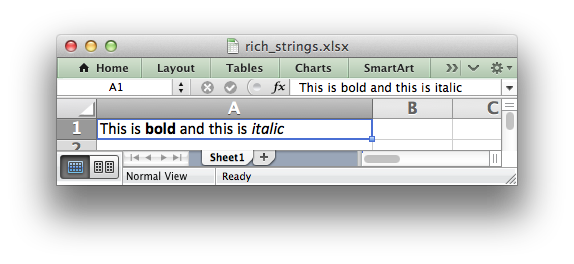

.. _worksheet:

The Worksheet Class
===================

The worksheet class represents an Excel worksheet. It handles operations such
as writing data to cells or formatting worksheet layout.

A worksheet object isn't instantiated directly. Instead a new worksheet is
created by calling the :func:`add_worksheet()` method from a :func:`Workbook`
object::

    workbook   = Workbook('filename.xlsx')

    worksheet1 = workbook.add_worksheet()
    worksheet2 = workbook.add_worksheet()
    
    worksheet1.write('A1', 123)

.. image:: _static/worksheet00.png

worksheet.write()
-----------------

.. py:function:: write(row, col, data[, cell_format])

   Write generic data to a worksheet cell.

   :param row:         The cell row (zero indexed).
   :param col:         The cell column (zero indexed).
   :param data:        Cell data to write. Variable types.
   :param cell_format: Optional Format object.
   :type  row:         int
   :type  col:         int
   :type  cell_format: :ref:`Format <format>`

Excel makes a distinction between data types such as strings, numbers, blanks,
formulas and hyperlinks. To simplify the process of writing data to an
XlsxWriter file the ``write()`` method acts as a general alias for several
more specific methods:

* :func:`write_string()`
* :func:`write_number()`
* :func:`write_blank()`
* :func:`write_formula()`
* :func:`write_url()`

The general rule is that if the data looks like a *something* then a
*something* is written. Here are some examples::

    worksheet.write(0, 0, 'Hello')          # write_string()
    worksheet.write(1, 0, 'World')          # write_string()
    worksheet.write(2, 0, 2)                # write_number()
    worksheet.write(3, 0, 3.00001)          # write_number()
    worksheet.write(4, 0, '=SIN(PI()/4)')   # write_formula()
    worksheet.write(5, 0, '')               # write_blank()
    worksheet.write(6, 0, None)             # write_blank()

This creates a worksheet like the following:

.. image:: _static/worksheet01.png

The ``write()`` method supports two forms of notation to designate the position
of cells: **Row-column** notation and **A1** notation::

    # These are equivalent.
    worksheet.write(0, 0, 'Hello')
    worksheet.write('A1', 'Hello')

See :ref:`cell_notation` for more details.

The ``cell_format`` parameter is used to apply formatting to the cell. This
parameter is optional but when present is should be a valid
:ref:`Format <format>` object::

    cell_format = workbook.add_format({'bold': True, 'italic': True})

    worksheet.write(0, 0, 'Hello', cell_format)  # Cell is bold and italic.

The ``write()`` method will ignore empty strings or ``None`` unless a format is
also supplied. As such you needn't worry about special handling for empty or
``None`` values in your data. See also the :func:`write_blank()` method.

One problem with the ``write()`` method is that occasionally data looks like a
number but you don't want it treated as a number. For example, Zip codes or ID
numbers or often start with a leading zero. If you write this data as a number
then the leading zero(s) will be stripped. In this case you shouldn't use the
``write()`` method and should use ``write_string()`` instead.

worksheet.write_string()
------------------------

.. py:function:: write_string(row, col, string[, cell_format])

   Write a string to a worksheet cell.

   :param row:         The cell row (zero indexed).
   :param col:         The cell column (zero indexed).
   :param string:      String to write to cell.
   :param cell_format: Optional Format object.
   :type  row:         int
   :type  col:         int
   :type  string:      string
   :type  cell_format: :ref:`Format <format>`

The ``write_string()`` method writes a string to the cell specified by ``row``
and ``column``::

    worksheet.write_string(0, 0, 'Your text here')
    worksheet.write_string('A2', 'or here')

Both row-column and A1 style notation are support. See :ref:`cell_notation` for
more details.

The ``cell_format`` parameter is used to apply formatting to the cell. This
parameter is optional but when present is should be a valid
:ref:`Format <format>` object.

Unicode strings are supported in UTF-8 encoding. This generally requires that
your source file in also UTF-8 encoded::

    # _*_ coding: utf-8

    worksheet.write('A1', u'Some UTF-8 text')

.. image:: _static/worksheet02.png

Alternatively, you can read data from an encoded file, convert it to UTF-8
during reading and then write the data to an Excel file. There are several
sample
``unicode_*.py`` programs like this in the ``examples`` directory of the XlsxWriter source tree.

The maximum string size supported by Excel is 32,767 characters. Strings longer
than this will be truncated by ``write_string()``.

.. note::
   Even though Excel allows strings of 32,767 characters in a cell, Excel
   can only **display** 1000. All 32,767 characters are displayed in the
   formula bar.

In general it is sufficient to use the ``write()`` method when dealing with
string data. However, you may sometimes need to use ``write_string()`` to
write data that looks like a number but that you don't want treated as a
number. For example, Zip codes or phone numbers::

    # Write ID number as a plain string.
    worksheet.write_string('A1', '01209')

However, if the user edits this string Excel may convert it back to a number.
To get around this you can use the Excel text format ``'@'``::

    # Format as a string. Doesn't change to a number when edited
    str_format = workbook.add_format({'num_format', '@'})
    worksheet.write_string('A1', '01209', str_format)

This behaviour, while slightly tedious, is unfortunately consistent with the
way Excel handles string data that looks like numbers. See :ref:`tutorial3`.

worksheet.write_number()
------------------------

.. py:function:: write_number(row, col, number[, cell_format])

   Write a number to a worksheet cell.

   :param row:         The cell row (zero indexed).
   :param col:         The cell column (zero indexed).
   :param number:      Number to write to cell.
   :param cell_format: Optional Format object.
   :type  row:         int
   :type  col:         int
   :type  number:      int or float
   :type  cell_format: :ref:`Format <format>`

The ``write_number()`` method writes an integer or a float to the cell
specified by ``row`` and ``column``::

    worksheet.write_number(0, 0, 123456)
    worksheet.write_number('A2', 2.3451)

Both row-column and A1 style notation are support. See :ref:`cell_notation` for
more details.

The ``cell_format`` parameter is used to apply formatting to the cell. This
parameter is optional but when present is should be a valid
:ref:`Format <format>` object.

Excel handles numbers as IEEE-754 64-bit double-precision floating point. This
means that, in most cases, the maximum number of digits that can be stored in
Excel without losing precision is 15.

worksheet.write_formula()
-------------------------

.. py:function:: write_formula(row, col, formula[, cell_format[, value]])

   Write a formula to a worksheet cell.

   :param row:         The cell row (zero indexed).
   :param col:         The cell column (zero indexed).
   :param formula:     Formula to write to cell.
   :param cell_format: Optional Format object.
   :type  row:         int
   :type  col:         int
   :type  formula:     string
   :type  cell_format: :ref:`Format <format>`

The ``write_formula()`` method writes a formula or function to the cell
specified by ``row`` and ``column``::

    worksheet.write_formula(0, 0, '=B3 + B4')
    worksheet.write_formula(1, 0, '=SIN(PI()/4)')
    worksheet.write_formula(2, 0, '=SUM(B1:B5)')
    worksheet.write_formula('A4', '=IF(A3>1,"Yes", "No")')
    worksheet.write_formula('A5', '=AVERAGE(1, 2, 3, 4)')
    worksheet.write_formula('A6', '=DATEVALUE("1-Jan-2013")')

Array formulas are also supported::

    worksheet.write_formula('A7', '{=SUM(A1:B1*A2:B2)}')

See also the ``write_array_formula()`` method below.

Both row-column and A1 style notation are support. See :ref:`cell_notation` for
more details.

The ``cell_format`` parameter is used to apply formatting to the cell. This
parameter is optional but when present is should be a valid
:ref:`Format <format>` object.

XlsxWriter doesn't calculate the value of a formula and instead stores the
value 0 as the formula result. It then sets a global flag in the XLSX file to
say that all formulas and functions should be recalculated when the file is
opened. This is the method recommended in the Excel documentation and in
general it works fine with spreadsheet applications. However, applications
that don't have a facility to calculate formulas, such as Excel Viewer, or
some mobile applications will only display the 0 results.

If required, it is also possible to specify the calculated result of the
formula using the options ``value`` parameter. This is occasionally necessary
when working with non-Excel applications that don't calculate the value of the
formula. The calculated ``value`` is added at the end of the argument list::

    worksheet.write('A1', '=2+2', num_format, 4)

.. note::
   Some early versions of Excel 2007 do not display the calculated values of
   formulas written by XlsxWriter. Applying all available Office Service
   Packs should fix this.

worksheet.write_array_formula()
-------------------------------

.. py:function:: write_array_formula(first_row, first_col, last_row, \
                                    last_col, formula[, cell_format[, value]])

   Write an array formula to a worksheet cell.

   :param first_row:   The first row of the range. (All zero indexed.)
   :param first_col:   The first column of the range.
   :param last_row:    The last row of the range.
   :param last_col:    The last col of the range.
   :param formula:     Array formula to write to cell.
   :param cell_format: Optional Format object.
   :type  first_row:   int
   :type  first_col:   int
   :type  last_row:    int
   :type  last_col:    int
   :type  formula:     string
   :type  cell_format: :ref:`Format <format>`

The ``write_array_formula()`` method write an array formula to a cell range. In
Excel an array formula is a formula that performs a calculation on a set of
values. It can return a single value or a range of values.

An array formula is indicated by a pair of braces around the formula:
``{=SUM(A1:B1*A2:B2)}``. If the array formula returns a single value then the
``first_`` and ``last_`` parameters should be the same::

    worksheet.write_array_formula('A1:A1', '{=SUM(B1:C1*B2:C2)}')

It this case however it is easier to just use the ``write_formula()`` or
``write()`` methods::

    # Same as above but more concise.
    worksheet.write('A1', '{=SUM(B1:C1*B2:C2)}')
    worksheet.write_formula('A1', '{=SUM(B1:C1*B2:C2)}')

For array formulas that return a range of values you must specify the range
that the return values will be written to::

    worksheet.write_array_formula('A1:A3',    '{=TREND(C1:C3,B1:B3)}')
    worksheet.write_array_formula(0, 0, 2, 0, '{=TREND(C1:C3,B1:B3)}')

As shown above, both row-column and A1 style notation are support. See
:ref:`cell_notation` for more details.

The ``cell_format`` parameter is used to apply formatting to the cell. This
parameter is optional but when present is should be a valid
:ref:`Format <format>` object.

If required, it is also possible to specify the calculated value of the
formula. This is occasionally necessary when working with non-Excel
applications that don't calculate the value of the formula. The calculated
``value`` is added at the end of the argument list::

    worksheet.write_array_formula('A1:A3', '{=TREND(C1:C3,B1:B3)}', format, 105)

In addition, some early versions of Excel 2007 don't calculate the values of
array formulas when they aren't supplied. Installing the latest Office Service
Pack should fix this issue.

See also :ref:`ex_array_formula`.

worksheet.write_blank()
-----------------------

.. py:function:: write_blank(row, col, blank[, cell_format])

   Write a blank worksheet cell.

   :param row:         The cell row (zero indexed).
   :param col:         The cell column (zero indexed).
   :param blank:       None or empty string. The value is ignored.
   :param cell_format: Optional Format object.
   :type  row:         int
   :type  col:         int
   :type  cell_format: :ref:`Format <format>`

Write a blank cell specified by ``row`` and ``column``::

    worksheet.write_blank(0, 0, None, format)

This method is used to add formatting to a cell which doesn't contain a string
or number value.

Excel differentiates between an "Empty" cell and a "Blank" cell. An "Empty"
cell is a cell which doesn't contain data whilst a "Blank" cell is a cell
which doesn't contain data but does contain formatting. Excel stores "Blank"
cells but ignores "Empty" cells.

As such, if you write an empty cell without formatting it is ignored::

    worksheet.write('A1', None, format)  # write_blank()
    worksheet.write('A2', None)          # Ignored

This seemingly uninteresting fact means that you can write arrays of data
without special treatment for ``None`` or empty string values.

As shown above, both row-column and A1 style notation are support. See
:ref:`cell_notation` for more details.

worksheet.write_datetime()
--------------------------

.. py:function:: write_datetime(row, col, datetime [, cell_format])

   Write a date or time to a worksheet cell.

   :param row:         The cell row (zero indexed).
   :param col:         The cell column (zero indexed).
   :param datetime:    A datetime.datetime object.
   :param cell_format: Optional Format object.
   :type  row:         int
   :type  col:         int
   :type  formula:     string
   :type  datetime:    :class:`datetime.datetime`
   :type  cell_format: :ref:`Format <format>`

The ``write_datetime()`` method can be used to write a date or time to the cell
specified by ``row`` and ``column``::

    worksheet.write_datetime(0, 0, datetime, date_format)

The :class:`datetime.datetime` class is part of the standard Python
:mod:`datetime` library.

There are many way to create a datetime object but the most common is to use
the :meth:`datetime.strptime <datetime.datetime.strptime>` method::

    date_time = datetime.strptime('2013-01-23', '%Y-%m-%d')

A date should always have a ``cell_format`` of type :ref:`Format <format>`,
otherwise it will appear as a number::

    date_format = workbook.add_format({'num_format': 'd mmmm yyyy'})

    worksheet.write_datetime('A1', date_time, date_format)

See :ref:`working_with_dates_and_time` for more details.

worksheet.write_url()
---------------------

.. py:function:: write_url(row, col, url[, cell_format[, string[, tip]]])

   Write a hyperlink to a worksheet cell.

   :param row:         The cell row (zero indexed).
   :param col:         The cell column (zero indexed).
   :param url:         Hyperlink url.
   :param cell_format: Optional Format object.
   :param string:      An optional display string for the hyperlink.
   :param tip:         An optional tooltip.
   :type  row:         int
   :type  col:         int
   :type  url:         string
   :type  string:      string
   :type  tip:         string
   :type  cell_format: :ref:`Format <format>`

The ``write_url()`` method is used to write a hyperlink in a worksheet cell.
The url is comprised of two elements: the displayed string and the
non-displayed link. The displayed string is the same as the link unless an
alternative string is specified.

Both row-column and A1 style notation are support. See :ref:`cell_notation` for
more details.

The ``cell_format`` parameter is used to apply formatting to the cell. This
parameter is optional, however, without a format the link won't look like a
link. The suggested :ref:`Format <format>`  is::

    link_format = workbook.add_format({'color': 'blue', 'underline': 1})

There are four web style URI's supported: ``http://``, ``https://``, ``ftp://``
and ``mailto:``::

    worksheet.write_url('A1', 'ftp://www.python.org/',    link_format)
    worksheet.write_url('A2', 'http://www.python.org/',   link_format)
    worksheet.write_url('A3', 'https://www.python.org/',  link_format)
    worksheet.write_url('A4', 'mailto:jmcnamaracpan.org', link_format)

All of the these URI types are recognised by the :func:`write()` method, so the
following are equivalent:: 

    worksheet.write_url('A2', 'http://www.python.org/', link_format)
    worksheet.write    ('A2', 'http://www.python.org/', link_format)  # Same.

You can display an alternative string using the ``string`` parameter::

    worksheet.write_url('A1', 'http://www.python.org', link_format, 'Python')

If you wish to have some other cell data such as a number or a formula you can
overwrite the cell using another call to ``write_*()``::

    worksheet.write_url('A1', 'http://www.python.org/', link_format)

    # Overwrite the URL string with a formula. The cell is still a link.
    worksheet.write_formula('A1', '=1+1', link_format)

There are two local URIs supported: ``internal:`` and ``external:``. These are
used for hyperlinks to internal worksheet references or external workbook and
worksheet references::

    worksheet.write_url('A1',  'internal:Sheet2!A1',             link_format)
    worksheet.write_url('A2',  'internal:Sheet2!A1',             link_format)
    worksheet.write_url('A3',  'internal:Sheet2!A1:B2',          link_format)
    worksheet.write_url('A4',  "internal:'Sales Data'!A1",       link_format)
    worksheet.write_url('A5', r'external:c:\temp\foo.xlsx',      link_format)
    worksheet.write_url('A6', r'external:c:\foo.xlsx#Sheet2!A1', link_format)
    worksheet.write_url('A7', r'external:..\foo.xlsx',           link_format)
    worksheet.write_url('A8', r'external:..\foo.xlsx#Sheet2!A1', link_format)
    worksheet.write_url('A9', r'external:\\NET\share\foo.xlsx',  link_format)

Worksheet references are typically of the form ``Sheet1!A1``. You can also
link to a worksheet range using the standard Excel notation: ``Sheet1!A1:B2``.

In external links the workbook and worksheet name must be separated by the
``#`` character: ``external:Workbook.xlsx#Sheet1!A1'``.

You can also link to a named range in the target worksheet. For example say you
have a named range called ``my_name`` in the workbook ``c:\temp\foo.xlsx`` you
could link to it as follows::

    worksheet.write_url('A14', r'external:c:\temp\foo.xlsx#my_name')

Excel requires that worksheet names containing spaces or non alphanumeric
characters are single quoted as follows ``'Sales Data'!A1``.

Links to network files are also supported. Network files normally begin with
two back slashes as follows ``\\NETWORK\etc``. In order to generate this in a
single or double quoted string you will have to escape the backslashes,
``'\\\\NETWORK\\etc'`` or use a raw string ``r'\\NETWORK\etc'``.

Alternatively, you can avoid most of these quoting problems by using forward
slashes. These are translated internally to backslashes::

    worksheet.write_url('A14', "external:c:/temp/foo.xlsx")
    worksheet.write_url('A15', 'external://NETWORK/share/foo.xlsx')

See also :ref:`ex_hyperlink`.

.. note:: 
   XlsxWriter will escape the following characters in URLs as required
   by Excel: ``\s " < > \ [ ] ` ^ { }`` unless the URL already contains ``%xx`` 
   style escapes. In which case it is assumed that the URL was escaped
   correctly by the user and will by passed directly to Excel.

worksheet.write_rich_string()
-----------------------------

.. py:function:: write_rich_string(row, col, *string_parts[, cell_format])

   Write a "rich" string with multiple formats to a worksheet cell.

   :param row:          The cell row (zero indexed).
   :param col:          The cell column (zero indexed).
   :param string_parts: String and format pairs.
   :param cell_format:  Optional Format object.
   :type  row:          int
   :type  col:          int
   :type  cell_format:  :ref:`Format <format>`

The ``write_rich_string()`` method is used to write strings with
multiple formats. For example to write the string "This is **bold**
and this is *italic*" you would use the following::

    bold   = workbook.add_format({'bold': True})
    italic = workbook.add_format({'italic': True})

    worksheet.write_rich_string('A1',
                                'This is ',
                                bold, 'bold',
                                ' and this is ',
                                italic, 'italic')

The basic rule is to break the string into fragments and put a
:func:`Format <format>` object before the fragment that you want to format.
For example::

    # Unformatted string.
    'This is an example string'

    # Break it into fragments.
    'This is an ', 'example', ' string'

    # Add formatting before the fragments you want formatted.
    'This is an ', format, 'example', ' string'

    # In XlsxWriter.
    worksheet.write_rich_string('A1',
                                'This is an ', format, 'example', ' string')

String fragments that don't have a format are given a default
format. So for example when writing the string "Some **bold** text"
you would use the first example below but it would be equivalent to
the second::

    # Some bold format and a default format.
    bold    = workbook.add_format({'bold': True})
    default = workbook.add_format()

    # With default formatting:
    worksheet.write_rich_string('A1',
                                'Some ', 
                                bold, 'bold', 
                                ' text')

    # Or more explicitly:
    worksheet.write_rich_string('A1',
                                 default, 'Some ', 
                                 bold,    'bold', 
                                 default, ' text')

In Excel only the font properties of the format such as font
name, style, size, underline, color and effects are applied to the
string fragments in a rich string. Other features such as border, background,
text wrap and alignment must be applied to the cell.

The ``write_rich_string()`` method allows you to do this by using the
last argument as a cell format (if it is a format object). The
following example centers a rich string in the cell::

    bold   = workbook.add_format({'bold': True})
    center = workbook.add_format({'align': 'center'})

    worksheet.write_rich_string('A5',
                                'Some ',
                                bold, 'bold text',
                                ' centered',
                                center)

See also :ref:`ex_rich_strings`.

worksheet.write_row()
---------------------

.. py:function:: write_row(row, col, data[, cell_format])

   Write a row of data starting from (row, col).

   :param row:         The cell row (zero indexed).
   :param col:         The cell column (zero indexed).
   :param data:        Cell data to write. Variable types.
   :param cell_format: Optional Format object.
   :type  row:         int
   :type  col:         int
   :type  cell_format: :ref:`Format <format>`

The ``write_row()`` method can be used to write a list of data in one go. This
is useful for converting the results of a database query into an Excel
worksheet. The :func:`write()` method is  called for each element of the data.
For example::

    # Some sample data.
    data = ('Foo', 'Bar', 'Baz')

    # Write the data to a sequence of cells.
    worksheet.write_row('A1', data)

    # The above example is equivalent to:
    worksheet.write('A1', data[0])
    worksheet.write('B1', data[1])
    worksheet.write('C1', data[2])

worksheet.write_column()
------------------------

.. py:function:: write_column(row, col, data[, cell_format])

   Write a column of data starting from (row, col).

   :param row:         The cell row (zero indexed).
   :param col:         The cell column (zero indexed).
   :param data:        Cell data to write. Variable types.
   :param cell_format: Optional Format object.
   :type  row:         int
   :type  col:         int
   :type  cell_format: :ref:`Format <format>`

The ``write_column()`` method can be used to write a list of data in one go.
This is useful for converting the results of a database query into an Excel
worksheet. The :func:`write()` method is  called for each element of the data.
For example::

    # Some sample data.
    data = ('Foo', 'Bar', 'Baz')

    # Write the data to a sequence of cells.
    worksheet.write_row('A1', data)

    # The above example is equivalent to:
    worksheet.write('A1', data[0])
    worksheet.write('A2', data[1])
    worksheet.write('A3', data[2])

worksheet.set_row()
-------------------

.. py:function:: set_row(row, height, cell_format, options)

   Set properties for a row of cells.
   
   :param int row:      The worksheet row (zero indexed).
   :param int height:   The row height.
   :param cell_format:  Optional Format object.
   :type  cell_format:  :ref:`Format <format>`
   :param dict options: Optional row parameters: hidden, level, collapsed.

The ``set_row()`` method is used to change the default properties of a row. The
most common use for this method is to change the height of a row::

    worksheet.set_row(0, 20)  # Set the height of Row 1 to 20.

The other common use for ``set_row()`` is to set the :ref:`Format <format>` for
all cells in the row::

    cell_format = workbook.add_format({'bold': True})

    worksheet.set_row(0, 20, cell_format)

If you wish to set the format of a row without changing the height you can pass
``None`` as the height parameter or use the default row height of 15::

    worksheet.set_row(1, None, cell_format)
    worksheet.set_row(1, 15,   cell_format)  # Same as this.

The ``cell_format`` parameter will be applied to any cells in the row that
don't have a format. As with Excel it is overidden by an explicit cell format.
For example::

    worksheet.set_row(0, None, format1)      # Row 1 has format1.
    
    worksheet.write('A1', 'Hello')           # Cell A1 defaults to format1.
    worksheet.write('B1', 'Hello', format2)  # Cell B1 keeps format2.

The ``options`` parameter is a dictionary with the following possible keys:

* ``'hidden'``
* ``'level'``
* ``'collapsed'``

Options can be set as follows::

    worksheet.set_row(0, 20, cell_format, {'hidden': 1})
    
    # Or use defaults for other properties and set the options only.
    worksheet.set_row(0, None, None, {'hidden': 1})
    
The ``'hidden'`` option is used to hide a row. This can be used, for example,
to hide intermediary steps in a complicated calculation::

    worksheet.set_row(0, 20, cell_format, {'hidden': 1})

The ``'level'`` parameter is used to set the outline level of the row. Outlines
are described in "Working with Outlines and Grouping". Adjacent rows with the
same outline level are grouped together into a single outline. (**Note**: This
feature is not implemented yet).

The following example sets an outline level of 1 for some rows::

    worksheet.set_row(0, None, None, {'level': 1})
    worksheet.set_row(1, None, None, {'level': 1})
    worksheet.set_row(2, None, None, {'level': 1})

.. note::
   Excel allows up to 7 outline levels. The ``'level'`` parameter
   should be in the range ``0 <= level <= 7``.

The ``'hidden'`` parameter can also be used to hide collapsed outlined rows
when used in conjunction with the ``'level'`` parameter::

    worksheet.set_row(1, None, None, {'hidden': 1, 'level': 1})
    worksheet.set_row(2, None, None, {'hidden': 1, 'level': 1})

The ``'collapsed'`` parameter is used in collapsed outlines to indicate which
row has the collapsed ``'+'`` symbol::

    worksheet.set_row(3, None, None, {'collapsed': 1})

worksheet.set_column()
----------------------

.. py:function:: set_column(first_col, last_col, width, cell_format, \
                            hidden, level, collapsed)

   Set properties for one or more columns of cells.
   
   :param int first_col: First column (zero-indexed).
   :param int last_col:  Last column (zero-indexed). Can be same as firstcol.
   :param int width:     The width of the column(s).
   :param cell_format:   Optional Format object.
   :type  cell_format:   :ref:`Format <format>`
   :param dict options:  Optional parameters: hidden, level, collapsed.

The ``set_column()``  method can be used to change the default properties of a
single column or a range of columns::

    worksheet.set_column(1, 3, 30)  # Width of columns B:D set to 30.

If ``set_column()`` is applied to a single column the value of ``first_col``
and ``last_col`` should be the same::

    worksheet.set_column(1, 1, 30)  # Width of column B set to 30.

It is also possible, and generally clearer, to specify a column range using the
form of A1 notation used for columns. See :ref:`cell_notation` for more
details.

Examples::

    worksheet.set_column(0, 0, 20)   # Column  A   width set to 20.
    worksheet.set_column(1, 3, 30)   # Columns B-D width set to 30.
    worksheet.set_column('E:E', 20)  # Column  E   width set to 20.
    worksheet.set_column('F:H', 30)  # Columns F-H width set to 30.

The width corresponds to the column width value that is specified in Excel. It
is approximately equal to the length of a string in the default font of
Calibri 11. Unfortunately, there is no way to specify "AutoFit" for a column
in the Excel file format. This feature is only available at runtime from
within Excel. It is possible to simulate "AutoFit" by tracking the width of
the data in the column as your write it.

As usual the ``cell_format`` :ref:`Format <format>`  parameter is optional. If
you wish to set the format without changing the width you can pass ``None`` as
the width parameter::

    cell_format = workbook.add_format({'bold': True})

    worksheet.set_column(0, 0, None, cell_format)

The ``cell_format`` parameter will be applied to any cells in the column that
don't have a format. For example::

    worksheet.set_column('A:A', None, format1)  # Col 1 has format1.
    
    worksheet.write('A1', 'Hello')              # Cell A1 defaults to format1.
    worksheet.write('A2', 'Hello', format2)     # Cell A2 keeps format2.

A  row format takes precedence over a default column format::

    worksheet.set_row(0, None, format1)         # Set format for row 1.
    worksheet.set_column('A:A', None, format2)  # Set format for col 1.
    
    worksheet.write('A1', 'Hello')              # Defaults to format1
    worksheet.write('A2', 'Hello')              # Defaults to format2

The ``options`` parameter is a dictionary with the following possible keys:

* ``'hidden'``
* ``'level'``
* ``'collapsed'``

Options can be set as follows::

    worksheet.set_column('D:D', 20, cell_format, {'hidden': 1})

    # Or use defaults for other properties and set the options only.
    worksheet.set_column('E:E', None, None, {'hidden': 1})

The ``'hidden'`` option is used to hide a column. This can be used, for
example, to hide intermediary steps in a complicated calculation::

    worksheet.set_column('D:D', 20,  cell_format, {'hidden': 1})

The ``'level'`` parameter is used to set the outline level of the column.
Outlines are described in "Working with Outlines and Grouping". Adjacent
columns with the same outline level are grouped together into a single
outline. (**Note**: This feature is not implemented yet).

The following example sets an outline level of 1 for columns B to G::

    worksheet.set_column('B:G', None, None, {'level': 1})

.. note::
   Excel allows up to 7 outline levels. The ``'level'`` parameter
   should be in the range ``0 <= level <= 7``.

The ``'hidden'`` parameter can also be used to hide collapsed outlined columns
when used in conjunction with the ``'level'`` parameter::

    worksheet.set_column('B:G', None, None, {'hidden': 1, 'level': 1})

The ``'collapsed'`` parameter is used in collapsed outlines to indicate which
column has the collapsed ``'+'`` symbol::

    worksheet.set_column('H:H', None, None, {'collapsed': 1})

worksheet.get_name()
--------------------

.. py:function:: get_name()

   Retrieve the worksheet name.
   
The ``get_name()`` method is used to retrieve the name of a worksheet.
This is something useful for debugging or logging::

    for worksheet in workbook.worksheets():
        print worksheet.get_name()

There is no ``set_name()`` method. The only safe way to set the worksheet name
is via the ``add_worksheet()`` method.

worksheet.activate()
--------------------

.. py:function:: activate()

   Make a worksheet the active, i.e., visible worksheet.

The ``activate()`` method is used to specify which worksheet is initially
visible in a multi-sheet workbook::

    worksheet1 = workbook.add_worksheet()
    worksheet2 = workbook.add_worksheet()
    worksheet3 = workbook.add_worksheet()

    worksheet3.activate()

.. image:: _static/worksheet_activate.png

More than one worksheet can be selected via the ``select()`` method, see below,
however only one worksheet can be active.

The default active worksheet is the first worksheet.

worksheet.select()
------------------

.. py:function:: select()

   Set a worksheet tab as selected.

The ``select()`` method is used to indicate that a worksheet is selected in a
multi-sheet workbook::

    worksheet1.activate()
    worksheet2.select()
    worksheet3.select()

A selected worksheet has its tab highlighted. Selecting worksheets is a way of
grouping them together so that, for example, several worksheets could be
printed in one go. A worksheet that has been activated via the ``activate()``
method will also appear as selected.

worksheet.hide()
----------------

.. py:function:: hide()

   Hide the current worksheet.

The ``hide()`` method is used to hide a worksheet::

    worksheet2.hide()

You may wish to hide a worksheet in order to avoid confusing a user with
intermediate data or calculations.

A hidden worksheet can not be activated or selected so this method is mutually
exclusive with the :func:`activate()` and :func:`select()` methods. In
addition, since the first worksheet will default to being the active
worksheet, you cannot hide the first worksheet without activating another
sheet::

    worksheet2.activate()
    worksheet1.hide()

worksheet.set_first_sheet()
---------------------------

.. py:function:: set_first_sheet()

   Set current worksheet as the first visible sheet tab. 
   
The :func:`activate()` method determines which worksheet is initially selected.
However, if there are a large number of worksheets the selected worksheet may
not appear on the screen. To avoid this you can select which is the leftmost
visible worksheet tab using ``set_first_sheet()``::

    for in range(1, 21):
        workbook.add_worksheet

    worksheet19.set_first_sheet()  # First visible worksheet tab.
    worksheet20.activate()         # First visible worksheet.

This method is not required very often. The default value is the
first worksheet.

worksheet.merge_range()
-----------------------

.. py:function:: merge_range(first_row, first_col, \
                             last_row, last_col, cell_format)

   Merge a range of cells.

   :param first_row:   The first row of the range. (All zero indexed.)
   :param first_col:   The first column of the range.
   :param last_row:    The last row of the range.
   :param last_col:    The last col of the range.
   :param data:        Cell data to write. Variable types.
   :param cell_format: Optional Format object.
   :type  first_row:   int
   :type  first_col:   int
   :type  last_row:    int
   :type  last_col:    int
   :type  cell_format: :ref:`Format <format>`

The ``merge_range()`` method allows cells to be merged together so that they
act as a single area.

Excel generally merges and centers cells at same time. To get similar
behaviour with XlsxWriter you need to apply a :ref:`Format <format>`::

    merge_format = workbook.add_format({'align': 'center'})

    worksheet.merge_range('B3:D4', 'Merged Cells', merge_format)

It is possible to apply other formatting to the merged cells as well::

    merge_format = workbook.add_format({
        'bold':     True,
        'border':   6,
        'align':    'center',
        'valign':   'vcenter',
        'fg_color': '#D7E4BC',
    })

    worksheet.merge_range('B3:D4', 'Merged Cells', merge_format)

.. image:: _static/merge_range.png

The ``merge_range()`` method writes its ``data`` argument using
:func:`write()`. Therefore it will handle numbers, strings and formulas as
usual. If this doesn't handle you data correctly then you can overwrite the
first cell with a call to one of the other ``write_*()`` methods using the
same :ref:`Format <format>` as in the merged cells.

See :ref:`ex_merge1` for more details.

worksheet.autofilter()
----------------------

.. py:function:: autofilter(first_row, first_col, last_row, last_col)

   Set the autofilter area in the worksheet.

   :param first_row:   The first row of the range. (All zero indexed.)
   :param first_col:   The first column of the range.
   :param last_row:    The last row of the range.
   :param last_col:    The last col of the range.
   :type  first_row:   int
   :type  first_col:   int
   :type  last_row:    int
   :type  last_col:    int

The ``autofilter()`` method allows an autofilter to be added to a worksheet.
An autofilter is a way of adding drop down lists to the headers of a 2D range
of worksheet data. This allows users to filter the data based on simple
criteria so that some data is shown and some is hidden.

.. image:: _static/autofilter3.png

To add an autofilter to a worksheet::

    worksheet.autofilter('A1:D11')
    worksheet.autofilter(0, 0, 10, 3) # Same as above.
    
Filter conditions can be applied using the :func:`filter_column()` or
:func:`filter_column_list()` methods.

See :ref:`working_with_autofilters` for more details.

worksheet.filter_column()
-------------------------

.. py:function:: filter_column(col, criteria)

   Set the column filter criteria.

   :param int col:          Filter column (zero-indexed).
   :param string criteria:  Filter criteria.

The ``filter_column`` method can be used to filter columns in a autofilter
range based on simple conditions.

The conditions for the filter are specified using simple expressions::

    worksheet.filter_column('A', 'x > 2000')
    worksheet.filter_column('B', 'x > 2000 and x < 5000')

The ``col`` parameter can either be a zero indexed column number or a
string column name.

It isn't sufficient to just specify the filter condition. You must also hide
any rows that don't match the filter condition.
See :ref:`working_with_autofilters` for more details.

worksheet.filter_column_list()
------------------------------

.. py:function:: filter_column_list(col, filters)

   Set the column filter criteria in Excel 2007 list style.

   :param int col:       Filter column (zero-indexed).
   :param list filters:  List of filter criteria to match.

The ``filter_column_list()`` method can be used to represent filters with
multiple selected criteria::

    worksheet.filter_column_list('A', 'March', 'April', 'May')

The ``col`` parameter can either be a zero indexed column number or a
string column name.

One or more criteria can be selected::

    worksheet.filter_column_list('A', 'March')
    worksheet.filter_column_list('C', 100, 110, 120, 130)

It isn't sufficient to just specify filters. You must also hide
any rows that don't match the filter condition.
See :ref:`working_with_autofilters` for more details.

worksheet.set_zoom()
--------------------

.. py:function:: set_zoom(zoom)

   Set the worksheet zoom factor.

   :param int zoom: Worksheet zoom factor.

Set the worksheet zoom factor in the range ``10 <= zoom <= 400``::

    worksheet1.set_zoom(50)
    worksheet2.set_zoom(75)
    worksheet3.set_zoom(300)
    worksheet4.set_zoom(400)

The default zoom factor is 100. It isn't possible to set the zoom to
"Selection" because it is calculated by Excel at run-time.

Note, ``set_zoom()`` does not affect the scale of the printed page. For that
you should use :func:`set_print_scale()`.

worksheet.right_to_left()
-------------------------

.. py:function:: right_to_left()

   Display the worksheet cells from right to left for some versions of Excel.
   
The ``right_to_left()`` method is used to change the default direction of the
worksheet from left-to-right, with the A1 cell in the top left, to
right-to-left, with the A1 cell in the top right.

    worksheet.right_to_left()

This is useful when creating Arabic, Hebrew or other near or far eastern
worksheets that use right-to-left as the default direction.

worksheet.hide_zero()
---------------------

.. py:function:: hide_zero()

   Hide zero values in worksheet cells.
   
The ``hide_zero()`` method is used to hide any zero values that appear in
cells::

    worksheet.hide_zero()

worksheet.set_tab_color()
-------------------------

.. py:function:: set_tab_color()

   Set the colour of the worksheet tab.

   :param string color: The tab color.  

The ``set_tab_color()`` method is used to change the colour of the worksheet
tab::

    worksheet1.set_tab_color('red')
    worksheet2.set_tab_color('#FF9900')  # Orange

The color can be a Html style ``#RRGGBB`` string or a limited number of named
colors, see :ref:`format_colors`.

See :ref:`ex_tab_colors` for more details.

worksheet.protect()
-------------------

.. py:function:: protect()

   Set the colour of the worksheet tab. 
   
   :param string password: A worksheet password.
   :param dict   options:  A dictionary of worksheet options to protect.

The ``protect()`` method is used to protect a worksheet from modification::

    worksheet.protect()

The ``protect()`` method also has the effect of enabling a cell's ``locked``
and ``hidden`` properties if they have been set. A *locked* cell cannot be
edited and this property is on by default for all cells. A *hidden* cell will
display the results of a formula but not the formula itself. These properties
can be set using the :func:`set_locked` and :func:`set_hidden` format methods.

You can optionally add a password to the worksheet protection::

    worksheet.protect('abc123')

Passing the empty string ``''`` is the same as turning on protection without a
password.

You can specify which worksheet elements you wish to protect by passing a
dictionary in the ``options`` argument with any or all of the following keys::

    # Default values shown.
    options = {
        'objects':               0,
        'scenarios':             0,
        'format_cells':          0,
        'format_columns':        0,
        'format_rows':           0,
        'insert_columns':        0,
        'insert_rows':           0,
        'insert_hyperlinks':     0,
        'delete_columns':        0,
        'delete_rows':           0,
        'select_locked_cells':   1,
        'sort':                  0,
        'autofilter':            0,
        'pivot_tables':          0,
        'select_unlocked_cells': 1,
    }

The default boolean values are shown above. Individual elements can be
protected as follows::

    worksheet.protect('acb123', { 'insert_rows': 1 })

See also the :func:`set_locked` and :func:`set_hidden` format methods and
:ref:`ex_protection`.

.. Note:: 
   Worksheet level passwords in Excel offer very weak protection. They not
   encrypt your data and are very easy to deactivate. Full workbook encryption
   is not supported by ``XlsxWriter`` since it requires a completely different
   file format and would take several man months to implement.

